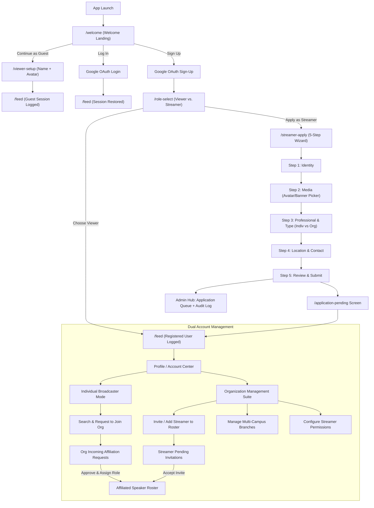

# 📘 Master Architecture & Implementation Specification
## Authentication, Onboarding, Dual Account Management & Org-Streamer Affiliation

---

## 🧭 1. Architectural Overview & Entity Hierarchy

This specification unites four interconnected pillars of the platform:
1. **Authentication & Onboarding Gateway**: Seamless Google OAuth, Guest/Skip access, and a 5-step Streamer Application Wizard.
2. **Admin Telemetry & Governance**: Real-time KPI telemetry, application queues, and immutable audit logs.
3. **Dual Account Management**: Tailored management consoles for both **Individual Broadcasters** and **Organizations**.
4. **Org $\leftrightarrow$ Streamer Affiliation Protocol**: Bi-directional onboarding (Org invites Streamer vs. Streamer applies to Org) with fine-grained permissions.



---

## 🚪 2. Phase 1: Authentication & Onboarding Gateway

### 2.1 Screen Navigation Flow
* `/welcome`: Premium landing page featuring brand logo, "Sign Up with Google", "Log In", and "Continue as Guest Viewer".
* `/viewer-setup`: For users choosing the Guest path — collects a friendly display name (required) and optional avatar, then increments `totalGuestSessions` in telemetry.
* `/role-select`: Presented immediately after new Google Sign-Up:
  * **Option A: "I'm a Viewer"** $\rightarrow$ Increments `totalRegisteredGoogleUsers`, grants instant access to `/feed`.
  * **Option B: "I want to become a Streamer"** $\rightarrow$ Routes to `/streamer-apply`.
* `/streamer-apply`: 5-step wizard with animated top progress bar (`Step N of 5`):
  * **Step 1 (Identity)**: Full Name, Display Handle (`@handle`), Rich Bio with character counter.
  * **Step 2 (Profile Media)**: Profile Picture & Banner Image picker (using native `image_picker` from device gallery/camera or web file selector).
  * **Step 3 (Professional Info & Account Type)**: Affiliation/Institute, YouTube Channel URL, Content Category dropdown, **Account Type Toggle** (`Individual Broadcaster` vs. `Educational Organization`), and Topic Tags.
  * **Step 4 (Location & Contact Details)**: City selector, Venue/Campus description, Phone number with `+966` country code, Preferred Contact Method (`Email` / `WhatsApp`).
  * **Step 5 (Review & Submission)**: Live preview card summarizing all data $\rightarrow$ "Submit Application" pushes application to `AdminDatabaseService` and transitions to `/application-pending`.
* `/application-pending`: Confirmation screen with friendly status banner explaining the review process $\rightarrow$ "Explore as Viewer while waiting" button leads to `/feed`.

---

## 🏛️ 3. Phase 2: Admin Hub Telemetry & Real-Time Sync

All auth and onboarding events hook directly into `AdminDatabaseService` and update the live Admin Hub:

| Event | Telemetry Destination | Admin Hub View / Tab |
|---|---|---|
| **Google Sign-Up / Login** | Increments `totalRegisteredGoogleUsers` in `ViewerAnalyticsModel` | **Analytics Tab $\rightarrow$ KPI Card "Registered Google Users"** |
| **Guest Viewer Entry** | Increments `totalGuestSessions` in `ViewerAnalyticsModel` | **Analytics Tab $\rightarrow$ KPI Card "Guest Sessions"** |
| **Streamer Application** | Appends `BroadcasterApplicationModel` into `_applications` storage | **Applications Tab $\rightarrow$ Pending Badge & Review/Approve/Reject Sheet** |
| **Admin Decision** | Approves/Rejects application with reviewer email and reason | **Governance Tab $\rightarrow$ Audit Log (`OrgAuditAction.approveBroadcaster`)** |

---

## 🏢 4. Phase 3: Dual Account Management Architecture

### 4.1 Individual Broadcaster Account Management
* **Profile & Identity Customization**:
  * Edit display name, bio, avatar, banner, category, tags, and city.
  * Link personal YouTube handle and preview live stream video player.
* **Broadcaster Studio Controls**:
  * Local RTMP Laptop IP configuration (`rtmpStreamUrl`).
  * Broadcast quality preference (1080p, 720p, Audio-Only).
* **Org Affiliation Portal ("My Organizations")**:
  * View current affiliated organizations.
  * "Join an Organization" directory search (browse registered Orgs like *Dalilk 4 IELTS*, *KFUPM Academic Center*).
  * Send "Affiliation Request" with portfolio note.
  * Track status (`Pending Review`, `Accepted`, `Declined`).

### 4.2 Organization (Org) Account Management Suite
* **Organization Profile & Campus HQ**:
  * Manage organization legal/display name in English & Arabic.
  * Multi-campus branch manager: Add, edit, or remove branches with GPS coordinates, seating capacities, and available facilities (AV, Fiber, Soundproofing).
* **Speaker & Instructor Roster**:
  * List all affiliated speakers with avatars, roles, and status.
  * Assign status: `Permanent Faculty` vs. `Visiting Lecturer` vs. `Guest Speaker`.
* **Org Audit & Activity Log**:
  * View all broadcast starts, speaker additions, branch modifications, and permission updates.

---

## 🤝 5. Phase 4: Org $\leftrightarrow$ Streamer Affiliation Protocol

### 5.1 Org-to-Streamer Flow (Outbound Invitation & Direct Add)
1. **Direct Add by Org Admin**:
   * Org Admin opens Org Management $\rightarrow$ "Add Instructor / Speaker".
   * Inputs name, bio, avatar, YouTube handle, and linked Google email.
   * Configures granular permissions (`OrgBroadcasterPermissions`):
     - `canGoLiveOnBehalfOfOrg`: Allow broadcasting under the Org's banner.
     - `canScheduleLectures`: Allow adding upcoming events to Org calendar.
     - `canManagePlaylists`: Allow managing VODs and playlists.
     - `canEditBranchDetails`: Allow updating branch seating/facilities.
2. **Invite Link / Code Dispatch**:
   * Org generates an invite link (`streamerapp://invite/org_dalilk_04?token=xyz`).
   * When the recipient accepts, their account is automatically linked to the Org roster.

### 5.2 Streamer-to-Org Flow (Inbound Application to Join)
1. **Individual Streamer Application**:
   * Streamer browses registered Organizations in Account Settings.
   * Selects an Org (e.g. *Dalilk 4 IELTS*) and taps "Request to Join as Speaker".
   * Submits application with proposed role (e.g., *IELTS Writing Specialist*) and sample lectures.
2. **Org Admin Review & Decision**:
   * Application appears in the Org Admin's "Incoming Speaker Requests" tab.
   * Org Admin reviews bio and YouTube portfolio $\rightarrow$ Clicks **Accept** (and assigns permissions) or **Decline**.
   * On acceptance, streamer receives an in-app notification and their profile reflects their new Org badge.

---

## 💾 6. State & Database Persistence Schema

### 6.1 `AppProvider` State Contract
```dart
// Auth State
bool get isLoggedInStreamer;
bool get isGuestViewer;
String? get googleUserEmail;
String? get googleUserName;
String? get googleUserAvatar;
UserProfileModel get userProfile;

// Telemetry & Analytics
ViewerAnalyticsModel get viewerAnalytics;
List<BroadcasterApplicationModel> get applications;
List<OrgAuditLogEntry> get auditLogs;

// Organization Affiliations
List<OrgSpeakerModel> getOrgSpeakers(String orgId);
List<StreamerModel> get affiliatedOrganizations;
Future<void> submitOrgAffiliationRequest(String orgId, String note);
Future<void> acceptSpeakerInvitation(String orgId);
Future<void> orgAddSpeaker(String orgId, OrgSpeakerModel speaker);
Future<void> orgRemoveSpeaker(String orgId, String speakerId);
Future<void> orgUpdateSpeakerPermissions(String orgId, String speakerId, OrgBroadcasterPermissions permissions);
```

### 6.2 Storage Keys (`AdminDatabaseService`)
* `admin_analytics_v1.json`: Persistent telemetry metrics.
* `admin_applications_v1.json`: Broadcaster and Org onboarding applications.
* `admin_audit_logs_v1.json`: Immutable audit trail.
* `org_rosters_v1.json`: Dynamic speaker rosters and branch allocations per Organization.

---

## 🧪 7. Quality Assurance & Verification Matrix

| Verification Scope | Testing Method | Target Outcome |
|---|---|---|
| **Auth & Routing** | Widget testing & Navigation state tests | Cold start routes to `/welcome`; authenticated user routes directly to `/feed`. |
| **Streamer Wizard** | Multi-step form validation & media upload | Validates required fields; prevents advance on incomplete data; generates valid `BroadcasterApplicationModel`. |
| **Admin Telemetry** | State verification against `ViewerAnalyticsModel` | Guest entry increments `totalGuestSessions`; Google login increments `totalRegisteredGoogleUsers`. |
| **Org Affiliation** | Bi-directional invite & accept test cases | Invited speaker receives permissions; Org roster updates reactively across map and profile views. |
| **Static Analysis** | `flutter analyze` | 0 issues, 0 warnings. |
| **Regression Suite** | `flutter test` | All 83+ unit/integration tests passing. |
