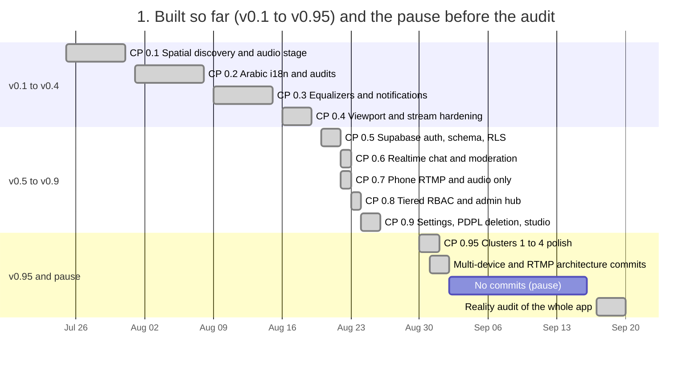
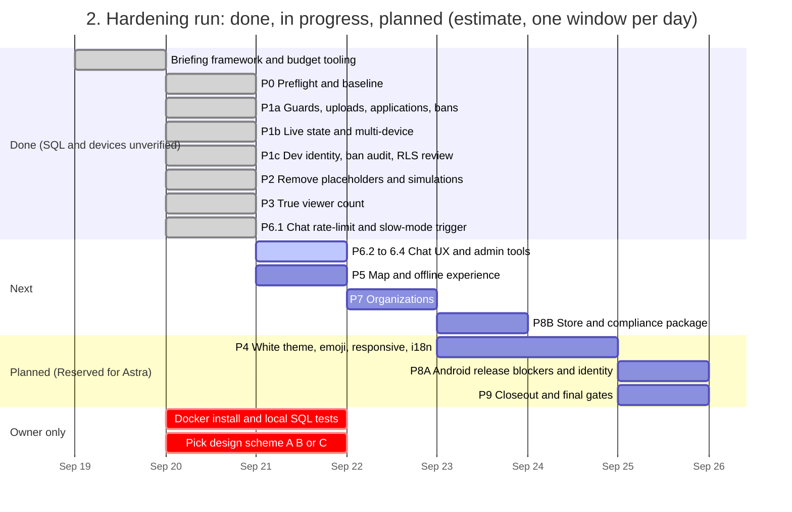

# 🗺️ Streamer App — Evolutionary Master Roadmap

> **Operational Git & Release Protocol:**
> - **Versions:** Major stable working releases of the application.
> - **Checkpoints:** Working snapshots combining multiple phases. **Rule: Each time a Checkpoint ends, push to GitHub.**
> - **Phases:** Focused functional features or major architecture edits. **Rule: Each time a Phase ends, make a Git commit.**
> - **Tasks:** Granular, atomic tasks executed step-by-step.

---

## 📅 Roadmap Overview & Version Progression

*Updated 2026-09-21. Sources: git history for the built versions, `brief/LEDGER.md` (agent-reported), verified test suite (264 pass, 0 fail, analyzer 0), and static gates check (`node brief/tools/gates.mjs` — 8 failing, all design scope). Future dates are estimates.*






### Where the hardening run stands (2026-09-21)

| Phase | Status | Evidence | Roadmap link |
|---|---|---|---|
| P0 Preflight | Done | analyzer 0 issues, tests 264 passing (full suite green) | none |
| P1a-b Guards, uploads, applications, bans, live state, multi-device | Done in source, SQL and phones unverified | commits 95b97fc, b61b3f7; 49 pgTAP assertions written, not run (no Docker) | CP 1.0.4, RLS follow-up to CP 0.5 |
| P1c Dev identity, RPC ban audit, RLS policy review, live-flag expiry | Done in source, SQL unverified | commit e94fb13; G1c = 0; helper migration 20260920110000 | CP 1.0.4 |
| P2 Placeholders and simulations | Done in full | commits d646053, 8ecba34, d83bd4a; G1a-e = 0, G5a-c = 0 | undoes simulated parts of CP 0.6.2.2 and 0.9.2.1 |
| P3 True viewer count | Done in full | commit 18d7b82; G1d = 0; deny-all stream_viewers + ViewerPresenceService | CP 1.0.1 |
| P6 Chat, moderation, admin | In Progress (P6.1 done) | commit 298db4b; chat rate-limit & slow-mode trigger; P6.2-6.4 next | CP 1.0.5 (part) |
| P5 Map and offline | Next after P6 | none | new (not in the old roadmap) |
| P7 Organizations | Planned | none | new (not in the old roadmap) |
| P8B Store and compliance package | Planned | none | CP 1.0.6 (part); not legal certification |
| P4 White theme, emoji, responsive, i18n | Reserved for Astra (05 D-27) | waiting on DESIGN_CHOICE; G2a 1532, G3 231, G6 467 | CP 1.0.2 |
| P8A Android release blockers | Reserved for Astra (05 D-27) | G4a 14, G4b 5, G8 1 | CP 1.0.6 |
| P9 Closeout | Reserved for Astra (05 D-27) | none | none |

Only 8 gates failing (down from 16 at baseline). All 8 failing gates (G2a/b/d, G3, G4a/b, G6, G8) belong strictly to Astra's design/release scope (D-27). All truthfulness (G1a-e), legacy cleanup (G5a-c), secrets (G11a-f), RLS policies (G10a/c/d), and translation symmetry (G7) are at 0 (PASS). Analyzer has 0 issues, 264 tests pass.
---

## 📝 Modification

### 2026-09-21 — Hardening Run Progress: P1c, P2, P3 & P6.1 Completed by Claude Code Opus

**Finding:** Claude Code Opus completed P1c, P2 in full, P3 in full, and the server-side P6.1 chat enforcement slice across two WORK_LIVE sessions (commits `e94fb13`, `d646053`, `8ecba34`, `d83bd4a`, `18d7b82`, `298db4b`, `55948bc`).
- **P1c**: Removed dev identities/emails, fixed missing `is_banned` migration dependency order (`20260920110000`), added server-side live-flag heartbeat expiry, created RLS policy matrix.
- **P2**: Empty catalog boot, VLC & spike removed, mock chat/VOD/Q&A pools deleted, G1b modal sites wired to real actions/share, G5c GADM asset removed, D-07 follows/bookmarks persistent server-side.
- **P3**: Server-backed true presence (`stream_viewers` deny-all, `viewer_heartbeat` + `get_viewer_counts` RPCs, client `ViewerPresenceService`, "—" for unknown, YouTube count separated into studio).
- **P6.1**: Server-side chat flood rate-limit (1.2s floor), slow mode, and chat-off trigger with client refusal handling.

**Effect:** Gates reduced from 16 to 8 failing. The remaining 8 are strictly design/theme/branding/release gates reserved for Astra under 05 D-27. Test suite is 264 passed, analyzer 0 issues. SQL remains UNVERIFIED-STATIC pending Docker installation.

---

### 2026-09-20 — Hardening Run Reconciliation and Gantt Refresh

**Finding:** A full reality audit (2026-09-17) showed that several roadmap items marked complete still rest on simulated data, client-writable privileged columns and hard-coded dev identities. A staged hardening run (phases P0 to P9 in `brief/03_WORK_PLAN.md`) began on 2026-09-20. P0 and most of P1 are committed; the new SQL has not been run because Docker is unavailable, and nothing has been tested on physical devices.

**Effect:** The version gantt was split into three charts (built, hardening run, road to release) and given real dates from git. Version 1.0 checkpoints are not ticked until the matching hardening phase has evidence. The Play Store submission date moved from 2026-09-18 to an estimate of early October.

**Changes Applied:**
- Rebuilt the Overview charts and added a phase status table with gate numbers.
- Corrected the CP 0.7, 0.8, 0.9 and 0.95 dates to the git history.
- Added a status note under Version 1.0.

---

### 2026-08-31 — Live Testing Feedback, Multi-Device Governance & Chat Alert Enhancements

**Finding:** Physical device testing across Android phones and desktop tablets surfaced critical operational findings recorded in `issue_log.md` and `testing_check_list.md`:
1. Fullscreen button was erroneously hidden on audio-only live streams due to viewport overlay condition.
2. In-app Picture-in-Picture mini-player required redesign from full-width bottom bar into a compact, draggable floating card with top-left Mute, top-right Close (`X`), and tap-to-fade controls.
3. Multi-device session collision occurred when logging into the same account across two active phones without device selection prompt.
4. "My Profile" tab was visible to unverified viewers/guests, causing confusion because viewers have no public streamer page.
5. Missing remote database tables (`public.academic_categories`, `public.stream_moderators`) threw `PostgrestException PGRST205` when remote migrations were unapplied.
6. Admins requested an Material icon glyph picker and bilingual script validation for academic categories, plus tag-to-streamer drill-down mapping and in-stream moderator alert thresholds ($3+$ user reports/hides).

**Effect:** Quick fixes are isolated in `To_fix_log.md` for immediate execution. Multi-device session disambiguation, onboarding role gating, tag-to-streamer discovery, and chat moderation alert thresholds are added as formal Phases under Version 1.0.

**Changes Applied:**
- Quick Fix QF-01: Fullscreen button enabled for all stream formats in `live_player_overlay_controls.dart`.
- Quick Fix QF-02: Compact floating card PiP redesign with Mute/Close overlay in `floating_stream_mini_player.dart`.
- Quick Fix QF-03: Suppress "My Profile" tab for viewers/guests in `app_router.dart`.
- Quick Fix QF-04: Graceful `try-catch` fallback for `PGRST205` in `admin_database_service.dart`.
- Quick Fix QF-05: Category script validation and icon picker in `academic_categories_view.dart`.
- Added Checkpoint 1.0.4: Multi-Device Session Conflict & Role Governance.
- Added Checkpoint 1.0.5: Advanced Tag Discovery & Chat Governance Alert Thresholds.

---

### 2026-08-30 — 6-Cluster Execution Restructuring & Architectural Pipeline Grounding

**Finding:** The project expanded across 2 months of rapid development, accumulating 226+ automated tests and reaching v0.9 (Settings Cleanup, Tiered RBAC, and Go-Live Studio). However, 29 specific polish items across player viewports, GIS basemaps, academic taxonomy, live chat moderation, telemetry logging, and mobile responsive layout remained scattered across disparate audit sheets and session notes.

**Effect:** All 29 outstanding deliverables were organized into 6 logical execution clusters (Clusters 1–6) designed to be built in strict 2–3 task increments, paired with rigorous verification rules (`flutter analyze` with zero issues and `flutter test` passing 100% green). Additionally, the 9 Core System Architecture Pipelines were formalized into explicit dataflow specifications.

---

## 🏷️ System Architecture Tracks

To ensure architectural clarity across multi-agent sessions, tasks and checkpoints are categorized under 5 core tracks:

1. `[Core Streaming Track]`: Video/audio playback, polymorphic player adapters (YouTube, RTMP, Local Loopback), audio stage visualizer, and broadcast engines.
2. `[Platform & UI Track]`: Flutter mobile/desktop responsive viewports, typography, i18n localization, floating mini-player, and gesture systems.
3. `[Admin & Governance Track]`: Tiered RBAC (Master Admin, Admin, Permitted Admin), verification queue, audit logging, and platform moderation.
4. `[Backend & Security Track]`: Supabase PostgreSQL schema, Row-Level Security (RLS) policies, Realtime broadcast channels, Auth, and Storage buckets.
5. `[GIS & Spatial Track]`: FlutterMap vector basemaps, marker clustering, Haversine distance computations, and external navigation launchers.

---

## 🏗️ The 9 Core System Architecture Pipelines

```
┌──────────────────────────────────────────────────────────────────────────────────────────────────┐
│                                SYSTEM ARCHITECTURE PIPELINES                                     │
├────────────────────────┬────────────────────────┬────────────────────────┬───────────────────────┤
│ 1. Streamer Abilities  │ 2. Admin Abilities     │ 3. Org Abilities       │ 4. Becoming a         │
│ & Features             │ & Features             │ & Features             │ Streamer/Org Pipeline │
├────────────────────────┼────────────────────────┼────────────────────────┼───────────────────────┤
│ 5. Notifications       │ 6. Starting Stream     │ 7. Starting Stream     │ 8. Starting Stream    │
│ Architecture           │ on Phone Pipeline      │ via OBS Pipeline       │ Locally (Same Wi-Fi)  │
├────────────────────────┴────────────────────────┴────────────────────────┴───────────────────────┤
│ 9. Database Connections & Supabase Schema Architecture                                           │
└──────────────────────────────────────────────────────────────────────────────────────────────────┘
```

### Pipeline 1: Streamer Abilities and Content Management
- **File Reference:** `lib/features/live_stream/services/rtmp_publish_engine.dart`, `lib/features/profile/presentation/widgets/streamer_editor_sheet.dart`
- **Capabilities:** Phone camera RTMP broadcast, OBS ingest key generation, audio-only broadcasting, VOD publishing, live chat moderation, moderator appointment, custom broadcast placeholder cards.

### Pipeline 2: Super Admin Platform Governance
- **File Reference:** `lib/features/admin/presentation/admin_hub_screen.dart`, `lib/core/services/admin_database_service.dart`
- **Capabilities:** Broadcaster verification queue, category and tag CRUD, chat report triage, platform-wide email bans, custom placeholder approvals, map visibility toggles.

### Pipeline 3: Organization & Multi-Campus Management
- **File Reference:** `lib/features/admin/presentation/widgets/org_management_view.dart`, `lib/features/profile/presentation/widgets/join_org_modal_sheet.dart`
- **Capabilities:** Organization profile editing, branch campus map pinpointing, speaker roster management, affiliation request approvals, org-scoped live moderation.

### Pipeline 4: 5-Step Streamer & Organization Application Wizard
- **File Reference:** `lib/features/auth/presentation/screens/streamer_apply_screen.dart`
- **Capabilities:** Step 1 Broadcaster Identity $\rightarrow$ Step 2 Profile Media & Branding $\rightarrow$ Step 3 Channel Info & Academic Fields $\rightarrow$ Step 4 Venue Pinpoint & Contact $\rightarrow$ Step 5 Terms & Charter submission.

### Pipeline 5: Real-Time Notifications & Heartbeat Architecture
- **File Reference:** `lib/core/services/notifications/notification_service.dart`, `lib/core/services/notifications/notification_models.dart`
- **Capabilities:** High-priority push alerts, broadcast start alerts to followers, admin approval notifications, 10-minute rate limiter, and interactive toast overlay.

### Pipeline 6: Phone Camera Broadcast Pipeline
- **File Reference:** `lib/features/live_stream/presentation/screens/phone_broadcast_screen.dart`
- **Capabilities:** Camera/microphone capture, RTMP publishing, YouTube live integration, auto-reconnect on network jitter, integrated live chat and studio controls overlay.

### Pipeline 7: OBS Studio & External Ingest Pipeline
- **File Reference:** `lib/features/live_stream/presentation/widgets/rtmp_ip_dialog.dart`
- **Capabilities:** Stream key generation, RTMP server ingest endpoint, stream privacy whitelist enforcement, broadcast session database logging.

### Pipeline 8: Local Wi-Fi Network Streaming Pipeline
- **File Reference:** `lib/features/live_stream/presentation/widgets/rtmp_ip_dialog.dart`
- **Capabilities:** Local IP configuration, low-latency loopback, local auditorium distribution on the same Wi-Fi network without external cloud egress.

### Pipeline 9: Supabase Database Schema & Realtime Replication
- **File Reference:** `supabase/migrations/`
- **Capabilities:** PostgreSQL RLS policies, Realtime chat message replication, Supabase Storage buckets, and migration schema integrity.

---

## 🏛️ Version 0.1 — Initial Prototype & Spatial Discovery Engine *(Completed)*

### Checkpoint 0.1: Spatial Discovery, Vector GIS & Audio Stage Prototype `[GIS & Spatial Track]`
*(Snapshot completed · Git Push Baseline)*

#### Phase 0.1.1: Flutter Mobile Foundation & Theming
- [x] Task 0.1.1.1: Establish dark theme palette (`#0C0D12`, `#1E293B`, `#22C55E`, `#3B82F6`, `#EF4444`) with high-contrast slate cards.
- [x] Task 0.1.1.2: Configure `go_router` declarative navigation with root and shell routes.

#### Phase 0.1.2: Spatial Map Discovery & Vector GIS
- [x] Task 0.1.2.1: Integrate `flutter_map` with interactive marker clustering and location bounds for Eastern Province / Saudi Arabia.
- [x] Task 0.1.2.2: Implement Haversine distance algorithm to calculate proximity between user coordinates and lecture venues.

#### Phase 0.1.3: Audio-Stage Multi-Speaker Prototype
- [x] Task 0.1.3.1: Build `LiveAudioStageMultiSpeaker` rendering active speaker avatar with voice ripple animations.
- [x] Task 0.1.3.2: Implement `YouTubePlayerAdapter` embedding live streams via iframe with fallback listeners.

---

## 🌍 Version 0.2 — RTL Arabic Localization & NLP Engine *(Completed)*

### Checkpoint 0.2: Full Arabic Localization & Security Audits `[Platform & UI Track]`
*(Snapshot completed · Git Push Baseline)*

#### Phase 0.2.1: Arabic Localization & RTL Layout Hardening
- [x] Task 0.2.1.1: Integrate `easy_localization` with complete `ar.json` and `en.json` asset dictionaries.
- [x] Task 0.2.1.2: Apply RTL directional padding, symmetrical icon mirroring, and Arabic typography scaling across all screens.

#### Phase 0.2.2: Automated Bidirectional Transliteration Engine
- [x] Task 0.2.2.1: Implement `AcademicLexiconService` for automated Arabic-English transliteration of scholar titles, universities, and lecture topics.
- [x] Task 0.2.2.2: Build lexicon dictionary parity checks ensuring consistent spelling of academic disciplines.

#### Phase 0.2.3: Comprehensive Security, User Flow & Performance Audits
- [x] Task 0.2.3.1: Author security audit reports in `doc/Audit/` analyzing authentication risks, RLS boundaries, and PII exposure.
- [x] Task 0.2.3.2: Benchmark widget rebuild trees and frame render times on mid-range Android hardware.

---

## 🔔 Version 0.3 — Sensory Polish & Notification Engine *(Completed)*

### Checkpoint 0.3: Dynamic Audio Equalizer & Notification System `[Platform & UI Track]`
*(Snapshot completed · Git Push Baseline)*

#### Phase 0.3.1: Humanized Notification System & Rate Limiting
- [x] Task 0.3.1.1: Implement `NotificationService` supporting high-priority broadcast alerts, system announcements, and application status updates.
- [x] Task 0.3.1.2: Implement a 10-minute rate limiter preventing spamming users with repetitive notification sounds.

#### Phase 0.3.2: Interactive Toast Overlay & Notification Center
- [x] Task 0.3.2.1: Build `InteractiveToastOverlay` with swipe-to-dismiss gestures and tap-to-navigate action handlers.
- [x] Task 0.3.2.2: Build `NotificationCenterSheet` with category filtering chips (Streams, Governance, System) and mark-all-read.

#### Phase 0.3.3: Dynamic Audio Visualizer & Speaking Ripples
- [x] Task 0.3.3.1: Build animated equalizer frequency bars bound to audio stream playback state.
- [x] Task 0.3.3.2: Implement pulsing radial glow behind active speaker avatar.

---

## 🛡️ Version 0.4 — Zero-Crash Fallback & Media Stream Hardening *(Completed)*

### Checkpoint 0.4: Viewport Sizing & Audio Stream Stability `[Core Streaming Track]`
*(Snapshot completed · Git Push Baseline)*

#### Phase 0.4.1: Viewport Sizing & 16:9 Aspect Ratio Containment
- [x] Task 0.4.1.1: Enforce strict 16:9 aspect ratio containment on video viewport, eliminating layout assertion errors.
- [x] Task 0.4.1.2: Fix equalizer animation jitter using static bounding containers.

#### Phase 0.4.2: WebView Background Audio Stability & Wakelock
- [x] Task 0.4.2.1: Configure HTML5 audio autoplay policies (`playsinline=1`, `enablejsapi=1`) preventing Android WebView from suspending background audio.
- [x] Task 0.4.2.2: Add `WakelockPlus` management preventing device sleep during live audio broadcasts.

#### Phase 0.4.3: Verified Fallback Stream Routing
- [x] Task 0.4.3.1: Replace expired live stream URLs with verified tilawah stream endpoints.
- [x] Task 0.4.3.2: Implement zero-crash state transitions falling back gracefully when primary stream disconnects.

---

## ⚡ Version 0.5 — Backend Foundation & Supabase RLS Migration *(Completed)*

### Checkpoint 0.5.1: Supabase Provisioning & Authentication Integration `[Backend & Security Track]`
*(Snapshot completed · Git Push Baseline)*

#### Phase 0.5.1.1: Supabase Client Provisioning
- [x] Task 0.5.1.1.1: Add `supabase_flutter` dependency and configure local `--dart-define` credential template.
- [x] Task 0.5.1.1.2: Initialize Supabase client in `main.dart` with offline failure resilience.

#### Phase 0.5.1.2: Supabase Auth & Google OAuth Migration
- [x] Task 0.5.1.2.1: Migrate `GoogleAuthService` from mock local flags to Supabase Auth Google provider.
- [x] Task 0.5.1.2.2: Handle OAuth deep-link callback redirects in `AppRouter` (`/login-callback`).

---

### Checkpoint 0.5.2: Database Migration & Row-Level Security `[Backend & Security Track]`
*(Snapshot completed · Git Push Baseline)*

#### Phase 0.5.2.1: PostgreSQL Schema Migration
- [x] Task 0.5.2.1.1: Author migration `20260820000000_core_schema.sql` creating `profiles`, `streamers`, `streams`, `organizations`, `applications`.
- [x] Task 0.5.2.1.2: Establish foreign key relationships, timestamps, and indexes.

#### Phase 0.5.2.2: Row-Level Security (RLS) Policies
- [x] Task 0.5.2.2.1: Configure RLS policies restricting profile mutation to record owners.
- [x] Task 0.5.2.2.2: Restrict application review access to verified administrator roles.

---

### Checkpoint 0.5.3: AppProvider State Optimization & Scoped Selectors `[Platform & UI Track]`
*(Snapshot completed · Git Push Baseline)*

#### Phase 0.5.3.1: Scoped State Selectors
- [x] Task 0.5.3.1.1: Refactor `AppProvider` to read auth, role, and streamer state from Supabase auth session.
- [x] Task 0.5.3.1.2: Replace broad `context.watch` with granular `context.select` across all primary screens, eliminating redundant widget rebuilds.

#### Phase 0.5.3.2: AdminDatabaseService Migration
- [x] Task 0.5.3.2.1: Migrate `AdminDatabaseService` from `SharedPreferences` to direct Supabase PostgreSQL queries.
- [x] Task 0.5.3.2.2: Add optimistic offline caching for verified streamers list.

---

## 💬 Version 0.6 — Live Chat & Realtime Engagement *(Completed)*

### Checkpoint 0.6.1: Realtime Chat Schema & Broadcast Channels `[Core Streaming Track]`
*(Snapshot completed · Git Push Baseline)*

#### Phase 0.6.1.1: Chat Schema & Realtime Subscription
- [x] Task 0.6.1.1.1: Author migration creating `chat_messages` table with `stream_id`, `sender_id`, `message`, `created_at`.
- [x] Task 0.6.1.1.2: Build `LiveChatController` connecting to Supabase Realtime broadcast channels with automatic reconnection.

#### Phase 0.6.1.2: Floating Reactions & Role Badges
- [x] Task 0.6.1.2.1: Build `FloatingReactionsOverlay` rendering animated floating emojis triggered across viewers.
- [x] Task 0.6.1.2.2: Render sender role badges (`Scholar`, `Admin`, `Moderator`, `Student`) on chat message bubbles.

---

### Checkpoint 0.6.2: Chat Moderation, User Blocking & Ghost Fallback `[Admin & Governance Track]`
*(Snapshot completed · Git Push Baseline)*

#### Phase 0.6.2.1: Server-Enforced Moderation Controls
- [x] Task 0.6.2.1.1: Implement streamer and admin message deletion and user muting enforced by server RLS.
- [x] Task 0.6.2.1.2: Add reporting and user blocking actions stored in `chat_reports` and `blocked_users`.

#### Phase 0.6.2.2: Ghost-Chat Offline Simulation
- [x] Task 0.6.2.2.1: Build `GhostCommentPool` simulating realistic audience questions when offline or in demonstration mode.

---

## 📱 Version 0.7 — Mobile Streaming & Phone Broadcast Studio *(Completed)*

### Checkpoint 0.7.1: Hardware Capture & RTMP Publishing `[Core Streaming Track]`
*(Snapshot completed · Git Push Baseline)*

#### Phase 0.7.1.1: Camera & Microphone Permissions & Capture
- [x] Task 0.7.1.1.1: Configure Android camera and audio capture permissions in `AndroidManifest.xml`.
- [x] Task 0.7.1.1.2: Build `RtmpPublishEngine` leveraging native platform channels for hardware video encoding.

#### Phase 0.7.1.2: RTMP Streaming to YouTube Live
- [x] Task 0.7.1.2.1: Implement RTMP stream publishing pipeline accepting YouTube RTMP server endpoint and stream key.
- [x] Task 0.7.1.2.2: Build `PhoneBroadcastScreen` with live duration clock, bitrate monitor, and resolution selector.

---

### Checkpoint 0.7.2: Audio-Only Broadcasting & Foreground Service `[Core Streaming Track]`
*(Snapshot completed · Git Push Baseline)*

#### Phase 0.7.2.1: Audio-Only Phone Broadcasting
- [x] Task 0.7.2.1.1: Implement audio-only broadcast toggle swapping camera frames for a branded static audio card.
- [x] Task 0.7.2.1.2: Tune AAC audio encoder to 128 kbps @ 44.1 kHz for clear vocal transmission.

#### Phase 0.7.2.2: Background Foreground Service
- [x] Task 0.7.2.2.1: Bind broadcast engine to an Android Foreground Service preventing OS process termination when screen locks.
- [x] Task 0.7.2.2.2: Add connection drop detection with automated 5-second reconnect retry sequence.

---

## 👑 Version 0.8 — Tiered RBAC & Administrative Governance *(Completed)*

### Checkpoint 0.8.1: Role Hierarchy Schema & Granular Permissions `[Admin & Governance Track]`
*(Snapshot completed · Git Push Baseline)*

#### Phase 0.8.1.1: Tiered Role Hierarchy Schema
- [x] Task 0.8.1.1.1: Author migration `user_roles` establishing Master Admin, Admin, and Permitted Admin hierarchy.
- [x] Task 0.8.1.1.2: Configure RLS ensuring only Master Admins can promote other Master Admins or Admins.

#### Phase 0.8.1.2: Granular Capability Grants
- [x] Task 0.8.1.2.1: Author `user_permissions` table for fine-grained capability checkboxes (`edit_terms`, `moderate_chat`, `manage_taxonomy`).
- [x] Task 0.8.1.2.2: Auto-derive Permitted Admin role from organization ownership in `organizations` table.

---

### Checkpoint 0.8.2: Admin Hub Modernization & Chat Triage Queue `[Admin & Governance Track]`
*(Snapshot completed · Git Push Baseline)*

#### Phase 0.8.2.1: Admin Hub Screen & Batch Actions
- [x] Task 0.8.2.1.1: Refactor `AdminHubScreen` enforcing tiered role authorization via Supabase RPC functions.
- [x] Task 0.8.2.1.2: Implement batch multi-selection in broadcaster verification queue for bulk approvals and rejections.

#### Phase 0.8.2.2: Platform-Wide Chat Moderation Dashboard
- [x] Task 0.8.2.2.1: Build `ChatModerationView` in Admin Hub displaying real-time stream of reported chat messages.
- [x] Task 0.8.2.2.2: Implement action handlers: `Dismiss Report`, `Delete Message`, `Mute User`, and `Platform Ban`.

---

## ⚙️ Version 0.9 — Settings Cleanup, Legal Compliance & Broadcaster Studio *(Completed)*

### Checkpoint 0.9.1: Role-Aware Settings & Saudi PDPL Compliance `[Platform & UI Track]`
*(Snapshot completed · Git Push Baseline)*

#### Phase 0.9.1.1: Role-Aware Settings Redesign
- [x] Task 0.9.1.1.1: Modularize `SettingsScreen` into distinct cards adapting dynamically to Viewer, Streamer, or Admin roles.
- [x] Task 0.9.1.1.2: Relocate experimental and developer toggles from user settings to Admin-only surface.

#### Phase 0.9.1.2: In-App Account & Data Deletion
- [x] Task 0.9.1.2.1: Build in-app user account and data deletion pipeline satisfying Saudi PDPL and App Store guidelines.
- [x] Task 0.9.1.2.2: Build user data export generator downloading JSON archive of profile and chat records.

---

### Checkpoint 0.9.2: Unified Broadcaster Studio & Private Streaming `[Core Streaming Track]`
*(Snapshot completed · Git Push Baseline)*

#### Phase 0.9.2.1: Unified Broadcaster Studio Bottom Sheet
- [x] Task 0.9.2.1.1: Build `LiveBroadcasterStudioSheet` supporting three broadcast modes: OBS Studio Ingest, Phone Camera, and Local Wi-Fi.
- [x] Task 0.9.2.1.2: Build `PhoneToYouTubeLiveService` simulating automated YouTube broadcast creation.

#### Phase 0.9.2.2: Private Stream Access Whitelist
- [x] Task 0.9.2.2.1: Implement private stream visibility mode with username/handle whitelist input chips.
- [x] Task 0.9.2.2.2: Enforce private stream access gating on stream room entry.

---

## 💎 Version 0.95 — Viewport, GIS, Taxonomy & Moderation Deep Polish *(Completed)*

### Checkpoint 0.95.1: Live Stream Player, GIS Basemaps & YouTube Fallback (Clusters 1 & 2) `[Core Streaming Track]`
*(Snapshot completed · Git Push Baseline)*

#### Phase 0.95.1.1: Audio Stability & Streamer Silence Indicator (Task 1)
- [x] Task 0.95.1.1.1: Enable `WakelockPlus` across broadcast lifecycle and force `autoPlay: true` on audio streams.
- [x] Task 0.95.1.1.2: Add animated amber pill badge in player overlay indicating streamer microphone mute / silent mode.
- [x] Task 0.95.1.1.3: Bind voice ripple animations strictly to active playing audio state.

#### Phase 0.95.1.2: Resolution Presets & Fullscreen Auto-Rotate (Tasks 2 & 3)
- [x] Task 0.95.1.2.1: Replace mock engine strings with actual resolution presets (`Auto`, `1080p`, `720p`, `480p`, `360p`) and hide on audio-only streams.
- [x] Task 0.95.1.2.2: Implement one-way fullscreen exit unlocking device orientation freedom without force-snapping to portrait.

#### Phase 0.95.1.3: Placeholders, Resilient YouTube Launcher & Floating Mini-Player (Tasks 4–6)
- [x] Task 0.95.1.3.1: Build `StreamStatePlaceholderOverlay` unifying branded non-live stream states.
- [x] Task 0.95.1.3.2: Configure Android `<queries>` and multi-tier fallback launcher for "Open in YouTube" button.
- [x] Task 0.95.1.3.3: Redesign `FloatingStreamMiniPlayer` with responsive 16:9 thumbnail and flexible title text, resolving RenderFlex overflow.

#### Phase 0.95.1.4: Spatial Map Basemaps, White Disc Markers & Google Maps (Tasks 7–9)
- [x] Task 0.95.1.4.1: Update `SpatialMapScreen` tile URLs to reliable OpenStreetMap and Carto Positron basemaps without API key errors.
- [x] Task 0.95.1.4.2: Update avatar background discs in map markers to clean white (`Colors.white`).
- [x] Task 0.95.1.4.3: Implement one-click Google Maps navigation launcher with exact destination coordinates.

---

### Checkpoint 0.95.2: Categories, Tags, Moderation & Permissions (Clusters 3 & 4) `[Admin & Governance Track]`
*(Snapshot completed · Git Push Baseline)*

#### Phase 0.95.2.1: Academic Categories & Tag Moderation Sync (Tasks 10–12)
- [x] Task 0.95.2.1.1: Define `AcademicCategoryModel` and sync active category filter across Discovery Feed, Filter Sheet, and Spatial Map dropdown.
- [x] Task 0.95.2.1.2: Build Academic Categories CRUD management tab in Admin Hub with bilingual (EN/AR) editing and DB migration.
- [x] Task 0.95.2.1.3: Build Tag Moderation Manager in Admin Hub with approve, merge, and blacklist actions.

#### Phase 0.95.2.2: Chat Actions, Moderation Queue & Moderator Badges (Tasks 13–15)
- [x] Task 0.95.2.2.1: Enable long-press message actions (Edit/Delete own, Report/Hide others) in live chat.
- [x] Task 0.95.2.2.2: Wire chat reports to live moderation triage queue in Admin Hub.
- [x] Task 0.95.2.2.3: Add `ChatSenderBadge.moderator` (`🛡️ MOD`) badge and moderator delegation audit table.

#### Phase 0.95.2.3: Account Bans, Chat History Purge & Map Removal (Tasks 16–18)
- [x] Task 0.95.2.3.1: Build Banned Accounts manager in Admin Hub and add global `/account-banned` router guard.
- [x] Task 0.95.2.3.2: Add Chat History & Privacy purge options in Settings ("Delete All My Messages", "Clear Messages by Stream").
- [x] Task 0.95.2.3.3: Add "Hide from Map" moderation toggle in Streamers Registry.

---

## 🚀 Version 1.0 — Stream Telemetry, Mobile Harmony & Store Submission *(Active Sprint)*

> Status note (2026-09-20): most tasks below map onto hardening phases P1 to P9 (see the Overview table). Boxes stay unticked until a phase has verified evidence; the multi-device SQL and the two-phone tests are still pending.

### Checkpoint 1.0.1: Stream Telemetry & Database Session Logging (Cluster 5) `[Backend & Security Track]`
*Rule: Upon completion of Checkpoint 1.0.1, push snapshot to GitHub.*

#### Phase 1.0.1.1: Accurate Views Counter on Streams and Videos (Task 19)
- [ ] Task 1.0.1.1.1: Format and display live viewer counts and cumulative video views across Stream Cards, VOD Tiles, and Player Overlays.
- [ ] Task 1.0.1.1.2: Integrate `WatchSessionTracker` recording duration ticks and reporting view telemetry.

#### Phase 1.0.1.2: Logging Stream Session Data into Supabase (Task 20)
- [ ] Task 1.0.1.2.1: Ensure starting/stopping a broadcast records session ID, streamer ID, title, start time, end time, duration, peak viewers, and ingest protocol into `public.streams`.
- [ ] Task 1.0.1.2.2: Ensure phone camera broadcasts trigger DB session logging on start/stop.

---

### Checkpoint 1.0.2: Responsive UI, Assets & Phone Studio Harmony (Cluster 6) `[Platform & UI Track]`
*Rule: Upon completion of Checkpoint 1.0.2, push snapshot to GitHub.*

#### Phase 1.0.2.1: Profile Media Refresh & Lecture Bookmarks (Tasks 21 & 22)
- [ ] Task 1.0.2.1.1: Expand preset avatar and banner library with clean academic and university themes.
- [ ] Task 1.0.2.1.2: Connect Lecture Bookmarks feature rendering saved lectures in a responsive GridView.

#### Phase 1.0.2.2: Layout Hardening & Emoji Strip (Tasks 23–25)
- [ ] Task 1.0.2.2.1: Audit and eliminate RenderFlex overflow errors across small phone viewports (320px–375px).
- [ ] Task 1.0.2.2.2: Strip emojis from notification titles, category filter tabs, and toast headers; use clean vector icons.
- [ ] Task 1.0.2.2.3: Remove redundant language selector card from Settings body.

#### Phase 1.0.2.3: Mobile Admin Hub & Studio Harmonization (Tasks 26–29)
- [ ] Task 1.0.2.3.1: Build fully mobile-responsive Admin Hub layout with horizontal scrollable tabs and stacked metric cards.
- [ ] Task 1.0.2.3.2: Harmonize phone camera broadcasting view with live room controls (chat, reactions, viewer count).
- [ ] Task 1.0.2.3.3: Restrict App Bar "Go Live" studio button to streamer's own profile page.
- [ ] Task 1.0.2.3.4: Verify 100% Arabic localization symmetry across all new views.

---

### Checkpoint 1.0.3: First-Run Onboarding Tour & Interactive Walkthrough `[Platform & UI Track]`
*Rule: Upon completion of Checkpoint 1.0.3, push snapshot to GitHub.*

#### Phase 1.0.3.1: Interactive First-Run Walkthrough
- [ ] Task 1.0.3.1.1: Build multi-step animated onboarding tour highlighting Spatial Map discovery, Live Auditorium, and Broadcaster Studio.
- [ ] Task 1.0.3.1.2: Persist onboarding completion flag in `SharedPreferences`.

---

### Checkpoint 1.0.4: Multi-Device Session Governance, Onboarding & Access Control `[Backend & Security Track]`
*Rule: Upon completion of Checkpoint 1.0.4, push snapshot to GitHub.*

#### Phase 1.0.4.1: Multi-Device Session Collision Disambiguation
- [ ] Task 1.0.4.1.1: Detect simultaneous active sessions on second device sign-in and present interactive device picker modal ("Continue on this device / Terminate other session").
- [ ] Task 1.0.4.1.2: Separate viewer session credentials from streamer studio tokens so testing on secondary devices does not override broadcaster state.

#### Phase 1.0.4.2: Post-Login Onboarding Gateway & Profile Gating
- [ ] Task 1.0.4.2.1: Implement post-login role onboarding gateway routing new accounts to `/role-select` ("Apply as Academic Broadcaster" vs "Continue as Viewer / Student").
- [ ] Task 1.0.4.2.2: Ensure non-streamer viewers have zero public profile tab in navigation until formal verification approval.

#### Phase 1.0.4.3: Discovery Feed Own-Card Highlight & Cell-Tower Permission Boundaries
- [ ] Task 1.0.4.3.1: Render a crisp white border (`Border.all(color: Colors.white, width: 1.8)`) with a glowing "Your Channel / قناتك" badge on the streamer's own card in Discovery Hub.
- [ ] Task 1.0.4.3.2: Restrict the App Bar "Go Live" Cell Tower button strictly to the broadcaster's own profile page, preventing accidental broadcast triggers on other channels.

#### Phase 1.0.4.4: Stream Key Persistence & Stream Decay Engine
- [ ] Task 1.0.4.4.1: Persist RTMP stream keys and broadcast metadata in `SharedPreferences` keyed by user handle (`stream_key_${userHandle}`).
- [ ] Task 1.0.4.4.2: Enforce `StreamDecayEngine` idle timeout (terminating ghost streams if no RTMP frames or heartbeats arrive for > 180 seconds).

#### Phase 1.0.4.5: Private Stream Access Control & Guest Feed Filtering
- [ ] Task 1.0.4.5.1: Enforce feed filtering so Public streams remain visible to all viewers, while Private streams with whitelists/knock-gates are strictly hidden from unauthorized guest viewers.

---

### Checkpoint 1.0.5: Advanced Tag Discovery & Chat Governance Alert Thresholds `[Admin & Governance Track]`
*Rule: Upon completion of Checkpoint 1.0.5, push snapshot to GitHub.*

#### Phase 1.0.5.1: Tag Explorer & Broadcaster Mapping
- [ ] Task 1.0.5.1.1: Build complete Tag Explorer in Admin Hub listing all active tags with streamer/organization count metrics.
- [ ] Task 1.0.5.1.2: Add drill-down modal showing all broadcasters tagged under a specific discipline.

#### Phase 1.0.5.2: In-Stream Moderator Alert Thresholds & Chatter Auditing
- [ ] Task 1.0.5.2.1: Add visual badge highlighting for Admin and Moderator messages in live chat.
- [ ] Task 1.0.5.2.2: Implement 3+ report/hide alert threshold alerting in-stream moderators with one-tap quick-block button.
- [ ] Task 1.0.5.2.3: Build Admin audit table of muted chatters showing previous message history across all streams.

---

### Checkpoint 1.0.6: Google Play Store Release & Regulatory Compliance `[Backend & Security Track]`
*Rule: Upon completion of Checkpoint 1.0.6, push snapshot to GitHub.*

#### Phase 1.0.6.1: Google Play Store Release Packaging
- [ ] Task 1.0.6.1.1: Configure Android App Bundle (`.aab`) signing keys, ProGuard rules, and 16 KB page-size alignment.
- [ ] Task 1.0.6.1.2: Complete Google Play Store Data Safety declarations and Saudi regulatory compliance sign-off.

---

## 🍏 Version 1.1 — iOS Platform Integration & App Store Deployment *(Upcoming)*

### Checkpoint 1.1.1: iOS Platform Bring-Up & Apple Sign-In `[Platform & UI Track]`
*Rule: Upon completion of Checkpoint 1.1.1, push snapshot to GitHub.*

#### Phase 1.1.1.1: iOS Project Configuration & Permissions
- [ ] Task 1.1.1.1.1: Configure iOS `Info.plist` with camera, microphone, and location usage descriptions in Arabic and English.
- [ ] Task 1.1.1.1.2: Integrate Sign in with Apple provider in Supabase Auth and configure native iOS entitlement.

---

### Checkpoint 1.1.2: iOS Hardware RTMP Streaming `[Core Streaming Track]`
*Rule: Upon completion of Checkpoint 1.1.2, push snapshot to GitHub.*

#### Phase 1.1.2.1: Native iOS RTMP Publisher
- [ ] Task 1.1.2.1.1: Integrate iOS AVFoundation hardware video/audio capture and RTMP streaming bridge.
- [ ] Task 1.1.2.1.2: Test audio-only background streaming with iOS `AVAudioSessionCategoryPlayback`.

---

### Checkpoint 1.1.3: Apple App Store Review & TestFlight Distribution `[Backend & Security Track]`
*Rule: Upon completion of Checkpoint 1.1.3, push snapshot to GitHub.*

#### Phase 1.1.3.1: Apple App Store Review Readiness
- [ ] Task 1.1.3.1.1: Author `PrivacyInfo.xcprivacy` manifest declaring data collection practices.
- [ ] Task 1.1.3.1.2: Verify Guideline 1.2 compliance (UGC moderation, user blocking, in-app reporting, account deletion).
- [ ] Task 1.1.3.1.3: Deploy initial release build to Apple TestFlight.

---

## 📌 Note: Sizing & Evolution Discipline

For all future additions to this roadmap, use this sizing decision rule:

1. **Make it a Task** if it is a small, atomic addition that belongs inside an existing planned Phase (e.g. adding a field to a model, an endpoint to a service, or a button to an existing screen).
2. **Make it a Phase** (within an existing Checkpoint) if it is a self-contained slice of functionality that can be committed on its own, but does not need its own public milestone or push tag.
3. **Make it a Checkpoint** if, once all its phases land, the application reaches a distinct, demoable state worthy of a GitHub push, or if it resolves critical dependencies that require a clean rollback point.
4. **Avoid Emojis in prose:** Maintain clean, professional documentation standards without unnecessary emoji characters in task bodies or filenames.
5. **Log Major Architectural Findings in the Modification Section:** Document audit findings, effects, and suggested structural adjustments with dated entries before modifying existing roadmap milestones.
