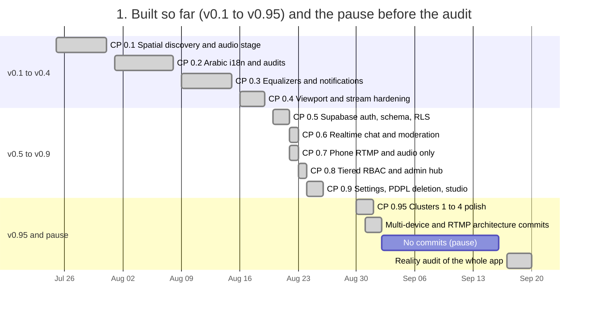
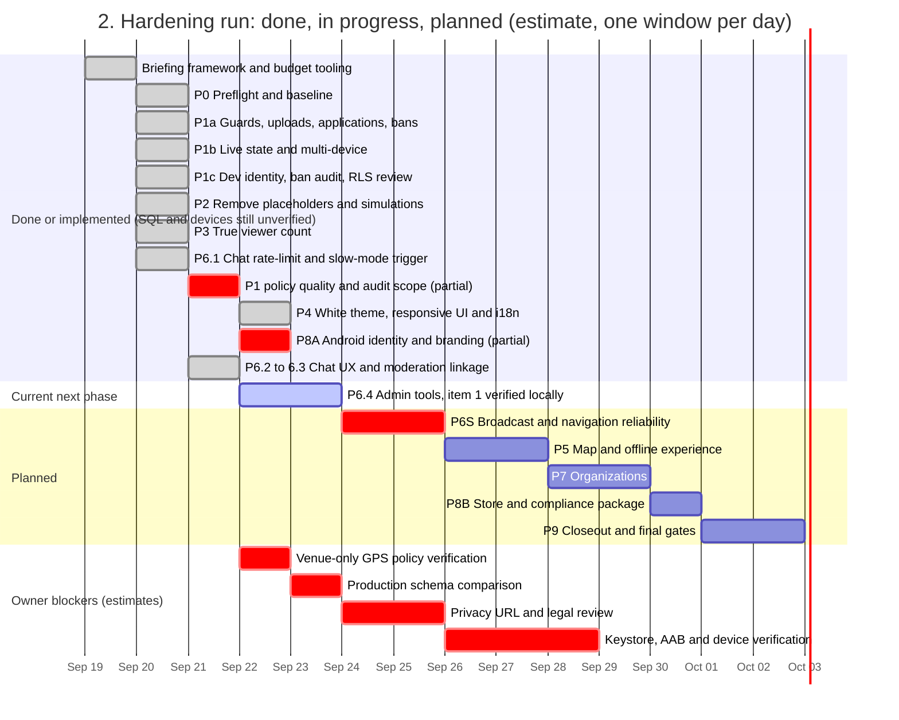
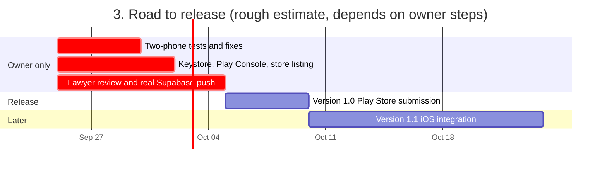

# 🗺️ Streamer App — Evolutionary Master Roadmap

> **Operational Git & Release Protocol:**
> - **Versions:** Major stable working releases of the application.
> - **Checkpoints:** Working snapshots combining multiple phases. The current release brief prohibits agent pushes; the owner controls publication and remote updates.
> - **Phases:** Focused functional features or major architecture edits. **Rule: Each time a Phase ends, make a Git commit.**
> - **Tasks:** Granular, atomic tasks executed step-by-step.

---

## 📅 Roadmap Overview & Version Progression

*Updated 2026-09-23. Sources: git history, the latest RESUME block in `brief/LEDGER.md`, `brief/03_WORK_PLAN.md`, `brief/06_VERIFICATION.md`, recorded analyzer/test evidence, and the current gate report. Future dates are estimates. The app is not release-ready.*







### Where the hardening run stands (2026-09-23)

| Phase | Status | Evidence | Roadmap link |
|---|---|---|---|
| P0 Preflight | Complete | Baseline, brief, tag and protected owner state are recorded. Local SQL execution remains environment-limited. | 1.0.0 |
| P1 Access control, RLS and secrets | Partial | Source, migration and recorded local SQL evidence are present. This audit could not rerun Docker/Supabase; device scenarios, production comparison and release scan remain open. | 1.0.1 |
| P2 Truthful data | Complete | Fresh gates show G1a-e and G5a-c at zero; fabricated production paths were removed. | 1.0.2 |
| P3 Viewer presence | Partial | Server-backed heartbeat/count code and grants are present. Guest, deduplication, expiry and multi-client device scenarios remain unrun. | 1.0.3 |
| P4 Design and responsive UI | Complete to recorded E1/E2 evidence | Scheme A, bundled IBM Plex fonts, white theme, localization and responsive/layout tests are present. No physical-device visual QA. | 1.0.4 |
| P8A Android identity and branding | Partial, complete to available owner inputs | Identity, permissions, launcher, splash, target SDK, 16 KB checks and fail-closed signing are done. No keystore, AAB, release scan or device smoke test. | 1.0.5 |
| P6.1-P6.3 Chat and moderation | Partial | Server rate limits, slow mode, report validation and viewer block policies have local evidence. The client Block action still uses local preferences and needs server sync. | 1.0.6 |
| P6.4 Admin tools | Partial | Directory deletion/session revocation and live end/feed removal have audited backend controls. Flag enforcement exists on the server; client controls, live list, audit/keyword views and cache acceptance remain open. | 1.0.6 |
| P6S Broadcast and navigation reliability | Not started | Physical sender/viewer tests, direct laptop, Local transport, private access, live-media PiP and exit paths remain open. | 1.0.6 |
| P5 Map and offline | Not started | No implementation or evidence yet. | 1.0.7 |
| P7 Organizations | Not started | Co-owner designation, invitations, public organization profile and scoped controls remain open. | 1.0.8 |
| P8B Store and compliance package | Not started | No store package exists. Drafting would not equal legal certification. | 1.0.9 |
| P9 Closeout | Not started | Full re-verification, diff review, final report and release gate remain open. | 1.0.10 |

The latest 2026-09-23 checkpoint passed 464 Flutter tests, `flutter analyze` with 0 issues, and 263 local SQL assertions across 14 files. G6 still flags 528 localization matches; its cause and disposition remain recorded in the brief. Physical streaming and release build evidence remain open. These newer results supersede the older counts below where they differ.

Workflow note, 2026-09-23: the next Claude Opus P6 client run was blocked twice by a missing usage snapshot before code changes. The owner waived Opus metering in `brief/04_BUDGET_PROTOCOL.md` §K. No P6 milestone advanced; the Codex 5% cap remains separate in §J.
---

## 📝 Modification

### 2026-09-21 — Hardening Run Progress: P1c, P2, P3 & P6.1 Completed by Claude Code Opus

**Finding:** Claude Code Opus completed P1c, P2 in full, P3 in full, and the server-side P6.1 chat enforcement slice across two WORK_LIVE sessions (commits `e94fb13`, `d646053`, `8ecba34`, `d83bd4a`, `18d7b82`, `298db4b`, `55948bc`).
- **P1c**: Removed dev identities/emails, fixed missing `is_banned` migration dependency order (`20260920110000`), added server-side live-flag heartbeat expiry, created RLS policy matrix.
- **P2**: Empty catalog boot, VLC & spike removed, mock chat/VOD/Q&A pools deleted, G1b modal sites wired to real actions/share, G5c GADM asset removed, D-07 follows/bookmarks persistent server-side.
- **P3**: Server-backed true presence (`stream_viewers` deny-all, `viewer_heartbeat` + `get_viewer_counts` RPCs, client `ViewerPresenceService`, "—" for unknown, YouTube count separated into studio).
- **P6.1**: Server-side chat flood rate-limit (1.2s floor), slow mode, and chat-off trigger with client refusal handling.

**Effect:** Gates reduced from 16 to 8 failing. The remaining 8 are strictly design/theme/branding/release gates reserved for Astra under 05 D-27. Test suite is 264 passed, analyzer 0 issues. SQL remains UNVERIFIED-STATIC pending Docker installation.

---

### 2026-09-20 — Hardening Run Reconciliation and Gantt Refresh

**Finding:** A full reality audit (2026-09-17) showed that several roadmap items marked complete still rest on simulated data, client-writable privileged columns and hard-coded dev identities. A staged hardening run (phases P0 to P9 in `brief/03_WORK_PLAN.md`) began on 2026-09-20. P0 and most of P1 are committed; the new SQL has not been run because Docker is unavailable, and nothing has been tested on physical devices.

**Effect:** The version gantt was split into three charts (built, hardening run, road to release) and given real dates from git. Version 1.0 checkpoints are not ticked until the matching hardening phase has evidence. The Play Store submission date moved from 2026-09-18 to an estimate of early October.

**Changes Applied:**
- Rebuilt the Overview charts and added a phase status table with gate numbers.
- Corrected the CP 0.7, 0.8, 0.9 and 0.95 dates to the git history.
- Added a status note under Version 1.0.

---

### 2026-08-31 — Live Testing Feedback, Multi-Device Governance & Chat Alert Enhancements

**Finding:** Physical device testing across Android phones and desktop tablets surfaced critical operational findings recorded in `issue_log.md` and `testing_check_list.md`:
1. Fullscreen button was erroneously hidden on audio-only live streams due to viewport overlay condition.
2. In-app Picture-in-Picture mini-player required redesign from full-width bottom bar into a compact, draggable floating card with top-left Mute, top-right Close (`X`), and tap-to-fade controls.
3. Multi-device session collision occurred when logging into the same account across two active phones without device selection prompt.
4. "My Profile" tab was visible to unverified viewers/guests, causing confusion because viewers have no public streamer page.
5. Missing remote database tables (`public.academic_categories`, `public.stream_moderators`) threw `PostgrestException PGRST205` when remote migrations were unapplied.
6. Admins requested an Material icon glyph picker and bilingual script validation for academic categories, plus tag-to-streamer drill-down mapping and in-stream moderator alert thresholds ($3+$ user reports/hides).

**Effect:** Quick fixes are isolated in `To_fix_log.md` for immediate execution. Multi-device session disambiguation, onboarding role gating, tag-to-streamer discovery, and chat moderation alert thresholds are added as formal Phases under Version 1.0.

**Changes Applied:**
- Quick Fix QF-01: Fullscreen button enabled for all stream formats in `live_player_overlay_controls.dart`.
- Quick Fix QF-02: Compact floating card PiP redesign with Mute/Close overlay in `floating_stream_mini_player.dart`.
- Quick Fix QF-03: Suppress "My Profile" tab for viewers/guests in `app_router.dart`.
- Quick Fix QF-04: Graceful `try-catch` fallback for `PGRST205` in `admin_database_service.dart`.
- Quick Fix QF-05: Category script validation and icon picker in `academic_categories_view.dart`.
- Added Checkpoint 1.0.4: Multi-Device Session Conflict & Role Governance.
- Added Checkpoint 1.0.5: Advanced Tag Discovery & Chat Governance Alert Thresholds.

---

### 2026-08-30 — 6-Cluster Execution Restructuring & Architectural Pipeline Grounding

**Finding:** The project expanded across 2 months of rapid development, accumulating 226+ automated tests and reaching v0.9 (Settings Cleanup, Tiered RBAC, and Go-Live Studio). However, 29 specific polish items across player viewports, GIS basemaps, academic taxonomy, live chat moderation, telemetry logging, and mobile responsive layout remained scattered across disparate audit sheets and session notes.

**Effect:** All 29 outstanding deliverables were organized into 6 logical execution clusters (Clusters 1–6) designed to be built in strict 2–3 task increments, paired with rigorous verification rules (`flutter analyze` with zero issues and `flutter test` passing 100% green). Additionally, the 9 Core System Architecture Pipelines were formalized into explicit dataflow specifications.

---

## 🏷️ System Architecture Tracks

To ensure architectural clarity across multi-agent sessions, tasks and checkpoints are categorized under 5 core tracks:

1. `[Core Streaming Track]`: Video/audio playback, polymorphic player adapters (YouTube, RTMP, Local Loopback), audio stage visualizer, and broadcast engines.
2. `[Platform & UI Track]`: Flutter mobile/desktop responsive viewports, typography, i18n localization, floating mini-player, and gesture systems.
3. `[Admin & Governance Track]`: Tiered RBAC (Master Admin, Admin, Permitted Admin), verification queue, audit logging, and platform moderation.
4. `[Backend & Security Track]`: Supabase PostgreSQL schema, Row-Level Security (RLS) policies, Realtime broadcast channels, Auth, and Storage buckets.
5. `[GIS & Spatial Track]`: FlutterMap vector basemaps, marker clustering, Haversine distance computations, and external navigation launchers.

---

## 🏗️ The 9 Core System Architecture Pipelines

```
┌──────────────────────────────────────────────────────────────────────────────────────────────────┐
│                                SYSTEM ARCHITECTURE PIPELINES                                     │
├────────────────────────┬────────────────────────┬────────────────────────┬───────────────────────┤
│ 1. Streamer Abilities  │ 2. Admin Abilities     │ 3. Org Abilities       │ 4. Becoming a         │
│ & Features             │ & Features             │ & Features             │ Streamer/Org Pipeline │
├────────────────────────┼────────────────────────┼────────────────────────┼───────────────────────┤
│ 5. Notifications       │ 6. Starting Stream     │ 7. Starting Stream     │ 8. Starting Stream    │
│ Architecture           │ on Phone Pipeline      │ via OBS Pipeline       │ Locally (Same Wi-Fi)  │
├────────────────────────┴────────────────────────┴────────────────────────┴───────────────────────┤
│ 9. Database Connections & Supabase Schema Architecture                                           │
└──────────────────────────────────────────────────────────────────────────────────────────────────┘
```

### Pipeline 1: Streamer Abilities and Content Management
- **File Reference:** `lib/features/live_stream/services/rtmp_publish_engine.dart`, `lib/features/profile/presentation/widgets/streamer_editor_sheet.dart`
- **Capabilities:** Phone camera RTMP broadcast, OBS ingest key generation, audio-only broadcasting, VOD publishing, live chat moderation, moderator appointment, custom broadcast placeholder cards.

### Pipeline 2: Super Admin Platform Governance
- **File Reference:** `lib/features/admin/presentation/admin_hub_screen.dart`, `lib/core/services/admin_database_service.dart`
- **Capabilities:** Broadcaster verification queue, category and tag CRUD, chat report triage, platform-wide email bans, custom placeholder approvals, map visibility toggles.

### Pipeline 3: Organization & Multi-Campus Management
- **File Reference:** `lib/features/admin/presentation/widgets/org_management_view.dart`, `lib/features/profile/presentation/widgets/join_org_modal_sheet.dart`
- **Capabilities:** Organization profile editing, branch campus map pinpointing, speaker roster management, affiliation request approvals, org-scoped live moderation.

### Pipeline 4: 5-Step Streamer & Organization Application Wizard
- **File Reference:** `lib/features/auth/presentation/screens/streamer_apply_screen.dart`
- **Capabilities:** Step 1 Broadcaster Identity $\rightarrow$ Step 2 Profile Media & Branding $\rightarrow$ Step 3 Channel Info & Academic Fields $\rightarrow$ Step 4 Venue Pinpoint & Contact $\rightarrow$ Step 5 Terms & Charter submission.

### Pipeline 5: Real-Time Notifications & Heartbeat Architecture
- **File Reference:** `lib/core/services/notifications/notification_service.dart`, `lib/core/services/notifications/notification_models.dart`
- **Capabilities:** High-priority push alerts, broadcast start alerts to followers, admin approval notifications, 10-minute rate limiter, and interactive toast overlay.

### Pipeline 6: Phone Camera Broadcast Pipeline
- **File Reference:** `lib/features/live_stream/presentation/screens/phone_broadcast_screen.dart`
- **Capabilities:** Camera/microphone capture, RTMP publishing, YouTube live integration, auto-reconnect on network jitter, integrated live chat and studio controls overlay.

### Pipeline 7: OBS Studio & External Ingest Pipeline
- **File Reference:** `lib/features/live_stream/presentation/widgets/rtmp_ip_dialog.dart`
- **Capabilities:** Stream key generation, RTMP server ingest endpoint, stream privacy whitelist enforcement, broadcast session database logging.

### Pipeline 8: Local Wi-Fi Network Streaming Pipeline
- **File Reference:** `lib/features/live_stream/presentation/widgets/rtmp_ip_dialog.dart`
- **Capabilities:** Local IP configuration, low-latency loopback, local auditorium distribution on the same Wi-Fi network without external cloud egress.

### Pipeline 9: Supabase Database Schema & Realtime Replication
- **File Reference:** `supabase/migrations/`
- **Capabilities:** PostgreSQL RLS policies, Realtime chat message replication, Supabase Storage buckets, and migration schema integrity.

---

## 🏛️ Version 0.1 — Initial Prototype & Spatial Discovery Engine *(Completed)*

### Checkpoint 0.1: Spatial Discovery, Vector GIS & Audio Stage Prototype `[GIS & Spatial Track]`
*(Snapshot completed · Git Push Baseline)*

#### Phase 0.1.1: Flutter Mobile Foundation & Theming
- [x] Task 0.1.1.1: Establish dark theme palette (`#0C0D12`, `#1E293B`, `#22C55E`, `#3B82F6`, `#EF4444`) with high-contrast slate cards.
- [x] Task 0.1.1.2: Configure `go_router` declarative navigation with root and shell routes.

#### Phase 0.1.2: Spatial Map Discovery & Vector GIS
- [x] Task 0.1.2.1: Integrate `flutter_map` with interactive marker clustering and location bounds for Eastern Province / Saudi Arabia.
- [x] Task 0.1.2.2: Implement Haversine distance algorithm to calculate proximity between user coordinates and lecture venues.

#### Phase 0.1.3: Audio-Stage Multi-Speaker Prototype
- [x] Task 0.1.3.1: Build `LiveAudioStageMultiSpeaker` rendering active speaker avatar with voice ripple animations.
- [x] Task 0.1.3.2: Implement `YouTubePlayerAdapter` embedding live streams via iframe with fallback listeners.

---

## 🌍 Version 0.2 — RTL Arabic Localization & NLP Engine *(Completed)*

### Checkpoint 0.2: Full Arabic Localization & Security Audits `[Platform & UI Track]`
*(Snapshot completed · Git Push Baseline)*

#### Phase 0.2.1: Arabic Localization & RTL Layout Hardening
- [x] Task 0.2.1.1: Integrate `easy_localization` with complete `ar.json` and `en.json` asset dictionaries.
- [x] Task 0.2.1.2: Apply RTL directional padding, symmetrical icon mirroring, and Arabic typography scaling across all screens.

#### Phase 0.2.2: Automated Bidirectional Transliteration Engine
- [x] Task 0.2.2.1: Implement `AcademicLexiconService` for automated Arabic-English transliteration of scholar titles, universities, and lecture topics.
- [x] Task 0.2.2.2: Build lexicon dictionary parity checks ensuring consistent spelling of academic disciplines.

#### Phase 0.2.3: Comprehensive Security, User Flow & Performance Audits
- [x] Task 0.2.3.1: Author security audit reports in `doc/Audit/` analyzing authentication risks, RLS boundaries, and PII exposure.
- [x] Task 0.2.3.2: Benchmark widget rebuild trees and frame render times on mid-range Android hardware.

---

## 🔔 Version 0.3 — Sensory Polish & Notification Engine *(Completed)*

### Checkpoint 0.3: Dynamic Audio Equalizer & Notification System `[Platform & UI Track]`
*(Snapshot completed · Git Push Baseline)*

#### Phase 0.3.1: Humanized Notification System & Rate Limiting
- [x] Task 0.3.1.1: Implement `NotificationService` supporting high-priority broadcast alerts, system announcements, and application status updates.
- [x] Task 0.3.1.2: Implement a 10-minute rate limiter preventing spamming users with repetitive notification sounds.

#### Phase 0.3.2: Interactive Toast Overlay & Notification Center
- [x] Task 0.3.2.1: Build `InteractiveToastOverlay` with swipe-to-dismiss gestures and tap-to-navigate action handlers.
- [x] Task 0.3.2.2: Build `NotificationCenterSheet` with category filtering chips (Streams, Governance, System) and mark-all-read.

#### Phase 0.3.3: Dynamic Audio Visualizer & Speaking Ripples
- [x] Task 0.3.3.1: Build animated equalizer frequency bars bound to audio stream playback state.
- [x] Task 0.3.3.2: Implement pulsing radial glow behind active speaker avatar.

---

## 🛡️ Version 0.4 — Zero-Crash Fallback & Media Stream Hardening *(Completed)*

### Checkpoint 0.4: Viewport Sizing & Audio Stream Stability `[Core Streaming Track]`
*(Snapshot completed · Git Push Baseline)*

#### Phase 0.4.1: Viewport Sizing & 16:9 Aspect Ratio Containment
- [x] Task 0.4.1.1: Enforce strict 16:9 aspect ratio containment on video viewport, eliminating layout assertion errors.
- [x] Task 0.4.1.2: Fix equalizer animation jitter using static bounding containers.

#### Phase 0.4.2: WebView Background Audio Stability & Wakelock
- [x] Task 0.4.2.1: Configure HTML5 audio autoplay policies (`playsinline=1`, `enablejsapi=1`) preventing Android WebView from suspending background audio.
- [x] Task 0.4.2.2: Add `WakelockPlus` management preventing device sleep during live audio broadcasts.

#### Phase 0.4.3: Verified Fallback Stream Routing
- [x] Task 0.4.3.1: Replace expired live stream URLs with verified tilawah stream endpoints.
- [x] Task 0.4.3.2: Implement zero-crash state transitions falling back gracefully when primary stream disconnects.

---

## ⚡ Version 0.5 — Backend Foundation & Supabase RLS Migration *(Completed)*

### Checkpoint 0.5.1: Supabase Provisioning & Authentication Integration `[Backend & Security Track]`
*(Snapshot completed · Git Push Baseline)*

#### Phase 0.5.1.1: Supabase Client Provisioning
- [x] Task 0.5.1.1.1: Add `supabase_flutter` dependency and configure local `--dart-define` credential template.
- [x] Task 0.5.1.1.2: Initialize Supabase client in `main.dart` with offline failure resilience.

#### Phase 0.5.1.2: Supabase Auth & Google OAuth Migration
- [x] Task 0.5.1.2.1: Migrate `GoogleAuthService` from mock local flags to Supabase Auth Google provider.
- [x] Task 0.5.1.2.2: Handle OAuth deep-link callback redirects in `AppRouter` (`/login-callback`).

---

### Checkpoint 0.5.2: Database Migration & Row-Level Security `[Backend & Security Track]`
*(Snapshot completed · Git Push Baseline)*

#### Phase 0.5.2.1: PostgreSQL Schema Migration
- [x] Task 0.5.2.1.1: Author migration `20260820000000_core_schema.sql` creating `profiles`, `streamers`, `streams`, `organizations`, `applications`.
- [x] Task 0.5.2.1.2: Establish foreign key relationships, timestamps, and indexes.

#### Phase 0.5.2.2: Row-Level Security (RLS) Policies
- [x] Task 0.5.2.2.1: Configure RLS policies restricting profile mutation to record owners.
- [x] Task 0.5.2.2.2: Restrict application review access to verified administrator roles.

---

### Checkpoint 0.5.3: AppProvider State Optimization & Scoped Selectors `[Platform & UI Track]`
*(Snapshot completed · Git Push Baseline)*

#### Phase 0.5.3.1: Scoped State Selectors
- [x] Task 0.5.3.1.1: Refactor `AppProvider` to read auth, role, and streamer state from Supabase auth session.
- [x] Task 0.5.3.1.2: Replace broad `context.watch` with granular `context.select` across all primary screens, eliminating redundant widget rebuilds.

#### Phase 0.5.3.2: AdminDatabaseService Migration
- [x] Task 0.5.3.2.1: Migrate `AdminDatabaseService` from `SharedPreferences` to direct Supabase PostgreSQL queries.
- [x] Task 0.5.3.2.2: Add optimistic offline caching for verified streamers list.

---

## 💬 Version 0.6 — Live Chat & Realtime Engagement *(Completed)*

### Checkpoint 0.6.1: Realtime Chat Schema & Broadcast Channels `[Core Streaming Track]`
*(Snapshot completed · Git Push Baseline)*

#### Phase 0.6.1.1: Chat Schema & Realtime Subscription
- [x] Task 0.6.1.1.1: Author migration creating `chat_messages` table with `stream_id`, `sender_id`, `message`, `created_at`.
- [x] Task 0.6.1.1.2: Build `LiveChatController` connecting to Supabase Realtime broadcast channels with automatic reconnection.

#### Phase 0.6.1.2: Floating Reactions & Role Badges
- [x] Task 0.6.1.2.1: Build `FloatingReactionsOverlay` rendering animated floating emojis triggered across viewers.
- [x] Task 0.6.1.2.2: Render sender role badges (`Scholar`, `Admin`, `Moderator`, `Student`) on chat message bubbles.

---

### Checkpoint 0.6.2: Chat Moderation, User Blocking & Ghost Fallback `[Admin & Governance Track]`
*(Snapshot completed · Git Push Baseline)*

#### Phase 0.6.2.1: Server-Enforced Moderation Controls
- [x] Task 0.6.2.1.1: Implement streamer and admin message deletion and user muting enforced by server RLS.
- [x] Task 0.6.2.1.2: Add reporting and user blocking actions stored in `chat_reports` and `blocked_users`.

#### Phase 0.6.2.2: Ghost-Chat Offline Simulation
- [x] Task 0.6.2.2.1: Build `GhostCommentPool` simulating realistic audience questions when offline or in demonstration mode.

---

## 📱 Version 0.7 — Mobile Streaming & Phone Broadcast Studio *(Completed)*

### Checkpoint 0.7.1: Hardware Capture & RTMP Publishing `[Core Streaming Track]`
*(Snapshot completed · Git Push Baseline)*

#### Phase 0.7.1.1: Camera & Microphone Permissions & Capture
- [x] Task 0.7.1.1.1: Configure Android camera and audio capture permissions in `AndroidManifest.xml`.
- [x] Task 0.7.1.1.2: Build `RtmpPublishEngine` leveraging native platform channels for hardware video encoding.

#### Phase 0.7.1.2: RTMP Streaming to YouTube Live
- [x] Task 0.7.1.2.1: Implement RTMP stream publishing pipeline accepting YouTube RTMP server endpoint and stream key.
- [x] Task 0.7.1.2.2: Build `PhoneBroadcastScreen` with live duration clock, bitrate monitor, and resolution selector.

---

### Checkpoint 0.7.2: Audio-Only Broadcasting & Foreground Service `[Core Streaming Track]`
*(Snapshot completed · Git Push Baseline)*

#### Phase 0.7.2.1: Audio-Only Phone Broadcasting
- [x] Task 0.7.2.1.1: Implement audio-only broadcast toggle swapping camera frames for a branded static audio card.
- [x] Task 0.7.2.1.2: Tune AAC audio encoder to 128 kbps @ 44.1 kHz for clear vocal transmission.

#### Phase 0.7.2.2: Background Foreground Service
- [x] Task 0.7.2.2.1: Bind broadcast engine to an Android Foreground Service preventing OS process termination when screen locks.
- [x] Task 0.7.2.2.2: Add connection drop detection with automated 5-second reconnect retry sequence.

---

## 👑 Version 0.8 — Tiered RBAC & Administrative Governance *(Completed)*

### Checkpoint 0.8.1: Role Hierarchy Schema & Granular Permissions `[Admin & Governance Track]`
*(Snapshot completed · Git Push Baseline)*

#### Phase 0.8.1.1: Tiered Role Hierarchy Schema
- [x] Task 0.8.1.1.1: Author migration `user_roles` establishing Master Admin, Admin, and Permitted Admin hierarchy.
- [x] Task 0.8.1.1.2: Configure RLS ensuring only Master Admins can promote other Master Admins or Admins.

#### Phase 0.8.1.2: Granular Capability Grants
- [x] Task 0.8.1.2.1: Author `user_permissions` table for fine-grained capability checkboxes (`edit_terms`, `moderate_chat`, `manage_taxonomy`).
- [x] Task 0.8.1.2.2: Auto-derive Permitted Admin role from organization ownership in `organizations` table.

---

### Checkpoint 0.8.2: Admin Hub Modernization & Chat Triage Queue `[Admin & Governance Track]`
*(Snapshot completed · Git Push Baseline)*

#### Phase 0.8.2.1: Admin Hub Screen & Batch Actions
- [x] Task 0.8.2.1.1: Refactor `AdminHubScreen` enforcing tiered role authorization via Supabase RPC functions.
- [x] Task 0.8.2.1.2: Implement batch multi-selection in broadcaster verification queue for bulk approvals and rejections.

#### Phase 0.8.2.2: Platform-Wide Chat Moderation Dashboard
- [x] Task 0.8.2.2.1: Build `ChatModerationView` in Admin Hub displaying real-time stream of reported chat messages.
- [x] Task 0.8.2.2.2: Implement action handlers: `Dismiss Report`, `Delete Message`, `Mute User`, and `Platform Ban`.

---

## ⚙️ Version 0.9 — Settings Cleanup, Legal Compliance & Broadcaster Studio *(Completed)*

### Checkpoint 0.9.1: Role-Aware Settings & Saudi PDPL Compliance `[Platform & UI Track]`
*(Snapshot completed · Git Push Baseline)*

#### Phase 0.9.1.1: Role-Aware Settings Redesign
- [x] Task 0.9.1.1.1: Modularize `SettingsScreen` into distinct cards adapting dynamically to Viewer, Streamer, or Admin roles.
- [x] Task 0.9.1.1.2: Relocate experimental and developer toggles from user settings to Admin-only surface.

#### Phase 0.9.1.2: In-App Account & Data Deletion
- [x] Task 0.9.1.2.1: Build in-app user account and data deletion pipeline satisfying Saudi PDPL and App Store guidelines.
- [x] Task 0.9.1.2.2: Build user data export generator downloading JSON archive of profile and chat records.

---

### Checkpoint 0.9.2: Unified Broadcaster Studio & Private Streaming `[Core Streaming Track]`
*(Snapshot completed · Git Push Baseline)*

#### Phase 0.9.2.1: Unified Broadcaster Studio Bottom Sheet
- [x] Task 0.9.2.1.1: Build `LiveBroadcasterStudioSheet` supporting three broadcast modes: OBS Studio Ingest, Phone Camera, and Local Wi-Fi.
- [x] Task 0.9.2.1.2: Build `PhoneToYouTubeLiveService` simulating automated YouTube broadcast creation.

#### Phase 0.9.2.2: Private Stream Access Whitelist
- [x] Task 0.9.2.2.1: Implement private stream visibility mode with username/handle whitelist input chips.
- [x] Task 0.9.2.2.2: Enforce private stream access gating on stream room entry.

---

## 💎 Version 0.95 — Viewport, GIS, Taxonomy & Moderation Deep Polish *(Completed)*

### Checkpoint 0.95.1: Live Stream Player, GIS Basemaps & YouTube Fallback (Clusters 1 & 2) `[Core Streaming Track]`
*(Snapshot completed · Git Push Baseline)*

#### Phase 0.95.1.1: Audio Stability & Streamer Silence Indicator (Task 1)
- [x] Task 0.95.1.1.1: Enable `WakelockPlus` across broadcast lifecycle and force `autoPlay: true` on audio streams.
- [x] Task 0.95.1.1.2: Add animated amber pill badge in player overlay indicating streamer microphone mute / silent mode.
- [x] Task 0.95.1.1.3: Bind voice ripple animations strictly to active playing audio state.

#### Phase 0.95.1.2: Resolution Presets & Fullscreen Auto-Rotate (Tasks 2 & 3)
- [x] Task 0.95.1.2.1: Replace mock engine strings with actual resolution presets (`Auto`, `1080p`, `720p`, `480p`, `360p`) and hide on audio-only streams.
- [x] Task 0.95.1.2.2: Implement one-way fullscreen exit unlocking device orientation freedom without force-snapping to portrait.

#### Phase 0.95.1.3: Placeholders, Resilient YouTube Launcher & Floating Mini-Player (Tasks 4–6)
- [x] Task 0.95.1.3.1: Build `StreamStatePlaceholderOverlay` unifying branded non-live stream states.
- [x] Task 0.95.1.3.2: Configure Android `<queries>` and multi-tier fallback launcher for "Open in YouTube" button.
- [x] Task 0.95.1.3.3: Redesign `FloatingStreamMiniPlayer` with responsive 16:9 thumbnail and flexible title text, resolving RenderFlex overflow.

#### Phase 0.95.1.4: Spatial Map Basemaps, White Disc Markers & Google Maps (Tasks 7–9)
- [x] Task 0.95.1.4.1: Update `SpatialMapScreen` tile URLs to reliable OpenStreetMap and Carto Positron basemaps without API key errors.
- [x] Task 0.95.1.4.2: Update avatar background discs in map markers to clean white (`Colors.white`).
- [x] Task 0.95.1.4.3: Implement one-click Google Maps navigation launcher with exact destination coordinates.

---

### Checkpoint 0.95.2: Categories, Tags, Moderation & Permissions (Clusters 3 & 4) `[Admin & Governance Track]`
*(Snapshot completed · Git Push Baseline)*

#### Phase 0.95.2.1: Academic Categories & Tag Moderation Sync (Tasks 10–12)
- [x] Task 0.95.2.1.1: Define `AcademicCategoryModel` and sync active category filter across Discovery Feed, Filter Sheet, and Spatial Map dropdown.
- [x] Task 0.95.2.1.2: Build Academic Categories CRUD management tab in Admin Hub with bilingual (EN/AR) editing and DB migration.
- [x] Task 0.95.2.1.3: Build Tag Moderation Manager in Admin Hub with approve, merge, and blacklist actions.

#### Phase 0.95.2.2: Chat Actions, Moderation Queue & Moderator Badges (Tasks 13–15)
- [x] Task 0.95.2.2.1: Enable long-press message actions (Edit/Delete own, Report/Hide others) in live chat.
- [x] Task 0.95.2.2.2: Wire chat reports to live moderation triage queue in Admin Hub.
- [x] Task 0.95.2.2.3: Add `ChatSenderBadge.moderator` (`🛡️ MOD`) badge and moderator delegation audit table.

#### Phase 0.95.2.3: Account Bans, Chat History Purge & Map Removal (Tasks 16–18)
- [x] Task 0.95.2.3.1: Build Banned Accounts manager in Admin Hub and add global `/account-banned` router guard.
- [x] Task 0.95.2.3.2: Add Chat History & Privacy purge options in Settings ("Delete All My Messages", "Clear Messages by Stream").
- [x] Task 0.95.2.3.3: Add "Hide from Map" moderation toggle in Streamers Registry.

---
## Version 1.0 — hardening and release

> Status on 2026-09-23: the P6 safety backend now includes audited account/session actions, live end/feed removal, chat blocks, report validation and global flags. Client wiring and admin views remain, so P6S has not started. The latest checkpoint passed 464 Flutter tests and 263 local SQL assertions; G6 remains a known scan failure. Physical streaming, signing and other release gates remain open. The app is not release-ready.

### Checkpoint 1.0.0: P0 hardening foundation `[Backend & Security Track]`

#### Phase 1.0.0.1: Preflight and evidence baseline

- [x] Task 1.0.0.1.1: Create the hardening brief, ledger, budget rules and verification gates.
- [x] Task 1.0.0.1.2: Record the baseline analyzer, test and gate results.
- [/] Task 1.0.0.1.3: Probe Docker and write the local SQL tests. The 48-migration chain and 179 pgTAP plan counts are recorded, but this audit environment could not rerun Docker/Supabase.
- [x] Task 1.0.0.1.4: Protect owner stashes and keep production Supabase changes out of the agent run.

### Checkpoint 1.0.1: P1 access control, RLS and secrets `[Backend & Security Track]`

#### Phase 1.0.1.1: privileged-column and storage guards

- [/] Task 1.0.1.1.1: Guard privileged profile and organization columns against ordinary client writes. Source and recorded local SQL evidence exist; this audit could not rerun the database.
- [/] Task 1.0.1.1.2: Add owner-scoped streamer and organization asset policies and upload paths. Source and recorded local SQL evidence exist; production comparison and device evidence remain open.
- [/] Task 1.0.1.1.3: Force application and affiliation review fields to server-controlled values. Source and recorded local SQL evidence exist; this audit could not rerun the database.
- [/] Task 1.0.1.1.4: Enforce ban checks on protected writes. The helper and policies are present; pgTAP evidence is recorded but not rerun in this audit.

#### Phase 1.0.1.2: guarded live state and multi-device sessions

- [/] Task 1.0.1.2.1: Restrict live-state changes to verified broadcasters, permitted organization members and valid stream IDs. Source and recorded SQL evidence exist; runtime probes remain open.
- [/] Task 1.0.1.2.2: Enforce one primary broadcaster device and deny viewers a broadcaster-device conflict. The server path exists; physical-device and runtime probes remain open.
- [/] Task 1.0.1.2.3: Add device heartbeats, displacement handling and stale-primary recovery. The server path exists; physical-device and runtime probes remain open.
- [/] Task 1.0.1.2.4: Expire stale live flags server-side. The migration is present; scheduled execution and runtime probes remain open.
- [/] Task 1.0.1.2.5: Verify two-phone conflict, transfer, silent-primary recovery and audio-only scenarios on physical devices.

#### Phase 1.0.1.3: private mode, development cleanup and navigation

- [x] Task 1.0.1.3.1: Disable private streaming behind the feature flag.
- [x] Task 1.0.1.3.2: Hide debug testing tools and simulator toggles outside debug mode.
- [x] Task 1.0.1.3.3: Restrict embedded web navigation to approved YouTube hosts without changing ADR-006 embed settings.
- [/] Task 1.0.1.3.4: Confirm the behavior on a real device and with the local database probes. No emulator or physical-device run exists.

#### Phase 1.0.1.4: policy quality and audit scope

- [x] Task 1.0.1.4.1: Write the table-by-table access matrix in `supabase/tests/policy_matrix.md`.
- [x] Task 1.0.1.4.2: Split the remaining loose `for all` policies into named per-command policies. Static gate and recorded local SQL evidence support completion.
- [x] Task 1.0.1.4.3: Add explicit function execute grants, view security-invoker checks and deny-all table intent comments. Source and recorded policy-matrix evidence support completion.
- [x] Task 1.0.1.4.4: Review storage buckets, realtime publication tables and Data API schema exposure. The review and matrix are recorded; production comparison remains open.
- [x] Task 1.0.1.4.5: Restrict `log_audit_event` to the correct organization scope. The audit re-read the guard directly and confirmed the organization check.
- [/] Task 1.0.1.4.6: Run the RLS attack and positive probes against local Supabase. The probes are written and prior local results are recorded, but this audit could not rerun them.

#### Phase 1.0.1.5: secrets and release-artifact security

- [x] Task 1.0.1.5.1: Keep service-role keys, database passwords, keystores and local define files out of the repository.
- [x] Task 1.0.1.5.2: Complete ignore rules, runtime local-key loading and the security documentation. The audit confirmed the source and documented setup.
- [/] Task 1.0.1.5.3: Build the release AAB and run `scan_build_secrets.mjs`. P8A's fail-closed signing path is complete, but the owner has not supplied the keystore and no AAB or release scan exists.

### Checkpoint 1.0.2: P2 truthful data and real actions `[Core Streaming Track]`

#### Phase 1.0.2.1: remove production simulations

- [x] Task 1.0.2.1.1: Start the app with an empty catalog and keep fixtures under `project/test/fixtures/`.
- [x] Task 1.0.2.1.2: Remove simulated chat, VOD, Q&A, audience, venue and viewer-count data from production paths.
- [x] Task 1.0.2.1.3: Remove the RTMP spike, VLC path, simulated services and fake broadcast identifiers.
- [x] Task 1.0.2.1.4: Remove fabricated avatars, verification, coordinates and fallback YouTube IDs.
- [x] Task 1.0.2.1.5: Remove the GADM asset while preserving the real custom placeholder-card feature.

#### Phase 1.0.2.2: real user actions and media controls

- [x] Task 1.0.2.2.1: Persist follows and bookmarks through Supabase with own-row RLS.
- [x] Task 1.0.2.2.2: Replace placeholder modal sites with bookmark and share actions, then remove the unused modal.
- [x] Task 1.0.2.2.3: Wire raise-hand to the existing reaction channel and keep RSVP disabled behind its flag.
- [x] Task 1.0.2.2.4: Verify play, pause and mute against the real iframe controller or keep unavailable actions hidden. The hardening pass removed simulated controls and kept unavailable actions out of production paths.

### Checkpoint 1.0.3: P3 true viewer presence `[Backend & Security Track]`

#### Phase 1.0.3.1: server-backed viewer counts

- [/] Task 1.0.3.1.1: Add deny-all `stream_viewers` storage and the `viewer_heartbeat` and `get_viewer_counts` RPCs. Source and grants are present; SQL runtime evidence is recorded but not rerun here.
- [/] Task 1.0.3.1.2: Add foreground-only client heartbeats and batched feed polling. The client path exists; guest, expiry and multi-client probes remain open.
- [x] Task 1.0.3.1.3: Display `—` for unknown counts and never invent a viewer number.
- [x] Task 1.0.3.1.4: Keep the YouTube concurrent count separate and label it "on YouTube" in the studio.
- [/] Task 1.0.3.1.5: Run the guest, signed-in, deduplication, expiry and direct-select-denial probes against local Supabase and devices. The required scenarios remain unrun.

### Checkpoint 1.0.4: P4 design and responsive app pass `[Platform & UI Track]`

#### Phase 1.0.4.1: design scheme, theme and responsive layout

- [x] Task 1.0.4.1.1: Select design scheme A, B or C and record `DESIGN_CHOICE`.
- [x] Task 1.0.4.1.2: Implement the selected white theme, semantic tokens, typography, gradients, spacing and contrast tests.
- [x] Task 1.0.4.1.3: Remove decorative emoji, migrate required strings to Arabic/English catalogs and complete the responsive sweep. G6's 505 matches are translated calls, not untranslated literals.
- [x] Task 1.0.4.1.4: Refactor Settings, Admin, Live and Onboarding layouts for phone, tablet, landscape, LTR and RTL. Recorded layout evidence is green; device visual QA remains open.

#### Phase 1.0.4.2: onboarding and first-run flow

- [x] Task 1.0.4.2.1: Build the first-run tour for discovery, live viewing and broadcaster studio.
- [x] Task 1.0.4.2.2: Persist onboarding completion and keep role routing truthful.

### Checkpoint 1.0.5: P8A Android release identity and branding `[Platform & UI Track]`

#### Phase 1.0.5.1: app identity, icon and release blockers

- [x] Task 1.0.5.1.1: Set the final application ID, app names, redirect scheme and package identity from the owner inputs. The audit confirmed the namespace and identity wiring.
- [x] Task 1.0.5.1.2: Create the selected logo, launcher icon, splash and store icon. Debug APK assets were rendered and inspected.
- [x] Task 1.0.5.1.3: Remove unnecessary permissions and verify the required Android target and native library alignment. Target SDK 36 and 16 KB alignment checks are recorded.
- [/] Task 1.0.5.1.4: Create the release AAB, smoke-test it, scan it for secrets and record the result. Signing correctly fails closed because the owner has not supplied a keystore and `key.properties`.

### Checkpoint 1.0.6: P6 chat, moderation and admin `[Admin & Governance Track]`

#### Phase 1.0.6.1: chat client and moderation UX

- [x] Task 1.0.6.1.1: Enforce the 1.2-second message floor, slow mode and chat-off state on the server.
- [/] Task 1.0.6.1.2: Complete Arabic-aware keyword normalization and report-reason validation. Arabic normalization and server validation of new report codes are implemented; verify the client reason choices against the server list.
- [/] Task 1.0.6.1.3: Add guest read-only mode, muted/slow/offline/banned composer states, retry behavior and the report/block action sheet. The backend block policy exists; the client Block action still needs server persistence and synchronization.

#### Phase 1.0.6.2: live moderation linkage

- [x] Task 1.0.6.2.1: Deliver reports to the admin queue live and reflect delete/mute actions in the room.
- [x] Task 1.0.6.2.2: Audit every moderation action with the corrected organization scope.

#### Phase 1.0.6.3: admin tools

- [/] Task 1.0.6.3.1: Directory actions and device reads passed 33 local SQL assertions in `1832b3e`. Account deletion and Auth-session revocation now have locally verified, audited backend actions in `4f1dbda`; real Auth HTTP and storage cases remain unverified.
- [/] Task 1.0.6.3.2: Audited live end/feed removal works from the directory against app state. A dedicated live list/count view and physical broadcaster reaction remain open; the action does not stop external YouTube ingest.
- [ ] Task 1.0.6.3.3: Add the audit-log viewer and keyword manager.
- [/] Task 1.0.6.3.4: Server-enforced chat/registration flags exist. Build admin and availability UI, then verify deleted-account cache invalidation beyond the directory.
- [ ] Task 1.0.6.3.5: Complete the tag explorer and broadcaster mapping.

### Checkpoint 1.0.7: P5 map and offline experience `[GIS & Spatial Track]`

#### Phase 1.0.7.1: connectivity and offline data

- [ ] Task 1.0.7.1.1: Add debounced connectivity and reachability state.
- [ ] Task 1.0.7.1.2: Cache the last good catalog with a version and timestamp.
- [ ] Task 1.0.7.1.3: Add offline banners, cached-card state, disabled-action explanations and live-room recovery.

#### Phase 1.0.7.2: map data and licensing

- [ ] Task 1.0.7.2.1: Choose and test the permitted offline map strategy with attribution and cache controls.
- [ ] Task 1.0.7.2.2: Add Saudi bounds, presets, clustering, provider-backed search and native directions.
- [ ] Task 1.0.7.2.3: Record map licensing and remove any remaining disallowed map assets.

### Checkpoint 1.0.8: P7 organizations `[Admin & Governance Track]`

#### Phase 1.0.8.1: organization roles and public profiles

- [ ] Task 1.0.8.1.1: Add owner/co-owner role designation, invitations, expiry, removal and permission enforcement.
- [ ] Task 1.0.8.1.2: Add the public organization profile with real venues, branches, roster and live streams.
- [ ] Task 1.0.8.1.3: Add organization admin member, venue and audit controls.
- [ ] Task 1.0.8.1.4: Update the organization specification and ADR-007.

### Checkpoint 1.0.9: P8B store and Saudi-compliance package `[Backend & Security Track]`

#### Phase 1.0.9.1: store documentation and data rights

- [ ] Task 1.0.9.1.1: Draft truthful Data Safety, permissions, foreground-service and UGC-moderation documents.
- [ ] Task 1.0.9.1.2: Extend data export to every user-linked table and verify consent withdrawal.
- [ ] Task 1.0.9.1.3: Draft Arabic/English listing text and mark all legal claims for counsel review.
- [ ] Task 1.0.9.1.4: Prepare the PDPL, CST/GCAM, minors, retention and cross-border questions for a lawyer.

### Checkpoint 1.0.10: P9 final verification and release gate `[Backend & Security Track]`

#### Phase 1.0.10.1: closeout

- [ ] Task 1.0.10.1.1: Run analyzer, full tests, gates, layout sweep, local SQL probes and the physical-device scenarios.
- [ ] Task 1.0.10.1.2: Review the full hardening diff for secrets, runtime files and unintended changes.
- [ ] Task 1.0.10.1.3: Update status, decisions, ADRs, the final report and owner action list.
- [ ] Task 1.0.10.1.4: Mark Version 1.0 complete only after the release AAB, SQL evidence, device evidence, store package and owner/legal approvals are present.

### Version 1.0 checkpoint map

| Checkpoint | Current status | Evidence or open work |
|---|---|---|
| 1.0.0 P0 hardening foundation | Partial | The brief and baseline are complete. Local SQL runtime evidence could not be rerun in this audit. |
| 1.0.1 P1 access control, RLS and secrets | Partial | Source and recorded local evidence are present. Production comparison, device scenarios and the release scan remain open. |
| 1.0.2 P2 truthful data and real actions | Complete to gate evidence | Production simulations were removed and real actions were wired. No device or production-database run exists. |
| 1.0.3 P3 true viewer presence | Partial | Presence service, count RPCs and grants are present. SQL runtime, expiry and multi-client device probes remain open. |
| 1.0.4 P4 design and responsive app pass | Complete to recorded E1/E2 evidence | Scheme A, white theme, fonts, localization and responsive tests are complete. Physical-device visual QA remains open. |
| 1.0.5 P8A Android release identity and branding | Partial, complete to available inputs | Identity, assets, permissions, target SDK, 16 KB checks and fail-closed signing are complete. No keystore, AAB, release scan or device smoke test exists. |
| 1.0.6 P6 chat, moderation and admin | Partial | Local safety backend passed 263 SQL assertions. Client blocks/flags, dedicated live list, audit/keyword views and deleted-account cache acceptance remain open. |
| 1.0.7 P5 map and offline experience | Not started | Connectivity, cache, offline map and licensing work remain open. |
| 1.0.8 P7 organizations | Not started | Co-owner roles, invitations, public organization profile and audit scope remain open. |
| 1.0.9 P8B store and Saudi-compliance package | Not started | Store documents, data export, counsel questions and listing draft remain open. |
| 1.0.10 P9 final verification and release gate | Not started | Full re-verification, gates, SQL, devices, release diff, store package and owner approvals remain open. |

### Release gate

Version 1.0 is not release-ready. Finish the remaining P6 work, then P6S broadcast, access, playback and exit-path reliability before P5, P7, P8B and P9. The owner has decided that exact coordinates are public venue coordinates for map navigation, not home addresses. The release track still needs venue-only data-entry verification, a production schema comparison before any owner-approved `db push`, physical-device verification, an owner-supplied keystore and signed AAB, and the P8B legal/store package. Do not mark the version complete from static code review or widget tests alone.

---

## 🍏 Version 1.1 — iOS Platform Integration & App Store Deployment *(Upcoming)*

### Checkpoint 1.1.1: iOS Platform Bring-Up & Apple Sign-In `[Platform & UI Track]`
*Rule: Upon completion of Checkpoint 1.1.1, push snapshot to GitHub.*

#### Phase 1.1.1.1: iOS Project Configuration & Permissions
- [ ] Task 1.1.1.1.1: Configure iOS `Info.plist` with camera, microphone, and location usage descriptions in Arabic and English.
- [ ] Task 1.1.1.1.2: Integrate Sign in with Apple provider in Supabase Auth and configure native iOS entitlement.

---

### Checkpoint 1.1.2: iOS Hardware RTMP Streaming `[Core Streaming Track]`
*Rule: Upon completion of Checkpoint 1.1.2, push snapshot to GitHub.*

#### Phase 1.1.2.1: Native iOS RTMP Publisher
- [ ] Task 1.1.2.1.1: Integrate iOS AVFoundation hardware video/audio capture and RTMP streaming bridge.
- [ ] Task 1.1.2.1.2: Test audio-only background streaming with iOS `AVAudioSessionCategoryPlayback`.

---

### Checkpoint 1.1.3: Apple App Store Review & TestFlight Distribution `[Backend & Security Track]`
*Rule: Upon completion of Checkpoint 1.1.3, push snapshot to GitHub.*

#### Phase 1.1.3.1: Apple App Store Review Readiness
- [ ] Task 1.1.3.1.1: Author `PrivacyInfo.xcprivacy` manifest declaring data collection practices.
- [ ] Task 1.1.3.1.2: Verify Guideline 1.2 compliance (UGC moderation, user blocking, in-app reporting, account deletion).
- [ ] Task 1.1.3.1.3: Deploy initial release build to Apple TestFlight.

---

## 📌 Note: Sizing & Evolution Discipline

For all future additions to this roadmap, use this sizing decision rule:

1. **Make it a Task** if it is a small, atomic addition that belongs inside an existing planned Phase (e.g. adding a field to a model, an endpoint to a service, or a button to an existing screen).
2. **Make it a Phase** (within an existing Checkpoint) if it is a self-contained slice of functionality that can be committed on its own, but does not need its own public milestone or push tag.
3. **Make it a Checkpoint** if, once all its phases land, the application reaches a distinct, demoable state worthy of a GitHub push, or if it resolves critical dependencies that require a clean rollback point.
4. **Avoid Emojis in prose:** Maintain clean, professional documentation standards without unnecessary emoji characters in task bodies or filenames.
5. **Log Major Architectural Findings in the Modification Section:** Document audit findings, effects, and suggested structural adjustments with dated entries before modifying existing roadmap milestones.

## 2026-09-23 checkpoint: weekly budget preflight repaired

The owner authorized weekly-only budgeting with a 5% absolute ceiling, aiming lower. Codex exposes a 10,080-minute weekly window and no five-hour window. The meter now classifies by duration, preserves 1% as 1%, rejects stale/missing weekly readings, and supports `--plan weekly --cap 5` with a 4% soft stop. Focused Node tests passed. Entry usage 1%, implementation entry 2%; no app/SQL/Flutter evidence added yet. P6.4 item 1 remains verified in `1832b3e`; P6 safety implementation is next and P6S remains blocked. Owner edits and both stashes are preserved. See brief/04_BUDGET_PROTOCOL.md section J. No push/deploy/production operations.

## 2026-09-23 checkpoint: P6 account/live controls and safety backend

Implemented authorized, audited directory account deletion/Auth-session revocation and app live end/feed removal. The server requires active admin sessions, protects self/master/admin targets, rejects deletion of organization/storage owners, and prevents forged success audits. Feed removal blocks the video ID from going live again in the app. Issued JWT expiry and external YouTube media remain explicit limits.

Also implemented backend own-row chat blocks, server report-reason/message validation and master-admin app flags enforced at chat/Auth INSERT. Client block persistence/cache sync and app-flag management/availability UI remain NOT DONE. Dedicated live list, audit viewer, keyword manager and global deleted-account cache acceptance remain open. P6S is not started.

Verification: 8 focused Flutter tests; 25 admin safety + 26 block/flag SQL assertions; GPT-6 Luna Medium analyzer 0 and full Flutter 464 passed. Parent fixed the intentional deny-all catalog allowlist and block-policy helper, then final SQL passed all 263 assertions across 14 files. Final gates retain known G6=528; security/secret gates passed. Only the named disposable local database was used. Existing owner edits and both stashes remain preserved. Evidence and next dependencies: `brief/evidence/2026-09-23/p6-safety.md`. Weekly usage measured 3% against the owner's 5% absolute ceiling; not all P6 work is complete.
