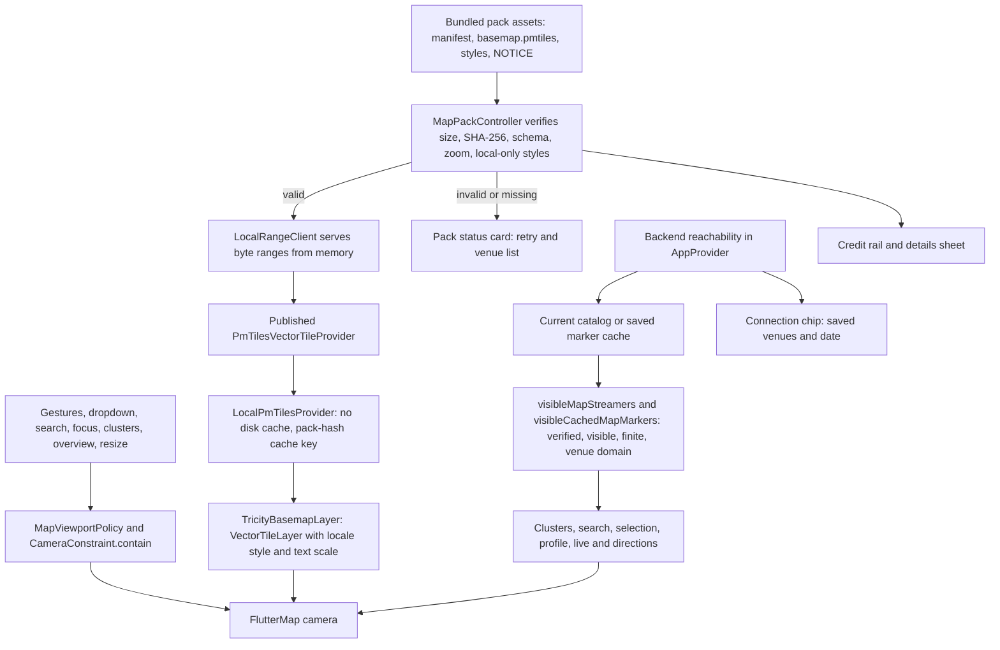
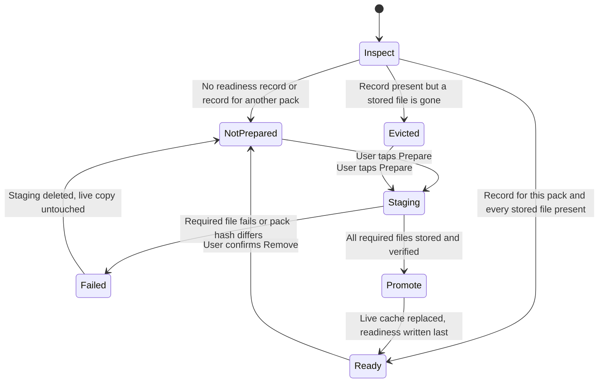

# P5 three-city map upgrade: implementation report

Date: 2026-09-26. Implementer: Claude Opus 5.5 (Claude Code). Branch `codex/tricity-map-upgrade`, worktree `C:/Users/User/.codex/worktrees/p5-basemap-spike/Streamer_app` (reused: it was clean and its branch `codex/p5-basemap-spike`, `86068e8`, is already merged into master; that branch ref is untouched).

**Status: implementation complete for the agreed bundled-release scope; ready for Astra's independent audit with explicit pending evidence. Not accepted.** Physical Android (SM-S936B) runs, TalkBack, performance traces and live-stream integration were not possible in this session (no phone attached, no reachable non-production backend). Accurate city outlines remain an **unmet requirement** (no licensed municipal geometry). See [ACCEPTANCE_RESULTS.md](ACCEPTANCE_RESULTS.md), [HANDOFF_TO_ASTRA.md](HANDOFF_TO_ASTRA.md) and the critic scores in [CRITIC_REVIEW.md](CRITIC_REVIEW.md).

## Starting point and preservation

| Item | Value |
|---|---|
| Baseline commit | `7b54cb5e565011c33dcd03351735b7cc45a0926a` (master HEAD at start; unchanged) |
| Main checkout dirty state at start | Modified: `Core_files/STATUS.md`, `Core_files/progres.md`, `Roadmap.md`, `brief/LEDGER.md`, `issue_encountered.md`, `skill-observations/log.md`. Untracked: `brief/assets/issues/`, P6 retest/review evidence, `brief/research/`. All documentation; no source dependency, so the committed baseline was used. |
| Stashes (untouched) | `stash@{0}` `d646b945d0007d55ec52690f1ca085a3879ccab8` owner-brief-settings-before-window2-2026-09-20; `stash@{1}` `d53c178e116328e8c3d349f36af795733dc31ee4` preexisting-before-budget-stop-2026-09-20 |
| Main checkout operations | Read-only (git status/log/diff, reading research). No switch, stage, commit, stash or write. `project/dart_define.local.json` never read. |
| Temporary checkout | `C:/Users/User/.codex/worktrees/tricity-baseline-7b54cb5` (detached at baseline) for the APK size baseline and gate comparison. Removal is listed in the handoff. |
| Device / owner app | No Android device was attached; nothing was installed. The test APK uses the separate id `sa.hadayah.streamer_app.maptest`. |

## Commits (oldest first)

| Commit | Summary |
|---|---|
| `78e1369` | feat(map): bundled three-city vector map with one viewport policy |
| `41cf23d` | fix(picker): truthful venue pin on the bundled three-city map |
| `47ed6f8` | fix(map): make browser offline preparation fail safe (found in the Chrome run) |
| `e821e1e` | fix(map): keep repository gates green for the map credit |
| `0162d75` | docs(map): record pack licensing, notices and ADR-008 |
| `5e10678` | feat(map): dated advisory for old map data; test directions failure |
| `53a6b9d` | docs(evidence): this directory |
| `d11e9f2` | fix(map): repair critic round 1 findings (D1-D8, D11, D12) |
| `87ecd98` | docs(evidence): critic round 1 record and paused-session handoff |
| `4b7a84c` | fix(web): start without Flutter's deprecated service worker (found in the round-2 Chrome re-check); adds the Windows picker render test |
| (next) | docs(evidence): round 2 re-check and evidence relabels |

## What changed

**Renderer and data (G0-G2).** `flutter_map` 7.0.2 -> **8.3.2** and **`flutter_map_vector_tiles` 2.9.0** (exact pins; `flutter_map_cancellable_tile_provider`, `dio`, `logger`, `polylabel` dropped; `crypto` and `web` promoted to direct). The published PMTiles reader only speaks HTTP ranges, so `local_pmtiles.dart` supplies a bounded in-memory `http.BaseClient` (single internal URI, `bytes=a-b` only, 4 MiB cap, 206 + Content-Range) and a delegating provider with `cacheBytesToDisk=false` and a pack-hash cache key. No server, parser or fork. `MapPackController` verifies manifest schema, byte sizes and SHA-256 of pack/styles, archive zoom 0-15 and local-only styles before opening; failures are `missingAsset`/`corrupt`/`incompatible`, never a partial map.

**Pack (G1).** Protomaps build `20260926` (schema 4.15.2, OSM 2026-09-26T04:00Z), `pmtiles extract` (go-pmtiles 1.31.2, zip SHA-256 verified) over `[49.70, 25.95, 50.45, 26.80]`, z0-15: **11,919,559 bytes**, SHA-256 `1deb87eab58135bcdccaab12df54fbe52290c4fe1ea5dd60b1d1dbb5c74c6a87`, about 12 MB transferred (no planet download). `validate_tricity_pack.py` decoded **all 8,298** z0-15 slots (0 missing, 0 decode errors), 15/15 district controls have roads, 386 named places inventoried ([pack-validation.json](pack-validation.json)). Styles are generated locally (`build_styles.py`), with `coalesce(name:<lang>, name)` labels, no sprite/glyph/remote URL and zero renderer warnings.

**Camera (G3).** `MapViewportPolicy` is the only camera path: initial overview, dropdown, search, venue focus, cluster tap, double-tap, overview button, resize/tab restore, plus the matching `CameraConstraint.contain` for gestures/wheel/keyboard. Minimum zoom = overview framing for the canvas; maximum 18; rotation disabled. Wide or tall canvases get a feasible centred map canvas; wide canvases use one control row. Venues are never moved; an out-of-area focus is refused with an explanation.

**Domain and data truth.** Map eligibility: verified, not hidden, finite, not (0,0), inside the venue rectangle `[49.72, 25.97, 50.33, 26.68]`. **Area disclosure (round-1 D8):** this rectangle is wider than the research proposal `[49.85, 26.05, 50.28, 26.60]` and also admits venues in Qatif, Saihat, Tarout, Safwa and Ras Tanura. The app's wording now says "Al Khobar, Dhahran and Dammam with nearby areas such as Qatif, Saihat and Ras Tanura"; whether to keep or narrow the area is an **owner decision** (not made). The navigation extent is wider over the Gulf/Ras Tanura (`[49.72, 25.97, 50.43, 26.78]`) only so the overview fits wide/tall screens. Moderation, null-versus-empty catalogs, stale-live clearing and route guards are unchanged. The unsourced polygons, Saudi-wide presets and "municipal" claim are removed.

**Presentation (G4).** Compact always-visible `© OpenStreetMap` link + 48 px details button in every state; details sheet with pack date/id/size, venue freshness, credits, the bundled NOTICE (offline) and, on the web, offline preparation. Single-line connection chip instead of the large banner; compact empty-venues notice; pack loading/failure card with retry and venue list. Label sizes follow the user's text scale (clamped 1.0-1.6). Localized directions-failure message. Dated advisory after 90 days (map keeps working).

**Web offline.** Opt-in "Prepare offline map" warms the label fonts, downloads shell + pack + styles + fonts into a staging cache with `cache: 'reload'`, verifies the pack SHA-256, then replaces the live `streamer-offline-v1` cache and writes readiness last. `streamer_offline_sw.js` is network-first for same-origin and the two Google CDNs only, answering from that cache when the network fails; other origins (Supabase, YouTube) are never intercepted.

**Location picker (A19).** Same pack, basemap layer, credit rail and policy; returns only the tapped point; typed venue text and chosen city are no longer overwritten; saved out-of-area points are shown and kept; the apply form no longer submits an invented Al Khobar point, and unpinned branches keep `null`.

## Round-1 repairs and round-2 re-check

Critic round 1 (on `53a6b9d`) found one high defect (D1) and scored 7/6/7/7. `d11e9f2` repaired:

- **D1:** browser preparation requires the start-up shell, rendering engine and Latin/Arabic label fonts, and fails as "incomplete" otherwise. A page-lifetime `PerformanceObserver` records resources, because the browser's 250-entry timing buffer drops them in long sessions.
- **D2:** approval no longer invents an Al Khobar point for an unpinned application, and directions refuse (0,0)/invalid points with a message.
- **D3:** the picker has a centre crosshair and a "Pin the map centre" action, and places no pin while the map is not showing.
- **D4:** a one-time, dismissible "use this map without internet" prompt on the web, shown again after eviction.
- **D5/D6:** 48 px map buttons; framing insets mirror for Arabic and include the empty-venues notice.
- **D7:** the picker's details sheet shows the real venue freshness.
- **D8:** the area wording names the nearby towns.
- **D11:** the worker falls back to the stored copy after 4 s.
- **D12:** one Retry when offline; tolerant city spellings.

The round-2 re-check (Chrome and Windows, ACCEPTANCE_RESULTS "Round 2 re-check") confirmed D1 after a simulated long session, with an Arabic offline cold start. It also found that Flutter's generated loader still registered its deprecated service worker at the offline worker's scope. That worker unregisters the scope's owner when it activates, and it added a second 4 s wait on a network that never answers. `4b7a84c` starts the loader without it.

## Implemented flow

## Browser offline preparation

## Measured results (details in VERIFICATION.md)

| Measure | Result |
|---|---|
| Analyzer / full Flutter suite at `4b7a84c` | 0 issues / **732 passed**, 0 failed (727 at `5e10678`; the round-1 repairs added 5 tests). No failures, so no pre-existing-failure triage was needed; historical master counts are not reused |
| Repository gates (`gates.mjs`) | 0 failing at `4b7a84c` and at baseline |
| Pack | 11,919,559 B raw; 8,298/8,298 tiles decode |
| APK (arm64 profile, same defines) | baseline 63,063,482 B; branch clean build 76,783,749 B (+13.72 MB, includes the `integration_test` dev plugin that release builds exclude); earlier pre-`integration_test` build +12.27 MB. Target <= 40 MB: met with margin |
| Windows real engine (debug build) | pack verify+open 1,025 ms; entry to ready 1,634 ms; max zoom 18; zoom below minimum refused; camera kept across locale change; 0 style warnings |
| Chrome 153 (release web build, headless) | prepare 4-5 s on localhost (31 files); offline cold start with server stopped and DNS blocked: shell to Welcome 3.0 s; all responses from the service worker; guest Enter to feed 0.5 s offline |

## Deviations from the research plan (with reasons)

1. **No application-support copy on native.** The pack is 11.9 MB (plan assumed up to 64 MiB), so it is read from the installed bundle into memory and hash-checked on each cold open. This removes the low-storage/partial-copy failure class; an app update replaces the bundle atomically. Remote update hosting was deferred by the owner, so there is no native write path at all.
2. **Label fonts.** flutter_map_vector_tiles 2.9.0 ignores style `text-font` families (`label_painter.dart` sets no `fontFamily`), so labels use platform defaults, not IBM Plex. On Chrome, the Arabic fallback font arrives after first shaping and the package caches the result; the layer is rebuilt on the engine's font-change signal (no fork) and web preparation warms and stores the fonts.
3. **Extents widened.** Final pack/navigation extents reach further east (Gulf, a sliver of Bahrain's west coast) and north (Ras Tanura) than the research proposal, so the overview can be framed below the controls on wide/tall canvases without clamping. Venue eligibility keeps the narrower venue rectangle, so Bahrain records never appear; that rectangle still includes nearby towns (see the D8 area disclosure above). +0.9 MB.
4. **Integration test.** `integration_test` added as a dev dependency to render the real screen on Windows (and, later, a phone).

## Unmet or pending

- **Accurate city outlines (A11): NOT MET / deferred.** No licensed municipal dataset; polygons removed and claims withdrawn.
- **SM-S936B physical evidence: pending** (first-use offline, reboot, rotation, TalkBack, frame/memory traces, Arabic on device, mini-player coexistence, map -> live -> back).
- **Backend-reachable runs: not done** (no authorized non-production backend was used). A14 "pack ready + backend current", A15 reconnect-removal and A17 are unverified at runtime.
- Web: storage `persist()` returned false in headless Chrome; quota exhaustion was not injected; Chrome only (no Edge/Firefox/Safari).
