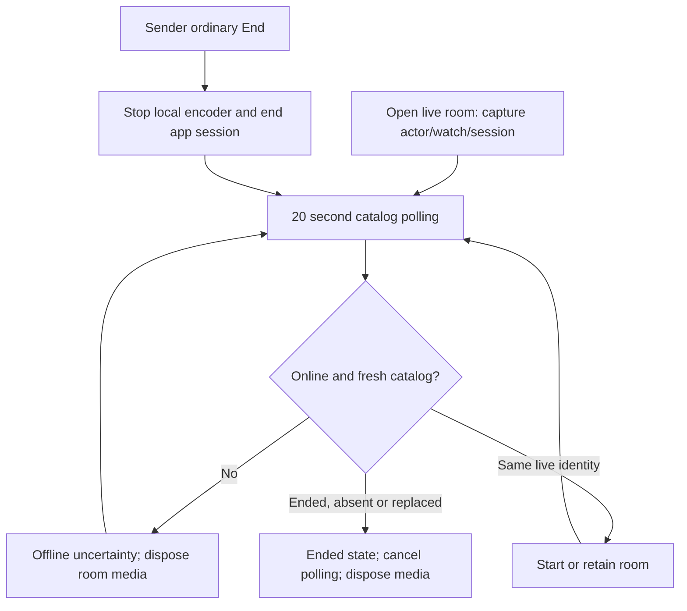
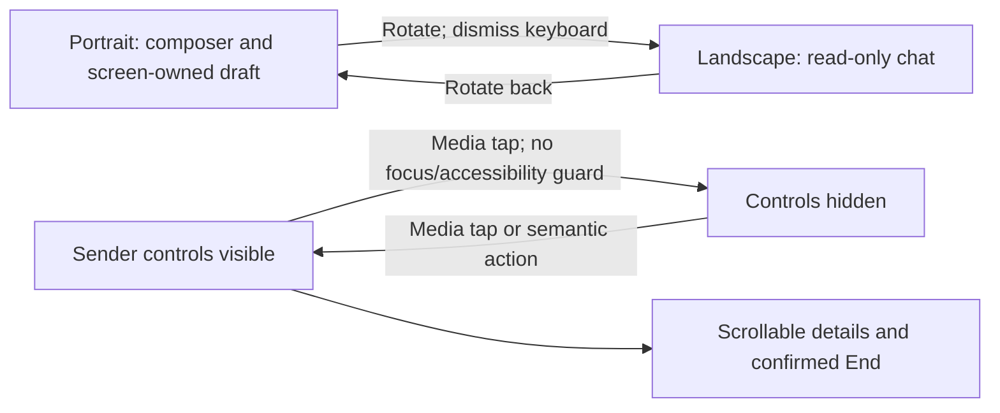

# Repair report
Status: NEEDS WORK. Budget-limited partial implementation; no physical pass is claimed.

| Finding | Diagnosis / change | Evidence / limit |
|---|---|---|
| G1 ordinary End leaves room stale | Reproduced when viewer connectivity drops before End. Recovery previously demanded a live entry before checking End, and disposed the polling timer. Reconcile fresh End first, retain polling through interruption, retain original actor/watch/session identity. | g1-before.txt fails the new regression on baseline; targeted.txt passes 43 tests. Owner's exact healthy-network timing was not reproduced; baseline healthy 20-second poll test already passed. |
| G1 same-watch restart | New session ID must end the original room even when watch ID is reused. Actor lookup remains pinned after interruption. | New same-watch replacement regression in p6s_wave3_group1_test.dart. Server/device End fences are unchanged. |
| G2 sender recovery | RtmpCamera2 uses reTry without configuring its SDK retry budget; native retry has no fresh server authorization. Callback resets and watchdog resets also need a bounded episode. | UNFIXED HIGH. No automatic-recovery claim. Do not accept until ownership, expiry and cancellation are checked before resending. |
| G2 viewer recovery | Existing connectivity recovery and manual Retry remain; no new 3-second/10-attempt episode. Retry currently resumes playback, so pause intent needs repair. | UNFIXED. Required 30–60 second bounded episode and server-expiry relationship need implementation/tests. |
| G3 chat/keyboard | Landscape composer removed in both viewer and phone chat; localized return-to-portrait notice. Sender draft is owned by screen so survives layout remounts. Dismiss keyboard on entering landscape. | Synthetic keyboard-inset tests, not physical IME evidence. |
| G3 controls/settings | Sender landscape title/telemetry header removed. Tap toggle includes End/fullscreen; focus/accessibility guard keeps focused controls visible. Details sheet contains status, scrolls, respects safe area, uses readable text colors. | Existing End/dialog tests plus new 740×360, 190px inset, 2× text tests in both locales. New tests first exposed narrow chat-header overflow (71/87px); fixed flexible labels. |
| G3 native orientation | Current bridge is RtmpCamera2 2.7.5; setOrientation returns success without changing anything. OpenGlView uses Fill. | UNFIXED HIGH. No encoder or preview rotation change in this slice. Screenshot pillarboxing is not an encoded-dimension measurement. |
| G3 viewer overlay | Existing gesture/transport behavior remains; no shared tap-toggle repair beyond read-only composer. | Incomplete. Retained-player/Chrome behavior must be rechecked. |
| G4 channel | Sheet accepts any nonempty handle and independent URL; legacy parser strips unrelated paths; channel resolution uses stale application handle. | UNFIXED. Central parser and save-boundary consistency validation still needed, including legitimate channel-ID/handle formats. |
| G4 security | Normal UI metadata checks fail closed; modified approved client can bypass them. Database validates syntax/role/device/moderation, not YouTube ownership or ingest-to-watch identity. | OPEN HIGH RELEASE DECISION D8. No migration, OAuth or hosted change made. |
| G4 deferred modes | Owner deferred organization broadcasting, upcoming management and return-chip polish. Existing organization selector and external-phone option remain reachable. | Org entry exclusion still needs implementation; external-phone D6 unresolved. Local/private/direct-laptop remain unavailable; no new transport/PiP. |
| Audio/background | GL muteVideo hides camera output; camera stays open. Service notification does not establish service-owned capture. | Historical audibility pass only. Camera resource, Home/lock and long runs NOT RUN. |

## End and recovery as implemented

Polling interval is 20 seconds, not a hard end-to-end deadline: hung catalog/sweep reads have no newly added timeout. Physical target: room <=25 seconds and discovery <=35 seconds after confirmed server End on healthy network, otherwise FAIL and preserve timing. External OBS/YouTube media is not stopped by app-session End.

## Layout as implemented

Native orientation is unchanged; these diagrams describe Flutter layout/session behavior only. No automatic hiding timer was added.

## Sources and decisions
Pinned RootEncoder source was inspected after Context7: [Camera2Base](https://github.com/pedroSG94/RootEncoder/blob/2.7.5/library/src/main/java/com/pedro/library/base/Camera2Base.java), [GlStreamInterface](https://github.com/pedroSG94/RootEncoder/blob/2.7.5/library/src/main/java/com/pedro/library/view/GlStreamInterface.kt), [StreamBase](https://github.com/pedroSG94/RootEncoder/blob/2.7.5/library/src/main/java/com/pedro/library/base/StreamBase.kt). Independent preview/encoder transforms require measured work, not a blind setRotation call. [Flutter focus](https://docs.flutter.dev/ui/interactivity/focus) informed focus ownership. YouTube privacy/referrer and player adapter are unchanged.

D1 preset choice/“740”, D2 moderation semantics, D3 LAN topology, D4 private media, D5 laptop direct scope, D6 external-phone sender, D7 output rotation design and D8 server/OAuth authorization remain explicit decisions except where the owner has separately recorded acceptance. Do not infer approval from a historical PASS heading.

