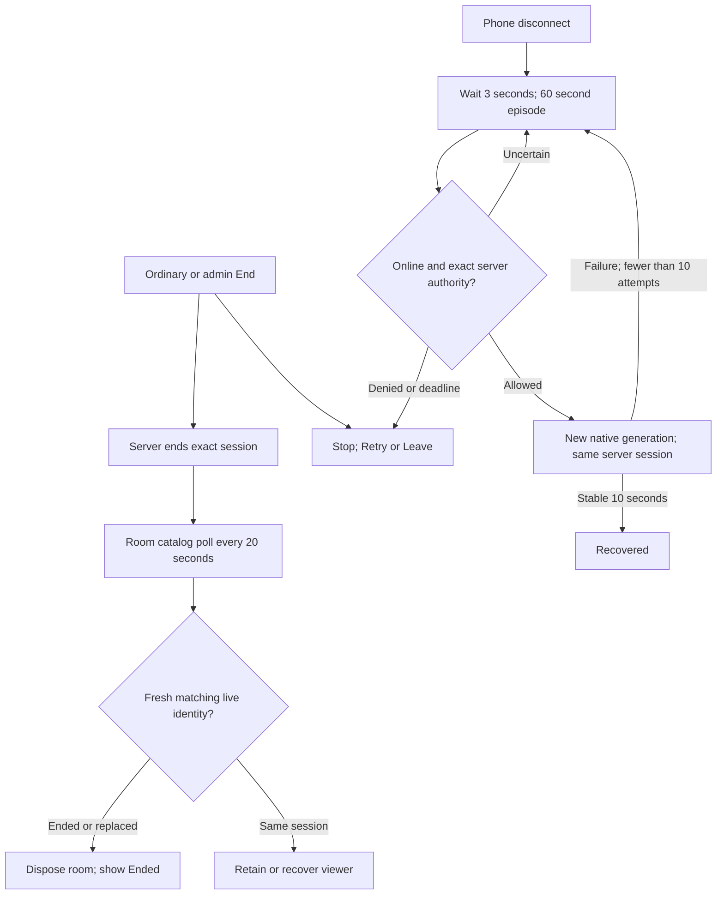
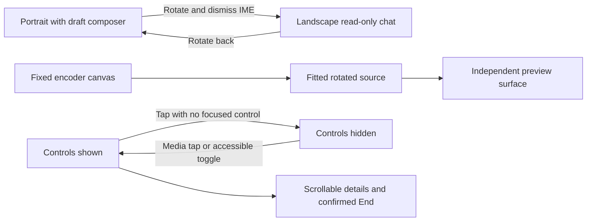

# Wave 4v2 repair report

Release acceptance remains blocked by D8 and missing physical evidence. The completed Wave 4 is preserved; a PASS heading does not close its failed siblings.

| Finding | Verified cause and repair | Evidence and limits |
|---|---|---|
| G1 ordinary sender End leaves an open room stale | Reproduced after viewer connectivity loss: the room discarded its polling timer and required a live row before reconciling End. Retain the original actor/watch/session, keep catalog polling during interruption, reconcile fresh End/replacement before joining again. | New regression failed on baseline (g1-before.txt). Healthy-network baseline already passed; the owner's exact healthy-network failure was not reproduced. Test each physical viewer again. |
| G1 stalled catalog | A sweep or read could block every later read. Optional sweep now times out after 2s; public read after 5s. Failed reads cannot become fresh truth. | Existing coalescing/stale-response and new room tests. Healthy room target ≤30s and discovery ≤40s after confirmed server End; record actual timings. Offline has no convergence guarantee. |
| G2 sender drop/retry | Native retry lacked fresh authority and a reliable bounded episode. Disable native retries; Dart schedules 3s between attempts, maximum 10, 60s overall, 5s authority timeout and 8s connection watchdog. Keep a 10s stable period before resetting an episode, fence each native generation. | Engine tests cover flapping, offline waiting, stale callbacks and queued authority after Stop. Server recheck covers session/watch/device, current permission, then locked report_ingest(false). Provider tests cover End, replacement, transfer, revocation, uncertainty and late End. |
| G2 viewer recovery | Add separate bounded recovery with fresh catalog before reload; ended/replaced rooms never retry. Preserve observed mute/pause. Exhaustion disposes playback and requires explicit Retry. | Viewer tests cover paused/muted reload, terminal End, late catalog after exhaustion and player retention. 3s wait plus up to 10s provider readiness per reload, max10/60s. Chrome lacks a confirmed state bridge: a recovery reload starts muted with autoplay disabled. Once delivered, the app stops automatic media retries and says playback is unconfirmed; native Play/Retry remains available. This is a manual fallback, not proven media recovery. The native 10s missing-handshake fallback uses the same unconfirmed state. |
| G3 native orientation | Baseline really used RtmpCamera2 and setOrientation was a no-op. Use installed RootEncoder 2.7.5 RtmpStream with Camera2Source/MicrophoneSource; retain one encoder across preview detach/rotation, fixed configured canvas, fitted preview/encoder transforms with SDK orientation handling. Each network attempt has a separate callback generation. | Kotlin compile passes. NATIVE_PROBE.md records actual fixed 1280x720 H264/AAC output and shutdown, but only 48 frames over 37.603s and a System UI ANR; smooth output is NOT established. Physical front/back and actual received orientation remain acceptance requirements. Pillarboxing in historical screenshots proves neither encoded dimensions nor source bars. |
| G3 landscape chat | Remove sender/viewer composer/send/mic, dismiss keyboard on entering landscape, preserve screen-owned draft, localized return-to-portrait notice. | Synthetic insets and English/Arabic 2x text tests; real IME pending. |
| G3 controls/settings | Sender landscape persistent title/telemetry removed; status lives in revealed controls/details. Tap-toggle retains focused/accessible controls. Viewer uses a pointer observer without stealing the native gesture arena and a small persistent accessible toggle. Settings reflow/scroll with SafeArea. | Tests caught and fixed the original chat-header overflow and an obscured viewer toggle. 740×360, 190px inset, 2x text, both locales. Real TalkBack and dialogs pending; isolated Chrome results are in BROWSER_PROBE.md. |
| G4 channel consistency | One parser accepts handle, handle URL, canonical UC channel URL/ID and legacy /user URL. Save boundary rejects malformed/deceptive URLs and contradictions. Mixed references must resolve to the same channel, then store one canonical reference. /c vanity URLs request a canonical handle/ID because channels.list has no reliable custom-URL selector. | Parser and existing watch/API/form tests. No silent approved-channel rewrite or approval bypass. Live channel lookup cache removed so an old account/handle result is not reused. |
| G4 watch security | Existing UI checks still fail closed for missing key, API failure, malformed/not-live/wrong channel. | This is public metadata, not OAuth ownership or ingest/watch binding. A modified approved client can still bypass it. **D8 remains an owner-confirmed release blocker.** No SQL or OAuth repair claimed. |
| G4 scope | Organization broadcasting and external-phone encoder options are visibly unavailable; provider rejects those selections. Upcoming-management and return-chip polish remain owner-deferred. Local/private/direct laptop/PiP are not implemented. | Existing backend organization protections retained. Unrelated organization CRUD/permissions remain. Formal exclusions for modes beyond the owner's explicit deferrals still need a scope decision. |
| Audio/background | Hidden video keeps the camera open. RtmpStream owns capture separately from the surface, with the existing foreground notification service. | Historical audio reception passed. Camera resource release, Home/lock continuity and long-duration physical evidence are separate and pending. No indefinite background or camera-release promise. |

## End and recovery

Server windows in existing migrations: device lease 90s; direct-ingest freshness 120s. Recovery's 60s episode ends earlier. The authorization RPC does not recreate an ended session. A physical prolonged outage can expire the server session; manual Retry rechecks the watch link and normal Start authorization. App End does not stop external YouTube/OBS media.

## Orientation and controls

No timer auto-hides controls. A Chrome iframe may consume native pointer events, so its explicit app toggle remains available. Actual media identity and orientation need received-video evidence.

## Sources and decisions

Context7 was used first, followed by the installed version's official source: [RootEncoder StreamBase 2.7.5](https://github.com/pedroSG94/RootEncoder/blob/2.7.5/library/src/main/java/com/pedro/library/base/StreamBase.kt), [GlStreamInterface](https://github.com/pedroSG94/RootEncoder/blob/2.7.5/library/src/main/java/com/pedro/library/view/GlStreamInterface.kt), [Camera2Source](https://github.com/pedroSG94/RootEncoder/blob/2.7.5/encoder/src/main/java/com/pedro/encoder/input/sources/video/Camera2Source.kt), [YouTube channels.list selectors](https://developers.google.com/youtube/v3/docs/channels/list), [Android applicationIdSuffix](https://developer.android.com/reference/tools/gradle-api/8.0/com/android/build/api/dsl/ApplicationBuildType), [Supabase local CLI](https://supabase.com/docs/reference/cli/supabase-start). YouTube nocookie base/referrer policy remains unchanged.

D1 fixed presets versus Auto/“740”, D2 exact moderation semantics, D3 local topology/exclusion, D4 private-media exclusion, D5 laptop-direct exclusion, D6 external-phone exclusion, D7 fixed fitted canvas and background/resource expectations still require any missing owner decisions or physical evidence. D8 is explicitly **not deferred**. Confirm scope against historical decisions, never infer acceptance from a PASS heading. Organization broadcasting, upcoming management and return-chip polish are the explicit Wave 4 deferrals.

## Round 2 corrections

Cancel queued viewer retries as soon as confirmed live/paused arrives while retaining the episode deadline and 10s stability guard. Three delayed-state regressions cover live, paused and unconfirmed. Remove duplicate sender recovery surfaces in portrait; both layouts assert a single reconnect banner and exhausted Retry/Leave panel. Preserve a submitted handle URL for canonicalization at the provider boundary; the complete sheet-submit regression reaches the stored canonical handle. Navigation delivery and the missing-handshake fallback now report unconfirmed rather than paused. No recovery success is inferred from those signals.

## Unresolved final-review defect

P2: the new unconfirmed text/Retry row overlaps and intercepts the viewer eye-toggle hit region in the full room. Normal confirmed-state toggle regression and the standalone Chrome probe do not cover this state. Third critic review is8/7/7/7; all three rounds are used. Source remains5162add and this defect is **not fixed**. Future repair: separate the notice from the reserved eye-button space, then test native-control and app-toggle input in the full unconfirmed room in both locales/short landscape. F09/F10 remain NOT RUN with this known source defect. D8, emulator ANR/sparse frames and essential physical evidence remain separate blockers/limitations.
