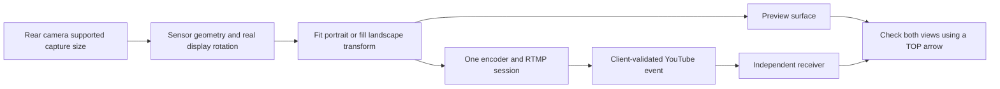
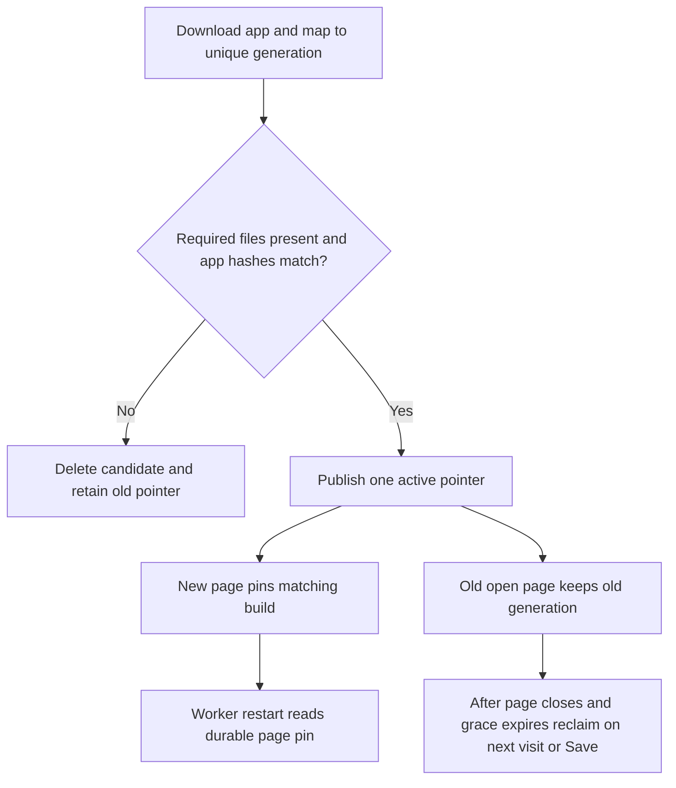
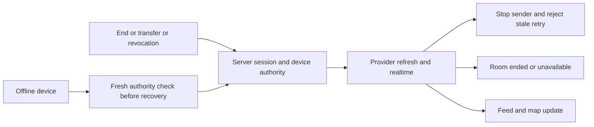

# Hadayah integration audit and repairs

Audit date: 2026-09-27. Branch reports were inputs to this audit, not acceptance evidence. See [source overlap](SOURCE_OVERLAP.json) and [preservation baseline](PRESERVATION_BASELINE.json). Final executable results and source identity belong in [VERIFICATION](VERIFICATION.md); owner results belong only in [the new results sheet](WAVE4V2_ACCEPTANCE_RESULTS.md).

## Inputs and authority

Integrated streaming tip `818cc127f8d89f0f2c5a08bca7390cc50aa67368` (latest camera source `ddcb521`) and map tip `74157bad63279053774a01cfc5b2399bea390bd0` (latest map source `a57dda7`), both based on `7b54cb5e565011c33dcd03351735b7cc45a0926a`. Neither source branch was edited. The user's integration instructions override direct-master/push instructions and older handoffs' narrower authorizations.

Read AGENTS, Core_files/STATUS and decisions, latest LEDGER resume, the relevant work plan/budget protocol and issue-name index; the dated [map handoff](../../2026-09-26/p5-tricity-map-upgrade/HANDOFF_TO_ASTRA.md), reports, critic and acceptance records; [streaming handoff](../../2026-09-26/p6s-wave4v2/HANDOFF.md), critic and closure matrix; and [latest camera report](../p6s-camera-landscape/REPAIR_REPORT.md), verification and raw receive/lifecycle evidence. The map worktree root handoff is obsolete and was not used as its map handoff.

Untracked main-checkout sources were read in place, not copied or assumed present here: `brief/evidence/2026-09-26/p6s-astra-audit/E4_ACCEPTANCE_RESULTS.md`, `SCREENSHOTS_AUDIT.md`, and relevant research under `brief/research/p6s-streaming-architecture/` and `brief/research/p5-tricity-map-upgrade/`. Their identities are in the preservation baseline. The old E4 ordinary-End failure, landscape defects and unsupported authorization claims remain historical findings; no historical PASS was transferred to this candidate.

## Confirmed defects and repairs

| Finding / cause | Combined repair | Independent evidence / limit |
|---|---|---|
| Selected venue actions used a fixed Row; audio badge also overflowed at 2× Arabic text. A fixed-height marker popup clipped expanded cards. | Wrapping actions and badges; primary, venue and Close targets at least 48 dp; one scrollable selected-card overlay at all zooms. | 72 selected-card combinations: widths 320/360/384/412, en/ar, 1/1.6/2×, offline/video/audio. Tests select a venue, check main action/Close reachability and change zoom. Tiles use an unavailable-pack fixture; this is not a rendered-map or physical tap PASS. Before-failure logs retained. |
| Short landscape End confirmation overflowed at 568×240 and 2×. | Scrollable confirmation; keep Stay/End and Back behavior. | English and Arabic reproduction failed before repair and passes afterward. |
| Map failure content overflowed narrow large-text screens. | Scrollable failure content without hiding attribution or Retry. | Selected-map test exposed it; focused regression covers it. |
| Venue sheet defaulted the user's origin to Khobar; live-room details offered directions for absent pins. | No distance without an actual valid origin; no directions button for absent/0,0 coordinates; shared usable-point checks retained. | Pinned/no-origin and unpinned widget checks; physical launcher remains pending. |
| Approval projection invented Khobar and an unrelated sample YouTube video; wizard city selection was not persisted; legacy application defaults/presets invented coordinates. | Persist explicit city_id through both application forms, local JSON, database rows and approval; retain legacy profile city when unknown. Remove default/preset coordinates and sample video; preserve exact submitted latitude/longitude. Cache city normalization uses exact names, including Arabic, rather than substring matches. | Source/caller review, application submission/approval/JSON regressions and fresh SQL assertions for city edits/RLS/pin preservation. Cycle1 found two additional reload/choice defects, corrected below. Unknown city membership is not guessed from coordinates. |
| Critic found organization backend reload still fabricated Khobar; local approval tests missed persistence. | Link organization creation to its approved application; public view verifies matching owner, organization account type and approved status before exposing only city/venue/point. No private org_venues publication or coordinate rewrite. Legacy organizations without an approved public link remain unknown. | Mock HTTP creation/catalog reload plus fresh SQL tests for exact coordinates, unknown/0,0, foreign/pending/individual applications and unchanged private venues. |
| Critic found four visible non-map city choices rejected by the new constraint. | One seven-city application choice catalogue; additive migration accepts all offered values. Three-city map filter stays separate. | Every exposed choice round-trips through model/catalog and SQL constraint. |
| Map rectangle admitted nearby-town venues beyond the three-city requirement. | Filter existing city metadata against the three accepted cities, in addition to valid coordinates. Cached marker IDs use the same city rule. No saved records or coordinates are rewritten. | Three-city/adjacent-town tests; conservative omission of unknown city metadata is explicit. Navigation padding remains broader; it is not a municipal boundary or approval to include nearby-town venues. |
| Saved readiness used only map identity. App-only streaming updates could inherit an old saved app. | Compile a distinct `HADAYAH_BUILD_ID`; stamp public build-file SHA-256 manifest; verify downloaded app files; readiness requires both build and pack identity. | Actual Chrome stale-build/same-pack fixture returns Save; worker tests prohibit new network pages from using an older application's JS. |
| Promotion replaced active files individually. A failure could leave a mixed active copy. | Download into a unique immutable generation; verify it; publish one metadata pointer last. Failed downloads/publication delete only their candidate. | Actual Chrome fault at final Cache.put, after 52 files: old pointer unchanged, no missing old files, failed generation removed. Separate download interruption also checked. |
| Worker routing state disappeared on worker restart; open tabs could mix generations. | Persist per-client build/cache references in CacheStorage. New network pages use matching saved builds only; existing tabs retain their generation. | Worker restart, app-only update and concurrent old/new tabs tested against actual worker code in Node; cold Chrome restart tests persistent data. |
| Hanging headers/body could strand startup or Save; repeated generations could accumulate. | Bound complete network reads (worker 4 s, Save 20 s); serialize Save/reset across tabs using Web Locks; reclaim copies no longer active or used by open/recent clients. A five-minute pin grace protects navigation commitment; a suspended navigation exceeding it may require reload. This is a bounded storage-cleanup choice, not a guarantee of unlimited suspended-page survival. | Worker hang test and actual browser fault/re-save/cold-start checks. Browser eviction remains possible. |
| Integration fault test exposed a Dart/JS rejected-promise handoff leaving a lock pending. Cold restart exposed premature cleanup of a navigating client. | Settle callback errors inside their Dart zone before rethrowing to caller; register each page's build with an acknowledged worker handshake before Save; preserve recent pins while clients.matchAll can omit reserved navigation clients. Cleanup follows page commit and Save/reset. | Pre-repair failures preserved. Repeat publication check shows zero held/pending locks. Cold-start result is recorded separately in VERIFICATION. |
| Save wording understated app bytes and blurred map availability with backend connectivity. | Save requires browser network availability; report download failures honestly; label map size plus app files. Explain delayed cleanup for open tabs. | Source/UI checks. A browser's online flag is not proof that the origin responds; actual Save remains the check. |

## Streaming source audit

Audited the native bridge, rear capture source, geometry helper, platform-preview callers, display forwarding, Dart publish engine, phone screen, live-room/retained player and provider recovery authorization paths. RootEncoder remains pinned at 2.7.5; no speculative encoder upgrade or fixed minus-90 correction was added. Activity display rotation is forwarded explicitly, rear capture geometry is selected from supported device sizes, and fit/fill uses the actual capture aspect. Rotation updates transforms without recreating the encoder/session. Native retries remain disabled; Dart retries are bounded and require fresh exact-session/device/account authority. Hide video clears the custom viewport so mute can produce black output; End releases capture and the service. Unsupported preparation unwinds resources. Front switching remains disabled with localized Coming Soon and no native switch command.

Normal sender landscape keeps End at physical top-left, settings/chat at physical top-right, tap toggling and accessible Back/End. No solid telemetry header, redundant fullscreen control, bitrate badge or old title was restored. Landscape chat/edit paths are read-only for streamer, viewer and admin; portrait drafts remain in the retained controller. Scrollable sheets and failure/recovery copy remain. Existing tests cover fencing, terminal-state precedence, authority checks, reconnect limits and mute/pause intent. These facts do not establish received-video uprightness, audio continuity or keyboard behavior on a phone.

### Sparse frames and System UI ANR

The latest preserved emulator receive file has 484 frames, 9.91 delivered fps and a 1.00 s largest frame gap; there is one Live transition and End, not a rotation reconnect. The dump identifies `com.android.systemui/.keyguard.KeyguardService`, with an Android system binder client. It does not include the ANR stack/CPU trace needed to attribute cause. A stopped app foreground service and empty camera clients support End cleanup, not acceptable runtime performance. The emulator's fixed house scene is not a physical orientation oracle. **Unresolved: neither an app cause nor an emulator-only limitation is established.** No phone is attached in this task. Capture synchronized sender/receiver video, redacted logcat, ANR trace/bugreport, frame timestamps and device thermal/resource data in S01/S07 before closing this item. Raw sources inspected: [frame timing](../p6s-camera-landscape/frame-timing-final.json), [event timeline](../p6s-camera-landscape/native-events-final.txt), [System UI service dump](../p6s-camera-landscape/native-services-after-end-final.txt) and [camera cleanup](../p6s-camera-landscape/native-camera-after-end-final.txt). Native bridge/geometry/capture and publish-engine source is unchanged from ddcb521; combined map/player memory remains a physical integration test.

## Behavior integration and overlap

Exactly five shared source paths were recomputed. Gradle was the only textual conflict: retained fail-closed release signing and the existing `.wave4v2` debug package/callback, with label **Hadayah Test**; removed the map-only alternate identity option. Both localization catalogues preserve the two branches' keys. AppProvider retains streaming authority/session changes and exact location handling; approval no longer fabricates city/video values. StreamerApplyScreen retains channel validation and the map's explicit pin semantics. No wholesale ours/theirs resolution was used.

Map-to-room uses the selected streamer's active session; retained navigation state and session termination listeners remain. Ordinary/admin End, hide, transfer and revocation must converge in room/feed/map; local SQL and provider regressions are independent evidence, while actual two-phone convergence and map/player resource coexistence remain owner cases. ADR-006 privacy host/referrer and player controls were preserved. Two additive migrations add nullable application city_id, align all existing choices, and link explicitly approved organization public locations. Existing migrations and stored coordinates were not rewritten; only the disposable local database received the two new migrations.

## Requirement to code to test

| Requirement | Principal code | Fresh verification / owner case | State |
|---|---|---|---|
| Portrait and both landscape outputs, session continuity | RtmpPublisherBridge, RearCameraSource, CameraFraming | Java geometry assertions; W02/S01/S07 | Implemented; physically unverified |
| Landscape overlays, drafts, no keyboard, short sheets | PhoneBroadcastScreen, live chat and live-room widgets | phone/chat/widget tests; W03/S02/A01 | Independently verified in widgets; physical open |
| Front Coming Soon without interruption | phone screen and native switch guard | phone/engine tests; S01 | Explicitly deferred feature; negative path implemented |
| End, fencing, authority, reconnect, mute/pause | AppProvider, RtmpPublishEngine, retained adapter | Fresh local SQL assertions (final count in VERIFICATION), 3 concurrency scenarios and Flutter regressions; W05/S03/S04/I02 | Independently verified locally; real convergence unverified |
| Selected narrow Arabic card | MarkerSummaryCard and SpatialMapScreen | 72 populated card cases; W04/M05 | Implemented and widget verified; physical open |
| Exact pins, no invented distance/directions | venue sheet, live details, approval/apply | location and provider tests; M06/I03 | Implemented; launcher/backend UI open |
| Three-city venue scope | map_visible_catalog and map_tricity_domain | adjacent-town/coordinate tests; M05 | Implemented from existing metadata, no official boundary claim |
| Whole-app offline save/update | platform web store, worker, build stamper | Chrome faults and startup; Node worker tests; M02-M04 | Independently verified locally; other browsers and physical runs open |
| Offline Arabic/fonts/images/pack | asset manifest and immutable generation | Chrome cold start, archive validator; M01/M02/A01 | Physical and other browsers unverified |
| Licensed accurate city outlines | No suitable accepted geometry integrated | M07 | Unmet; sourcing/owner scope decision required |
| Server YouTube authorization D8 | Existing client validation only | S06/C06 negative checks | Explicit retained HIGH release blocker |
| Audio-only camera release/background survival | Current video mute and notification service | S07/S08 | Not implemented/proven as requested; no approved blanket deferral |
| Unavailable transports/modes | capability gates and localized explanations | S09/C07 | Negative paths implemented; several scope approvals outstanding |
| OAuth/test backend readiness | SupabaseConfig, Gradle callback | W00; setup checklist in README | Diagnostic; external setup blocked |

## Technical sources

- Flutter accessibility: [minimum targets and testing](https://docs.flutter.dev/ui/accessibility/accessibility-testing), retrieved through Context7 `/flutter/website`; existing Wrap/scrollable widgets and AppTheme tokens reused.
- Cache versions/lifecycle and [Web Locks](https://developer.mozilla.org/en-US/docs/Web/API/Web_Locks_API), [LockManager.request](https://developer.mozilla.org/en-US/docs/Web/API/LockManager/request), [Clients.matchAll](https://developer.mozilla.org/en-US/docs/Web/API/Clients/matchAll), retrieved through Context7 `/mdn/content`. The navigating-client cleanup rule is an inference confirmed by the actual Chrome failure, not a claim that the API guarantees immediate client visibility.
- RootEncoder [2.7.5 CameraRender](https://github.com/pedroSG94/RootEncoder/blob/2.7.5/encoder/src/main/java/com/pedro/encoder/input/gl/render/CameraRender.java) and [Android camera preview geometry](https://developer.android.com/codelabs/android-camera2-preview). Historical extracted runtime source was not treated as the pinned tag when it differed.
- Local database workflow: [Supabase local development](https://supabase.com/docs/guides/local-development), via Context7 `/supabase/cli`. All database execution here used an explicitly named disposable local workdir.
- Browser harness: [Playwright persistent contexts](https://playwright.dev/docs/api/class-browsertype#browser-type-launch-persistent-context), via Context7 `/microsoft/playwright`. Existing bundled tooling and installed Chrome; isolated profile, no owner browser session.

No conclusion here accepts P5, P6, P6S or a release. [Closure matrix](CLOSURE_MATRIX.md) keeps implementation, physical evidence and approved deferrals separate.

## Review-cycle repairs and browser limits

The four cycle 1 findings and their reasons are preserved in CRITIC_REVIEW. Source `7cab6d0` corrects them; no native camera code changed after the camera audit. A first browser run under a deeply nested test profile failed every Cache.put, including unrelated probe keys. The identical artifact under a short, isolated temporary profile passed those writes and the acknowledged initial-page handshake. This indicates a profile/path-related browser environment failure; the precise Chromium filesystem cause is not established. The failed profile is preserved. No app source workaround or broad cache clearing was used.

Real final Chrome checks: first-claimed page Save → 52/52 required files offline without reload; worker termination; cold Arabic app/map/images; final publication failure with old pointer intact and no locked save; genuine hanging navigation ~4.08 seconds; separate real tabs and cleanup during offline navigation. The final34d074a rerun also exercised actual old7cab6d0 and new34d074a builds together: distinct JS hashes, new-build rejection of old saved bytes, preserved old-tab bytes after re-save,52/52 current files,4,072ms hanging navigation and zero settled locks after a cleanup storm/worker restart. See browser34-summary.json. Earlier build-mismatch probes used labelled metadata fixtures; deterministic reserved-client omission/generation replacement uses the actual-worker VM test. These fixtures are not physical/backend acceptance.

Further checks before cycle 2 found an old-worker update race: the old active worker can ignore a new page-build message before its replacement claims the page. The actual HTML-script test fails before the fix and passes after retrying on `controllerchange` (commit12f081d); no acknowledgement still fails closed after15s. [MDN controllerchange](https://developer.mozilla.org/en-US/docs/Web/API/ServiceWorkerContainer/controllerchange_event), fetched through Context7, supports this lifecycle choice.

The organization branch sheet also offered directions for0,0. Commit1ec9a04 uses the existing shared usable-point guard/launcher and removes the action for absent locations. Legitimate stored branch coordinates remain unchanged. The shard run exposed a test-order dependency in the same screen's test: prior tests failed to reset pixel ratio, and its lazy-list assertion assumed every row was built. Resetting test pixel ratio and scrolling to the third branch repairs the test, without enlarging or weakening product UI requirements.

Final local SQL:23 files/462 assertions plus3 concurrency scenarios. The new public-location view rejects foreign, pending and individual application locations. A combined owner/reference attack confirms the existing guarded-column trigger preserves owner identity while the adversarial reference is actually stored; the public location remains absent. No private branch data or PII was added to the public view.
