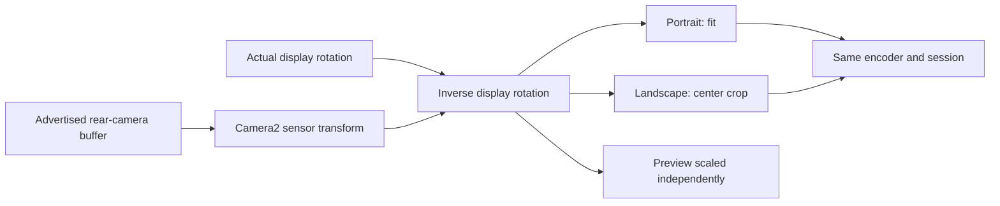

# Camera and landscape repair — 2026-09-27

This is a new owner-directed follow-up on `codex/p6s-wave4v2-repair`, starting at `23cfa662947c3e0d096adef9609522b57438455e`. Wave 4v2 is a test round for Hadayah, not a separate product. The isolated APK uses a different application ID to protect the installed Hadayah app. The screenshots do not establish the installed source hash; do not label them a physical failure of a particular repair-branch commit.

All six supplied screenshots were visually inspected and copied with SHA-256 identities into `screenshots/` and `screenshot-hashes.json`. Original files and the September 26 acceptance pack remain untouched.

## Findings and changes

| Request | Verified cause / current implementation | Repair and verification boundary |
|---|---|---|
| Sideways portrait-width landscape output | Original Wave 4 bridge had a no-op orientation handler. Starting repair branch used RtmpStream but relied on sensor polling gated by UI rotation; assumed portrait-native geometry and configured encoder ratio instead of actual camera buffer ratio. A local receive probe then exposed that Flutter's SurfaceView belongs to a virtual display whose rotation remains zero. | Read the physical Activity display identity, not preview.display. A native display listener plus preview resize synchronizes both render targets. Sensor rotation is already in Camera2 SurfaceTexture's per-frame matrix; apply only inverse display rotation. Query sensor orientation to determine source axes. No encoder/session replacement on rotation. Local received frames change framing in both directions; hardware/YouTube uprightness remains pending. |
| Different camera ratios | SDK 2.7.5 resolution calculator returns the requested size when no matching ratio exists. Its Camera2Source LEGACY check also conflates capture size and encoder size. Low preset incorrectly encoded 640x480 despite its 360p label. | Small rear-only VideoSource reuses the installed Camera2ApiManager and chooses an advertised capture size. Stable 16:9 output at 640x360, 1280x720 or 1920x1080. Fit portrait; center-fill/crop landscape; no nonuniform scaling. A wide phone preview can crop more at its edges than the 16:9 received picture. Unsupported hardware/codec configuration still fails closed. |
| Crowded landscape sender | Prior repair removed telemetry header but left fullscreen and bottom End. Native preview could intercept the media tap. | End at physical top-left in both locales; settings/chat top-right. Three normal controls, no fullscreen icon or solid header. Removed the obsolete fullscreen orientation lock: physical orientation now selects the layout, and each new screen entry restores portrait/landscape support. Camera surface is rendering-only; Flutter receives taps. Controls toggle together. Real focused controls/TalkBack stay available; system Back still confirms End. Important failure/recovery notices remain visible. |
| Landscape keyboard/chat | Composer guards existed in both sender/viewer. Own-message editing could still open a keyboard; closing its dialog could dispose the controller before the reverse animation finished. | Edit dialog becomes read-only on rotation and retains draft; dispose after route completion. Applies to viewers and moderators. Studio opened from video shows a portrait-edit prompt while landscape and retains its controllers. Sender chat extends to the bottom safe area. |
| Settings overflow | Prior repair already added safe-area scrolling to sender settings. | Retained that fix; added short 568x240, phone 740x360 and laptop 1366x768 checks at 2x text in en/ar. Message action/report menus also scroll. Actual device screenshots and large-font/TalkBack remain acceptance checks. |
| Front camera | Owner explicitly deferred switching in this message (2026-09-27). | Rear-only native capture; native switch refuses without stopping stream, Dart switch rejects, UI displays a localized Coming Soon dialog. Restarts cannot select front. Older front-camera acceptance cases are superseded by this explicit scope decision. |
| Prior critic's viewer toggle obstruction | Unconfirmed playback notice occupied the eye toggle's hit area. | Reserved the toggle's space; actual hit-test regression now covers unconfirmed state. No new independent score assigned. |

Two defects found during implementation were fixed before packaging. A Java geometry helper placed under `src/main/kotlin` compiled against Kotlin but was omitted from the APK, causing `NoClassDefFoundError`; it now lives under `src/main/java`, and the same native path executes in the final receive probe. Also, RootEncoder's custom stream viewport overrides the zero-sized viewport used by `muteVideo()`. Clear the custom stream viewport while video is hidden; the final received frame is black. Late settings completions now ignore a disposed engine/screen. See [native evidence](NATIVE_PROBE.md) for successful checks and unresolved ANR/frame delivery.

The stock camera app's 9:16/4:3 setting does not configure this app's Camera2 stream. Capture sizes are selected from the camera's advertised modes. This handles different aspect ratios mathematically; it does not claim every physical camera/codec has been tested.

## Research used

Context7 first, then the pinned SDK source:
- [RootEncoder 2.7.5 SensorRotationManager](https://github.com/pedroSG94/RootEncoder/blob/2.7.5/library/src/main/java/com/pedro/library/util/SensorRotationManager.java): sensor events are filtered against display orientation.
- [CameraRender](https://github.com/pedroSG94/RootEncoder/blob/2.7.5/encoder/src/main/java/com/pedro/encoder/input/gl/render/CameraRender.java): consumes SurfaceTexture transform every frame.
- [Camera2 resolution selection](https://github.com/pedroSG94/RootEncoder/blob/2.7.5/encoder/src/main/java/com/pedro/encoder/input/video/Camera2ResolutionCalculator.kt), [Camera2Source](https://github.com/pedroSG94/RootEncoder/blob/2.7.5/encoder/src/main/java/com/pedro/encoder/input/sources/video/Camera2Source.kt), [Camera2ApiManager](https://github.com/pedroSG94/RootEncoder/blob/2.7.5/encoder/src/main/java/com/pedro/encoder/input/video/Camera2ApiManager.kt).
- [Android resizable camera surfaces](https://developer.android.com/codelabs/android-camera2-preview), [camera transform metadata](https://developer.android.com/reference/androidx/camera/core/SurfaceRequest.TransformationInfo#hasCameraTransform()).

## Limits and release status

P6 and P6S remain NOT ACCEPTED. D8 (server-side YouTube authorization/ownership validation) remains a HIGH release blocker, as explicitly requested. No database or authorization repair is claimed here. Audio-only still keeps the camera active. Background/lock survival, real hardware smoothness, thermal behavior, YouTube rotation and the other outstanding release-scope decisions still need evidence/decisions.

The three permitted independent critic reviews were consumed by the September 26 candidate (final 8/7/7/7). This newer source follows the owner's new repair request and has no new independent review score. Old scores do not apply to it. No fourth review was started.
