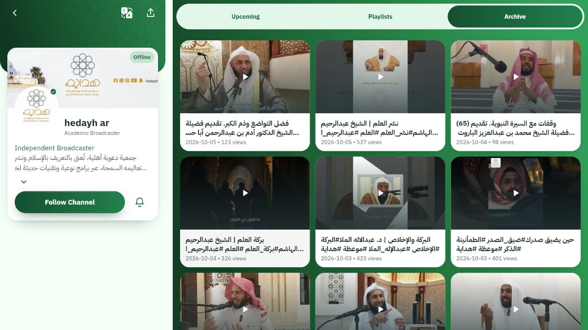
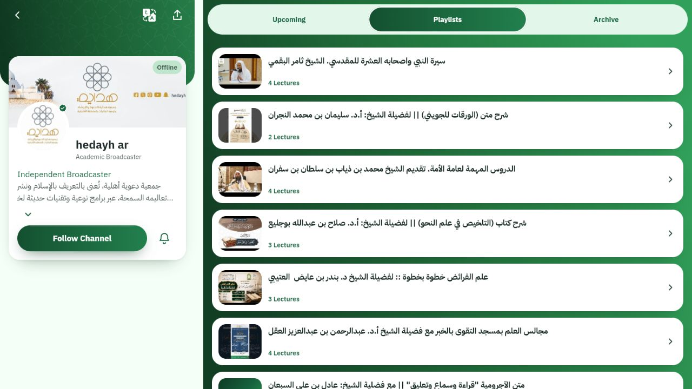
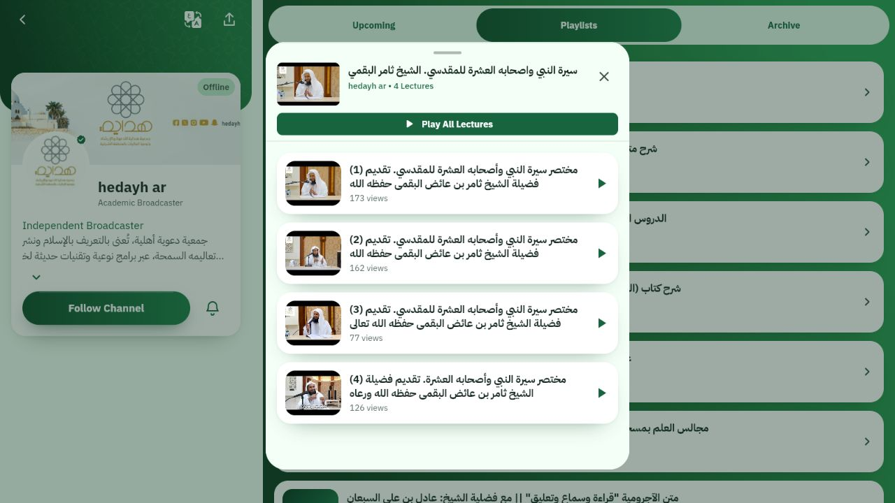

# YouTube web deployment verified, 2026-10-06

The owner explicitly authorized copying the existing phone key into Vercel's
sensitive Production setting for `stream-application` and redeploying.
The setting is verified as sensitive and Production-only. No credential value
is recorded here. The earlier transfer rejection was resolved by this approval.

- Application commit: `77bba0aec00dd7aeffd469fa02e637c343e738ef`.
- Deployment: `dpl_BFLczX7sA7HiJzeeARzNmNsRn1pF`, READY, production.
- Public site: https://stream-application-ten.vercel.app/#/feed.
- Build ID: `77bba0aec00dd7aeffd469fa02e637c343e738ef-20261006054100`.

## Fresh live checks

Public `/api/youtube` reads for a populated channel return 200: channel details,
25 archived videos and 10 playlists. The downloaded browser bundle contains
`/api/youtube` and does not contain the actual phone key. Public channel/archive/
playlist response bodies also do not contain it.

The Hedayh channel on the deployed site renders populated Archive and Playlists
tabs. Opening its first playlist renders four videos with real titles and view
counts. The browser error log was empty. Playback was not required for this
content-list repair and was not tested.

Invalid queries with a client-supplied key return 400, POST returns 405 and an
uncached cross-site request returns 403 with `no-store`. A cross-site request to
an already cached public query returned 200 from the CDN. Origin checks are not
access control for cached public content; the endpoint does not grant CORS read
permission. This does not expose the key or private data.

## Source checks inherited from the repair

Analyzer zero issues, full Flutter 1,059 passed, seven Node checks passed,
release web build passed, injected sentinel key excluded from browser bundle.
The exposed real test fixture was replaced with a fake and its five tests passed
again. These checks were not rerun for this environment-only deployment.

The reused key previously appeared in Git history. The current tracked tree is
redacted, but that history exposure remains; a future key rotation is advisable.
No API restriction was weakened, no OAuth credential was copied, and no database
privilege or application source was changed during deployment.

## Browser evidence

