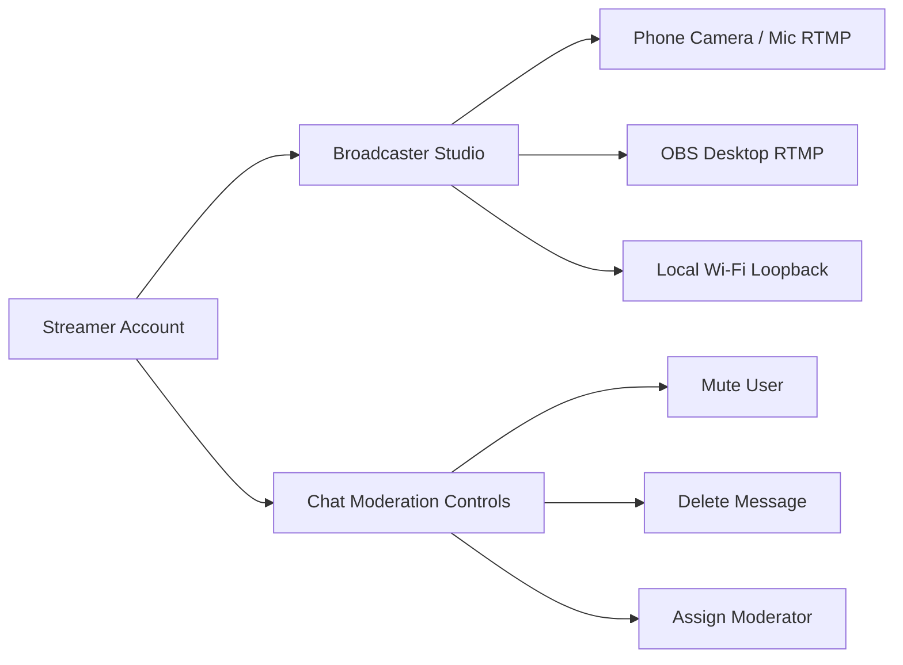
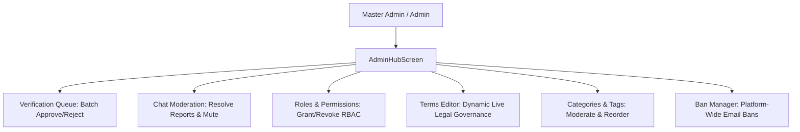
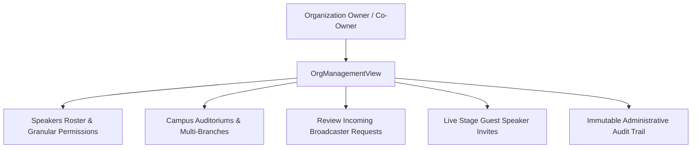
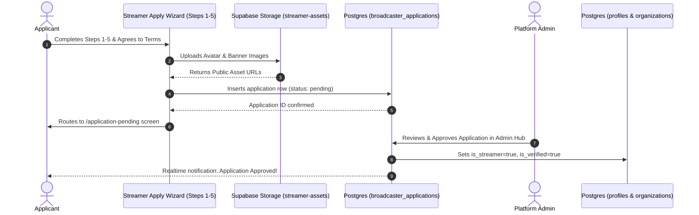
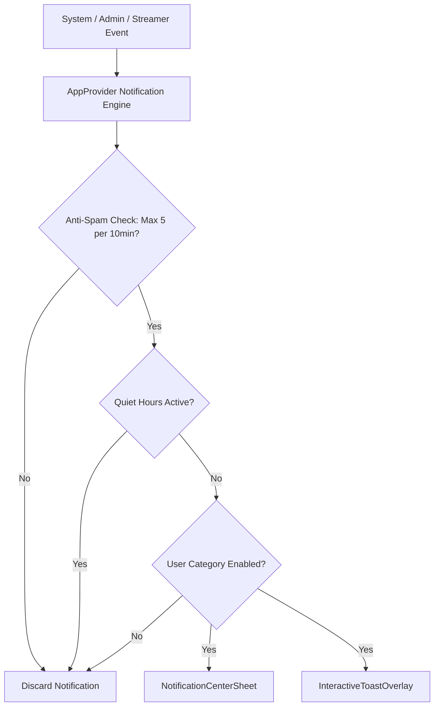
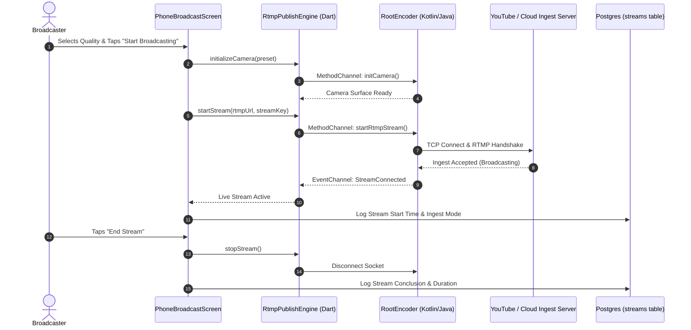
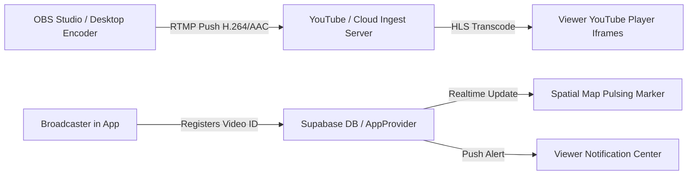
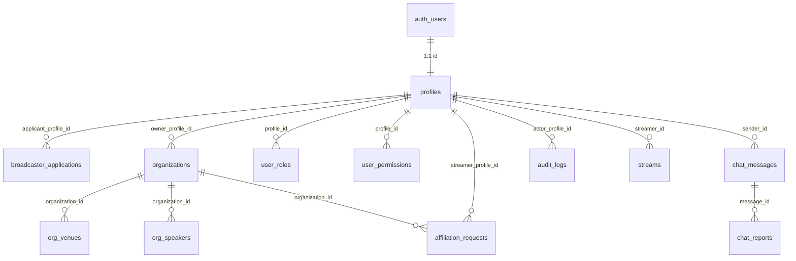

# 📋 Master Task Catalog & System Architecture Pipelines

**Project:** Streamer App (Educational Knowledge Streaming Platform — AlSharqia / KSA)  
**Location:** `doc/MASTER_TASKS_AND_ARCHITECTURE_ROADMAP.md`  
**Updated:** 2026-08-30  
**Status:** Ready for Implementation  

---

## 🧭 Executive Summary & Current Codebase Status

The Streamer App is currently at **v0.8+ / v0.9 (Settings Cleanup, Admin Hub & Mobile Broadcasting)**.
- **Frontend:** Flutter (Mobile + Web/Desktop responsive) with `go_router`, `provider`, `easy_localization` (Arabic/English), `flutter_map` (GIS vector tiles), and `youtube_player_iframe` / native RootEncoder RTMP broadcasting.
- **Backend:** Supabase PostgreSQL with RLS, Realtime channels, Storage buckets, and multi-tier RBAC (`master_admin`, `admin`, `org_owner`, `org_co_owner`).
- **Test Suite:** 83+ unit/widget tests passing green.

This document compiles **all 29 requested tasks** organized into **6 logical execution clusters** (designed for working on 2–3 tasks at a time without overwhelming context), along with deep-dive technical documentation for the **9 Core System Architecture Pipelines**.

---

# 📑 PART 1: LOGICAL TASK WORK CLUSTERS

```
┌──────────────────────────────────────────────────────────────────────────────────────────────────┐
│                                   TASK EXECUTION CLUSTERS                                        │
├────────────────────────┬────────────────────────┬────────────────────────┬───────────────────────┤
│ Cluster 1: Live Stream │ Cluster 2: Spatial Map │ Cluster 3: Categories  │ Cluster 4: Moderation │
│ & Player Viewport      │ & GIS Navigation       │ & Feed Tag Sync        │ & Permissions         │
│ (Tasks 1 - 6)          │ (Tasks 7 - 9)          │ (Tasks 10 - 12)        │ (Tasks 13 - 18)       │
├────────────────────────┴────────────────────────┼────────────────────────┴───────────────────────┤
│ Cluster 5: Telemetry, Views & Database Logging  │ Cluster 6: Responsive UI, Assets & Localization│
│ (Tasks 19 - 20)                                 │ (Tasks 21 - 29)                                │
└─────────────────────────────────────────────────┴────────────────────────────────────────────────┘
```

---

## 🎬 Cluster 1: Live Stream Player, Audio & Viewport Enhancements

### 🎯 Task 1: Fix Audio Issue & Streamer Silence / Mic Muted Indicator
- **Goal:** Fix audio playback dropping, ensure audio streams continue playing seamlessly across foreground and background, prevent audio session conflicts, and add a smart **Silence / Mic Muted Indicator** so viewers immediately know when a streamer is in silent mode (mic turned off) rather than suspecting an audio bug.
- **Audio Dropping Fix:**
  1. [`live_broadcast_screen.dart`](file:///c:/Users/User/Documents/Amir%20Ob/projects/Ideas/Current/Streamer_app/project/lib/features/live_stream/presentation/live_broadcast_screen.dart#L43-L65):
     - Ensure `isAudioLive` correctly maintains `autoPlay: true` and active audio focus on `AbstractVideoPlayer.fromSource` while displaying `LiveAudioStageMultiSpeaker`.
     - Enable `WakelockPlus.enable()` to prevent mobile OS battery optimization from killing background audio playback.
  2. [`youtube_player_adapter.dart`](file:///c:/Users/User/Documents/Amir%20Ob/projects/Ideas/Current/Streamer_app/project/lib/features/live_stream/presentation/adapters/youtube_player_adapter.dart#L118-L159):
     - Function `_loadVideoEmbed(String videoId)`: Ensure HTML5 audio policies allow uninterrupted media playback with `playsinline=1&enablejsapi=1&autoplay=1`.
  3. [`rtmp_publish_engine.dart`](file:///c:/Users/User/Documents/Amir%20Ob/projects/Ideas/Current/Streamer_app/project/lib/features/live_stream/services/rtmp_publish_engine.dart#L97-L125):
     - Method `setAudioOnly(bool enabled)`: Audio sample rate and bitrate tuning (AAC 128kbps @ 44.1kHz).
- **Streamer Silence / Mic Muted Indicator:**
  1. Broadcaster Side (`RtmpPublishEngine` / `PhoneBroadcastScreen`): Monitor microphone audio level / RMS amplitude and `isMuted` state. When microphone input is muted or dead silent (< -50dB for >3s), broadcast silent state.
  2. Viewer Side (`LiveBroadcastScreen` / `LivePlayerOverlayControls`): When silence / mic mute is detected, display a clean animated pill badge:
     - 🇬🇧 *"Streamer Microphone Muted / Silent Mode"*
     - 🇸🇦 *"الميكروفون مغلق / البث في وضع الصمت"*
     This ensures viewers know the broadcaster intentionally muted their mic rather than the app having an audio failure.

---

### 🎯 Task 2: Real Quality Options ({1080p, 720p, 480p, Auto}) & Remove from Audio-Only
- **Goal:** Remove mock engine strings (`1080p60 (Local RTMP Loopback)`, `720p60 (AWS IVS Low-Latency)`, `480p (YouTube Embed)`) from the quality selector. Replace with real resolution presets (`Auto`, `1080p`, `720p`, `480p`, `360p`) and hide the selector entirely for Audio-Only streams.
- **Target Files & Locations:**
  1. [`live_player_overlay_controls.dart`](file:///c:/Users/User/Documents/Amir%20Ob/projects/Ideas/Current/Streamer_app/project/lib/features/live_stream/presentation/widgets/live_player_overlay_controls.dart#L198-L265):
     - Class `LivePlayerOverlayControls`: Add `bool isAudioOnly` property.
     - Lines 198–265: Replace `PopupMenuButton<StreamSourceType>` with `PopupMenuButton<String>` representing resolution presets (`auto`, `1080`, `720`, `480`, `360`). Wrap in `if (!widget.isAudioOnly)` to hide when audio-only.
  2. [`live_broadcast_screen.dart`](file:///c:/Users/User/Documents/Amir%20Ob/projects/Ideas/Current/Streamer_app/project/lib/features/live_stream/presentation/live_broadcast_screen.dart#L384-L408):
     - Pass `isAudioOnly: isAudioLive` to `LivePlayerOverlayControls`. Handle resolution selection callback.

---

### 🎯 Task 3: Auto-Rotate to Fullscreen Landscape on Zoom/Increase Size Button Tap
- **Goal:** When the user clicks the expand/fullscreen button while the phone is in portrait mode, automatically lock orientation to landscape and enter immersive fullscreen mode; return to portrait on exit.
- **Target Files & Locations:**
  1. [`live_broadcast_screen.dart`](file:///c:/Users/User/Documents/Amir%20Ob/projects/Ideas/Current/Streamer_app/project/lib/features/live_stream/presentation/live_broadcast_screen.dart#L399-L405):
     - Method `_toggleFullscreen()`:
       ```dart
       void _toggleFullscreen() {
         setState(() => _isFullscreen = !_isFullscreen);
         if (_isFullscreen) {
           SystemChrome.setPreferredOrientations([
             DeviceOrientation.landscapeLeft,
             DeviceOrientation.landscapeRight,
           ]);
           SystemChrome.setEnabledSystemUIMode(SystemUiMode.immersiveSticky);
         } else {
           SystemChrome.setPreferredOrientations([
             DeviceOrientation.portraitUp,
           ]);
           SystemChrome.setEnabledSystemUIMode(SystemUiMode.edgeToEdge);
         }
       }
       ```
  2. [`live_player_overlay_controls.dart`](file:///c:/Users/User/Documents/Amir%20Ob/projects/Ideas/Current/Streamer_app/project/lib/features/live_stream/presentation/widgets/live_player_overlay_controls.dart#L325-L345):
     - Fullscreen toggle button icon and tooltip updates (`Icons.fullscreen_rounded` / `Icons.fullscreen_exit_rounded`).

---

### 🎯 Task 4a: Default Stream State Placeholders & Diagnostics Engine
- **File Decision:** **CREATE NEW FILE** `project/lib/features/live_stream/presentation/widgets/stream_state_placeholder_overlay.dart` to unify and replace ad-hoc error/loading views across adapters.
- **Goal:** Build rich, informative default placeholder states for all stream lifecycle phases with actionable diagnostics.
- **Target Files & Locations:**
  1. **[NEW]** [`stream_state_placeholder_overlay.dart`](file:///c:/Users/User/Documents/Amir%20Ob/projects/Ideas/Current/Streamer_app/project/lib/features/live_stream/presentation/widgets/stream_state_placeholder_overlay.dart):
     - Encapsulates branded animated UI states:
       - `StreamState.initializing`: "Connecting to live feed... / جاري الاتصال بالبث المباشر..."
       - `StreamState.startingSoon`: "Broadcast starting soon / سيبدأ البث قريباً — المحاضر يستعد"
       - `StreamState.ended`: "Broadcast concluded / انتهى البث المباشر — شكراً لحضوركم"
       - `StreamState.offline`: "Broadcaster currently offline / القناة غير نشطة حالياً"
       - `StreamState.noAudioToken`: "Audio stream token expired / تعذر مزامنة الصوت (يرجى إبلاغ المحاضر)"
       - `StreamState.reconnecting`: "Reconnecting to broadcast feed / جاري إعادة الاتصال..."
  2. [`live_broadcast_screen.dart`](file:///c:/Users/User/Documents/Amir%20Ob/projects/Ideas/Current/Streamer_app/project/lib/features/live_stream/presentation/live_broadcast_screen.dart#L280-L330):
     - Integrate `StreamStatePlaceholderOverlay` on top of video viewport when state != `StreamState.live`.
  3. [`youtube_player_adapter.dart`](file:///c:/Users/User/Documents/Amir%20Ob/projects/Ideas/Current/Streamer_app/project/lib/features/live_stream/presentation/adapters/youtube_player_adapter.dart#L283-L328):
     - Delegate error & loading rendering to `StreamStatePlaceholderOverlay`.
  4. Localization files: [`en.json`](file:///c:/Users/User/Documents/Amir%20Ob/projects/Ideas/Current/Streamer_app/project/assets/i18n/en.json) & [`ar.json`](file:///c:/Users/User/Documents/Amir%20Ob/projects/Ideas/Current/Streamer_app/project/assets/i18n/ar.json) under `live.placeholders.*`.

---

### 🎯 Task 4b: Streamer Custom State Placeholders & Admin Moderation Pipeline
- **Goal:** Allow Streamers to upload custom branded placeholder graphics (for "Starting Soon", "Intermission / Be Right Back", and "Stream Ended"), and give Admins the power in Admin Hub to **Approve or Reject** custom placeholders with detailed feedback communicated back to the streamer.
- **Workflow & Architecture:**
  1. **Streamer Upload Surface:**
     - [`streamer_editor_sheet.dart`](file:///c:/Users/User/Documents/Amir%20Ob/projects/Ideas/Current/Streamer_app/project/lib/features/profile/presentation/widgets/streamer_editor_sheet.dart): Add "Custom Broadcast Cards / بطاقات البث المخصصة" (Starting Soon card, Break card, Ending card).
     - Images uploaded to Supabase Storage bucket `streamer-assets/custom_placeholders/`.
     - Inserts row into `streamer_custom_placeholders` with `status: 'pending'`.
  2. **Admin Moderation & Communication Surface:**
     - [`admin_hub_screen.dart`](file:///c:/Users/User/Documents/Amir%20Ob/projects/Ideas/Current/Streamer_app/project/lib/features/admin/presentation/admin_hub_screen.dart): Add "Placeholder Approval Queue / مراجعة بطاقات البث".
     - Admins can preview submitted cards and take action:
       - ✅ **Approve:** Updates status to `approved`, activating the card in live broadcasts.
       - ❌ **Reject with Reason:** Admin enters mandatory rejection reason (e.g. "Low image quality", "Text violates guidelines", "Incorrect aspect ratio").
  3. **Streamer Notification & Resolution Feedback:**
     - [`app_provider.dart`](file:///c:/Users/User/Documents/Amir%20Ob/projects/Ideas/Current/Streamer_app/project/lib/core/providers/app_provider.dart#L3630-L3680):
       - Automatically dispatches high-priority notification to streamer (`NotificationType.adminCardEditRequestStreamer`):
         - 🇬🇧 *"Custom starting card rejected: [Reason]. Please update and resubmit."*
         - 🇸🇦 *"تم رفض بطاقة البث المخصصة: [السبب]. يرجى التعديل وإعادة الإرسال."*
  4. **Live Stream Integration:**
     - `StreamStatePlaceholderOverlay` checks if streamer has an `approved` custom card; if yes, renders custom graphic; if not or while pending, gracefully falls back to the **Default System Placeholder**.

---

### 🎯 Task 5: Failed to Load Video YouTube Fallback Action
- **Goal:** When a video fails to embed or stream, display a dedicated button: "Open in YouTube / المشاهدة عبر تطبيق يوتيوب" that launches the video directly in the external YouTube app/browser.
- **Target Files & Locations:**
  1. [`youtube_player_adapter.dart`](file:///c:/Users/User/Documents/Amir%20Ob/projects/Ideas/Current/Streamer_app/project/lib/features/live_stream/presentation/adapters/youtube_player_adapter.dart#L310-L326):
     - Method `_buildErrorView()`:
       ```dart
       ElevatedButton.icon(
         onPressed: () => launchUrl(
           Uri.parse('https://www.youtube.com/watch?v=$_currentVideoId'),
           mode: LaunchMode.externalApplication,
         ),
         icon: const Icon(Icons.open_in_new_rounded),
         label: Text('live.open_in_youtube'.tr()),
       )
       ```
  2. [`vod_player_modal_sheet.dart`](file:///c:/Users/User/Documents/Amir%20Ob/projects/Ideas/Current/Streamer_app/project/lib/features/profile/presentation/widgets/vod_player_modal_sheet.dart#L150-L210):
     - Add external YouTube launch fallback for archived VOD playback errors.

---

### 🎯 Task 6: In-App Picture-in-Picture (PiP) Floating Mini-Player Fix
- **Goal:** Ensure smooth minimization from `LiveBroadcastScreen` to `FloatingStreamMiniPlayer` inside the app without stopping audio, with working drag coordinates, play/pause controls, and tap-to-restore.
- **Target Files & Locations:**
  1. [`floating_stream_mini_player.dart`](file:///c:/Users/User/Documents/Amir%20Ob/projects/Ideas/Current/Streamer_app/project/lib/core/widgets/floating_stream_mini_player.dart#L15-L65):
     - Pan gesture clamping logic, aspect ratio bounding, play/pause toggle call to `AppProvider`.
  2. [`app_provider.dart`](file:///c:/Users/User/Documents/Amir%20Ob/projects/Ideas/Current/Streamer_app/project/lib/core/providers/app_provider.dart#L2440-L2480):
     - Methods `openMiniPlayer(...)`, `closeMiniPlayer()`, `toggleMiniPlayerPlayback()`.
  3. [`live_broadcast_screen.dart`](file:///c:/Users/User/Documents/Amir%20Ob/projects/Ideas/Current/Streamer_app/project/lib/features/live_stream/presentation/live_broadcast_screen.dart#L420-L460):
     - Add "Minimize / Minimize to PiP" icon in top app bar that activates mini-player and pops route.

---

## 🗺️ Cluster 2: Spatial Map & GIS Navigation Polish

### 🎯 Task 7: Fix Carto Basemap API Key Issue with Resilient Free Tile Provider
- **Goal:** Replace broken/rate-limited Carto basemap URLs that require an API key with reliable, free OpenStreetMap / OpenFreeMap / Carto Positron basemap tiles that do not fail unexpectedly.
- **Target Files & Locations:**
  1. [`spatial_map_screen.dart`](file:///c:/Users/User/Documents/Amir%20Ob/projects/Ideas/Current/Streamer_app/project/lib/features/map/presentation/spatial_map_screen.dart#L153-L165):
     - Section `TileLayer`:
       ```dart
       TileLayer(
         urlTemplate: 'https://tile.openstreetmap.org/{z}/{x}/{y}.png',
         fallbackUrl: 'https://{s}.basemaps.cartocdn.com/rastertiles/voyager/{z}/{x}/{y}.png',
         subdomains: const ['a', 'b', 'c'],
         userAgentPackageName: 'com.streamer.app',
         tileProvider: NetworkTileProvider(),
       )
       ```

---

### 🎯 Task 8: Spatial Map Profile Markers White Background
- **Goal:** Change the background container of map markers from dark/black (`AppTheme.darkSurface1`) to crisp white (`Colors.white`) so streamer profile pictures, avatars, and organization icons pop clearly on top of the map.
- **Target Files & Locations:**
  1. [`spatial_streamer_marker.dart`](file:///c:/Users/User/Documents/Amir%20Ob/projects/Ideas/Current/Streamer_app/project/lib/features/map/presentation/widgets/spatial_streamer_marker.dart#L185-L215):
     - Line 192: Change `color: AppTheme.darkSurface1` to `color: Colors.white`.
  2. [`offline_marker.dart`](file:///c:/Users/User/Documents/Amir%20Ob/projects/Ideas/Current/Streamer_app/project/lib/features/map/presentation/widgets/offline_marker.dart#L40-L70):
     - Update border and avatar background to clean white base.
  3. [`pulsing_live_marker.dart`](file:///c:/Users/User/Documents/Amir%20Ob/projects/Ideas/Current/Streamer_app/project/lib/features/map/presentation/widgets/pulsing_live_marker.dart#L70-L100):
     - Maintain pulsing radar ring while keeping avatar disc background white.

---

### 🎯 Task 9: One-Click Google Maps Integration
- **Goal:** Add a direct button to launch Google Maps with exact destination coordinates (`latitude, longitude`) using `url_launcher`.
- **Target Files & Locations:**
  1. [`venue_navigation_sheet.dart`](file:///c:/Users/User/Documents/Amir%20Ob/projects/Ideas/Current/Streamer_app/project/lib/features/map/presentation/widgets/venue_navigation_sheet.dart#L390-L440):
     - Method `onPressed` on `venue.open_maps` button:
       ```dart
       final googleMapsUrl = Uri.parse(
         'https://www.google.com/maps/search/?api=1&query=${streamer.latitude},${streamer.longitude}',
       );
       if (await canLaunchUrl(googleMapsUrl)) {
         await launchUrl(googleMapsUrl, mode: LaunchMode.externalApplication);
       }
       ```
  2. [`marker_summary_card.dart`](file:///c:/Users/User/Documents/Amir%20Ob/projects/Ideas/Current/Streamer_app/project/lib/features/map/presentation/widgets/marker_summary_card.dart#L120-L160):
     - Add quick navigation icon button next to venue title.

---

## 🏷️ Cluster 3: Categories, Tags & Feed Filter Synchronization

### 🎯 Task 10: Sync Academic Categories Across Discovery, Filters & Spatial Map
- **Goal:** Unify the source of truth for Academic Categories between the Discovery Feed chips, Advanced Tags Filter sheet, and Spatial Map "All Topics" dropdown.
- **Target Files & Locations:**
  1. [`app_provider.dart`](file:///c:/Users/User/Documents/Amir%20Ob/projects/Ideas/Current/Streamer_app/project/lib/core/providers/app_provider.dart#L114-L140):
     - Define `List<AcademicCategoryModel> _academicCategories` and getter `currentCategoryFilter`.
     - Method `setCategoryFilter(String categoryId)`: Synchronize state across all listening screens.
  2. [`topic_selector_dropdown.dart`](file:///c:/Users/User/Documents/Amir%20Ob/projects/Ideas/Current/Streamer_app/project/lib/features/map/presentation/widgets/topic_selector_dropdown.dart#L22-L80):
     - Migrate hardcoded `kAcademicTopics` list to consume `appProvider.academicCategories`.
  3. [`discovery_feed_screen.dart`](file:///c:/Users/User/Documents/Amir%20Ob/projects/Ideas/Current/Streamer_app/project/lib/features/discovery/presentation/discovery_feed_screen.dart#L390-L415):
     - Dynamically generate category filter chips from `appProvider.academicCategories`.
  4. [`tags_filter_bottom_sheet.dart`](file:///c:/Users/User/Documents/Amir%20Ob/projects/Ideas/Current/Streamer_app/project/lib/features/discovery/presentation/widgets/tags_filter_bottom_sheet.dart#L40-L90):
     - Bind category selector to `appProvider.academicCategories`.

---

### 🎯 Task 11: Admin Power to Change and Edit Academic Categories
- **Goal:** Allow platform Admins and Master Admins to create, edit names (EN/AR), reorder, and remove Academic Categories in the Admin Hub.
- **Target Files & Locations:**
  1. [`admin_hub_screen.dart`](file:///c:/Users/User/Documents/Amir%20Ob/projects/Ideas/Current/Streamer_app/project/lib/features/admin/presentation/admin_hub_screen.dart#L300-L340):
     - Add new Admin Tab: "Academic Categories / التصنيفات الأكاديمية" with add/edit dialogs.
  2. [`admin_database_service.dart`](file:///c:/Users/User/Documents/Amir%20Ob/projects/Ideas/Current/Streamer_app/project/lib/core/services/admin_database_service.dart#L800-L860):
     - Methods `loadCategories()`, `createCategory()`, `updateCategory()`, `deleteCategory()`.
  3. [`supabase/migrations/`](file:///c:/Users/User/Documents/Amir%20Ob/projects/Ideas/Current/Streamer_app/supabase/migrations):
     - Create table `public.academic_categories (id text primary key, name_en text, name_ar text, icon_name text, sort_order int)`.

---

### 🎯 Task 12: Admin Controls on Tags & Tag Moderation
- **Goal:** Moderate suggested tags submitted by streamers/organizations during onboarding and manage allowed tags displayed in public search/filters.
- **Target Files & Locations:**
  1. [`admin_hub_screen.dart`](file:///c:/Users/User/Documents/Amir%20Ob/projects/Ideas/Current/Streamer_app/project/lib/features/admin/presentation/admin_hub_screen.dart):
     - Tag Moderation Manager: Approve/Reject custom tags, merge duplicate tags, whitelist/blacklist.
  2. [`apply_step_3_professional.dart`](file:///c:/Users/User/Documents/Amir%20Ob/projects/Ideas/Current/Streamer_app/project/lib/features/auth/presentation/steps/apply_step_3_professional.dart#L120-L180):
     - Autocomplete against approved tag list with "Suggest new tag" moderation flag.
  3. [`tags_filter_bottom_sheet.dart`](file:///c:/Users/User/Documents/Amir%20Ob/projects/Ideas/Current/Streamer_app/project/lib/features/discovery/presentation/widgets/tags_filter_bottom_sheet.dart#L100-L150):
     - Render only Admin-approved active tags.

---

## 🛡️ Cluster 4: Moderation, Chat, and User Permission Architecture

### 🎯 Task 13: User Message Actions (Delete/Edit Own, Report, and Hide Others)
- **Goal:** Allow users to edit and delete their own chat messages via long press. Allow users to Report or Hide other users' messages.
- **Target Files & Locations:**
  1. [`live_chat_widget.dart`](file:///c:/Users/User/Documents/Amir%20Ob/projects/Ideas/Current/Streamer_app/project/lib/features/live_stream/presentation/widgets/live_chat_widget.dart#L120-L132):
     - Remove restriction `message.isCurrentUser ? null : ...` so all tiles support long-press action menu.
  2. [`chat_message_actions_sheet.dart`](file:///c:/Users/User/Documents/Amir%20Ob/projects/Ideas/Current/Streamer_app/project/lib/features/live_stream/presentation/widgets/chat_message_actions_sheet.dart#L20-L60):
     - Add `_ChatMessageAction.edit` and `_ChatMessageAction.hideMessage`.
     - Render options conditionally: `Edit` / `Delete` if `isCurrentUser`; `Report` / `Hide Message` / `Block User` / `Mute` if other user.
  3. [`live_chat_controller.dart`](file:///c:/Users/User/Documents/Amir%20Ob/projects/Ideas/Current/Streamer_app/project/lib/features/live_stream/services/live_chat_controller.dart#L100-L175):
     - Methods `editMessage(String messageId, String newText)`, `hideMessage(String messageId)`.
     - Add local `Set<String> _hiddenMessageIds` persisted in `SharedPreferences`.

---

### 🎯 Task 14: Link Reports and Hides to the Moderation Team
- **Goal:** Ensure reported messages and flagged content instantly sync to the Admin Hub and Org Admin Chat Moderation queue.
- **Target Files & Locations:**
  1. [`chat_moderation_view.dart`](file:///c:/Users/User/Documents/Amir%20Ob/projects/Ideas/Current/Streamer_app/project/lib/features/admin/presentation/widgets/chat_moderation_view.dart#L1-L150):
     - Real-time stream of `chat_reports` with action buttons: `Dismiss Report`, `Delete Reported Message`, `Mute User in Stream`, `Ban User Platform-Wide`.
  2. [`admin_database_service.dart`](file:///c:/Users/User/Documents/Amir%20Ob/projects/Ideas/Current/Streamer_app/project/lib/core/services/admin_database_service.dart#L1500-L1600):
     - Method `resolveChatReport(String reportId, String resolution)`.

---

### 🎯 Task 15: Stream Moderator Labels & Delegation Hierarchy
- **Goal:** Allow Streamers to appoint stream-specific moderators, Orgs to appoint org moderators, and Admins to appoint global moderators. Display moderator badges (`🛡️ Mod`) in chat and track who granted the role.
- **Target Files & Locations:**
  1. [`chat_message_model.dart`](file:///c:/Users/User/Documents/Amir%20Ob/projects/Ideas/Current/Streamer_app/project/lib/features/live_stream/models/chat_message_model.dart#L8-L15):
     - Add `ChatSenderBadge.moderator`.
  2. [`role_permission_management_view.dart`](file:///c:/Users/User/Documents/Amir%20Ob/projects/Ideas/Current/Streamer_app/project/lib/features/admin/presentation/widgets/role_permission_management_view.dart#L40-L120):
     - Audit table displaying moderator appointments: `Moderator Email`, `Assigned By`, `Scope (Stream / Org / Global)`, `Granted At`, `Revoke Action`.
  3. [`supabase/migrations/`](file:///c:/Users/User/Documents/Amir%20Ob/projects/Ideas/Current/Streamer_app/supabase/migrations):
     - Migration for `stream_moderators` table with `stream_id`, `profile_id`, `granted_by`, `created_at`.

---

### 🎯 Task 16: Admin Power to Block User from the Application (Email/Account Ban)
- **Goal:** Empower Admins to block a user platform-wide by banning their email and profile ID, terminating active sessions and preventing re-login.
- **Target Files & Locations:**
  1. [`admin_hub_screen.dart`](file:///c:/Users/User/Documents/Amir%20Ob/projects/Ideas/Current/Streamer_app/project/lib/features/admin/presentation/admin_hub_screen.dart):
     - Add "Banned Users / المستخدمين المحظورين" management card with email ban search.
  2. [`admin_database_service.dart`](file:///c:/Users/User/Documents/Amir%20Ob/projects/Ideas/Current/Streamer_app/project/lib/core/services/admin_database_service.dart):
     - Methods `banUser(String email, String profileId, String reason)`, `unbanUser(String email)`.
  3. [`app_router.dart`](file:///c:/Users/User/Documents/Amir%20Ob/projects/Ideas/Current/Streamer_app/project/lib/core/routing/app_router.dart#L100-L150):
     - Auth redirect gate: Check `provider.isUserBanned`; if true, route to `/account-banned`.

---

### 🎯 Task 17: Option in Settings to Delete Past Messages (All or by Stream)
- **Goal:** Give users and streamers an option in Settings under "Privacy & Chat History" to delete all their past chat messages or purge messages from a specific stream.
- **Target Files & Locations:**
  1. [`settings_screen.dart`](file:///c:/Users/User/Documents/Amir%20Ob/projects/Ideas/Current/Streamer_app/project/lib/features/profile/presentation/settings_screen.dart#L200-L260):
     - Add "Chat History & Privacy / سجل الدردشة والخصوصية" section.
     - Action buttons: "Delete All My Messages / حذف جميع رسائلي" & "Clear Messages by Stream / حذف رسائل بث محدد".
  2. [`admin_database_service.dart`](file:///c:/Users/User/Documents/Amir%20Ob/projects/Ideas/Current/Streamer_app/project/lib/core/services/admin_database_service.dart):
     - Method `deleteUserChatHistory(String userId, {String? streamId})`.

---

### 🎯 Task 18: Temporary Removal of Streamer from Map by Moderation
- **Goal:** Add moderation power in Admin Hub to temporarily hide a streamer/organization from the spatial map without banning or deleting their account.
- **Target Files & Locations:**
  1. [`admin_hub_screen.dart`](file:///c:/Users/User/Documents/Amir%20Ob/projects/Ideas/Current/Streamer_app/project/lib/features/admin/presentation/admin_hub_screen.dart#L1100-L1150):
     - Streamers Registry tab: Add toggle switch "Hide from Map / إخفاء من الخريطة".
  2. [`app_provider.dart`](file:///c:/Users/User/Documents/Amir%20Ob/projects/Ideas/Current/Streamer_app/project/lib/core/providers/app_provider.dart#L2530-L2560):
     - Method `filteredStreamers`: Exclude streamers where `s.isTemporarilyHiddenFromMap == true`.
  3. [`streamer_models.dart`](file:///c:/Users/User/Documents/Amir%20Ob/projects/Ideas/Current/Streamer_app/project/lib/features/profile/models/streamer_models.dart#L40-L80):
     - Add field `bool isTemporarilyHiddenFromMap`.

---

## 📊 Cluster 5: Stream & Video Data Telemetry, Views & Logging

### 🎯 Task 19: Accurate Views Counter on Streams and Videos
- **Goal:** Correctly calculate, format, and display live viewer counts and cumulative video views across Stream Cards, VOD Tiles, and Player Overlays.
- **Target Files & Locations:**
  1. [`streamer_grid_card.dart`](file:///c:/Users/User/Documents/Amir%20Ob/projects/Ideas/Current/Streamer_app/project/lib/features/discovery/presentation/widgets/streamer_grid_card.dart#L140-L170):
     - Format viewer count: `${streamer.viewerCount} watching / يشاهد الآن`.
  2. [`vod_grid_tile.dart`](file:///c:/Users/User/Documents/Amir%20Ob/projects/Ideas/Current/Streamer_app/project/lib/features/profile/presentation/widgets/vod_grid_tile.dart#L80-L110):
     - Format VOD views: `${vod.viewsCount} views / مشاهدة`.
  3. [`watch_session_tracker.dart`](file:///c:/Users/User/Documents/Amir%20Ob/projects/Ideas/Current/Streamer_app/project/lib/core/services/notifications/watch_session_tracker.dart#L1-L100):
     - Record view duration ticks and report to backend telemetry.

---

### 🎯 Task 20: Logging Stream Session Data into Supabase Database
- **Goal:** Persist all broadcast sessions (stream ID, streamer ID, title, start time, end time, duration, peak viewers, quality, ingest mode) to the database on start and end.
- **Target Files & Locations:**
  1. [`app_provider.dart`](file:///c:/Users/User/Documents/Amir%20Ob/projects/Ideas/Current/Streamer_app/project/lib/core/providers/app_provider.dart#L2170-L2240):
     - Method `startLiveBroadcast(...)` & `endLiveBroadcast(...)`: Insert/update rows in `public.streams`.
  2. [`phone_broadcast_screen.dart`](file:///c:/Users/User/Documents/Amir%20Ob/projects/Ideas/Current/Streamer_app/project/lib/features/live_stream/presentation/screens/phone_broadcast_screen.dart#L300-L340):
     - Ensure phone camera broadcasts trigger DB logging on start/stop.
  3. [`supabase/migrations/`](file:///c:/Users/User/Documents/Amir%20Ob/projects/Ideas/Current/Streamer_app/supabase/migrations):
     - Ensure table `public.streams` has `duration_seconds`, `peak_viewers`, `broadcast_type`, `ingest_protocol`.

---

## 🎨 Cluster 6: Responsive UI, Assets & Localization

### 🎯 Task 21: Refresh Default Profile Avatars & Banners
- **Goal:** Remove personal/test images and replace with an expanded library of professional academic avatars and high-resolution university/scholarly banners.
- **Target Files & Locations:**
  1. [`viewer_setup_screen.dart`](file:///c:/Users/User/Documents/Amir%20Ob/projects/Ideas/Current/Streamer_app/project/lib/features/auth/presentation/viewer_setup_screen.dart#L23-L28):
     - Update `_avatarPresets` list with clean SVG/vector and academic presets.
  2. [`apply_step_2_media.dart`](file:///c:/Users/User/Documents/Amir%20Ob/projects/Ideas/Current/Streamer_app/project/lib/features/auth/presentation/steps/apply_step_2_media.dart#L37-L50):
     - Update `_avatarPresets` and `_bannerPresets` lists.
  3. [`streamer_editor_sheet.dart`](file:///c:/Users/User/Documents/Amir%20Ob/projects/Ideas/Current/Streamer_app/project/lib/features/profile/presentation/widgets/streamer_editor_sheet.dart):
     - Update preset asset picker.

---

### 🎯 Task 22: Connect Lecture Bookmarks Feature
- **Goal:** Allow users to bookmark lectures from feed cards or VOD tiles and display the list of saved lectures in the Bookmarks sheet.
- **Target Files & Locations:**
  1. [`discovery_feed_screen.dart`](file:///c:/Users/User/Documents/Amir%20Ob/projects/Ideas/Current/Streamer_app/project/lib/features/discovery/presentation/discovery_feed_screen.dart#L40-L89):
     - Method `_showBookmarksSheet(BuildContext context)`: Render `GridView` of bookmarked VODs instead of static "No bookmarks" placeholder.
  2. [`vod_grid_tile.dart`](file:///c:/Users/User/Documents/Amir%20Ob/projects/Ideas/Current/Streamer_app/project/lib/features/profile/presentation/widgets/vod_grid_tile.dart):
     - Add bookmark icon button calling `provider.toggleBookmark(vod.id)`.

---

### 🎯 Task 23: Fix Overflowed Pixels Across All Screen Sizes
- **Goal:** Eliminate layout overflow exceptions (RenderFlex overflow) across compact mobile screens (320px–390px) and tablets/desktops.
- **Target Files & Locations:**
  1. [`admin_hub_screen.dart`](file:///c:/Users/User/Documents/Amir%20Ob/projects/Ideas/Current/Streamer_app/project/lib/features/admin/presentation/admin_hub_screen.dart): Wrap admin stat rows in `Wrap` / `LayoutBuilder`.
  2. [`discovery_feed_screen.dart`](file:///c:/Users/User/Documents/Amir%20Ob/projects/Ideas/Current/Streamer_app/project/lib/features/discovery/presentation/discovery_feed_screen.dart): Use flexible sizing for live carousel cards.
  3. [`top_spatial_search_bar.dart`](file:///c:/Users/User/Documents/Amir%20Ob/projects/Ideas/Current/Streamer_app/project/lib/features/map/presentation/widgets/top_spatial_search_bar.dart): Constrain dropdown widths.

---

### 🎯 Task 24: Remove Emojis from Notifications
- **Goal:** Remove emojis (`🎤`, `🏛️`, `ℹ️`, `📩`, `🔴`, `✨`) from notification titles, category filter tabs, and toast headers; use clean Material vector icons.
- **Target Files & Locations:**
  1. [`notification_models.dart`](file:///c:/Users/User/Documents/Amir%20Ob/projects/Ideas/Current/Streamer_app/project/lib/core/services/notifications/notification_models.dart#L4-L20):
     - Strip emoji characters from default strings.
  2. [`app_provider.dart`](file:///c:/Users/User/Documents/Amir%20Ob/projects/Ideas/Current/Streamer_app/project/lib/core/providers/app_provider.dart#L3560-L3740):
     - Remove emojis from notification title generators (`titleEn`, `titleAr`).
  3. [`notification_center_sheet.dart`](file:///c:/Users/User/Documents/Amir%20Ob/projects/Ideas/Current/Streamer_app/project/lib/features/notifications/presentation/notification_center_sheet.dart#L145-L165):
     - Clean category chip labels.

---

### 🎯 Task 25: Remove App Language Option from Settings Body
- **Goal:** Remove Section 3 (`_buildLanguageSelectorCard`) from Settings body since the top App Bar already features the dedicated `LanguageSwitcher` pill.
- **Target Files & Locations:**
  1. [`settings_screen.dart`](file:///c:/Users/User/Documents/Amir%20Ob/projects/Ideas/Current/Streamer_app/project/lib/features/profile/presentation/settings_screen.dart#L163-L172):
     - Remove Section 3 call `_buildLanguageSelectorCard(context, currentLocale)`.
     - Remove helper method `_buildLanguageSelectorCard(...)` (Lines 1526–1580).

---

### 🎯 Task 26: Fully Build Mobile Admin Hub View
- **Goal:** Make the Admin Hub responsive on mobile phones with collapsible navigation, scrollable tabs, stacked metric cards, and responsive approval cards.
- **Target Files & Locations:**
  1. [`admin_hub_screen.dart`](file:///c:/Users/User/Documents/Amir%20Ob/projects/Ideas/Current/Streamer_app/project/lib/features/admin/presentation/admin_hub_screen.dart#L295-L350):
     - When `!isDesktop`, use scrollable TabBar with icons or bottom sheet switcher.
  2. [`chat_moderation_view.dart`](file:///c:/Users/User/Documents/Amir%20Ob/projects/Ideas/Current/Streamer_app/project/lib/features/admin/presentation/widgets/chat_moderation_view.dart):
     - Mobile card layout for reported messages.
  3. [`role_permission_management_view.dart`](file:///c:/Users/User/Documents/Amir%20Ob/projects/Ideas/Current/Streamer_app/project/lib/features/admin/presentation/widgets/role_permission_management_view.dart):
     - Stacked card view for role assignments.

---

### 🎯 Task 27: Harmonize Phone Broadcast with Live Stream Room Interface
- **Goal:** Unify the phone camera broadcaster view with the existing Live Stream room tabs (Live Chat, Q&A, Venue, Reactions, Floating Controls) so the streamer has full studio control while broadcasting from their phone.
- **Target Files & Locations:**
  1. [`phone_broadcast_screen.dart`](file:///c:/Users/User/Documents/Amir%20Ob/projects/Ideas/Current/Streamer_app/project/lib/features/live_stream/presentation/screens/phone_broadcast_screen.dart#L250-L400):
     - Embed `LiveChatWidget`, `FloatingReactionsOverlay`, and viewer counters directly on top of the camera viewfinder.
  2. [`rtmp_ip_dialog.dart`](file:///c:/Users/User/Documents/Amir%20Ob/projects/Ideas/Current/Streamer_app/project/lib/features/live_stream/presentation/widgets/rtmp_ip_dialog.dart#L1480-L1500):
     - Ensure launching Phone Broadcast smoothly navigates to the unified broadcaster room.

---

### 🎯 Task 28: Streamer Can Only Go Live on Their Own Profile Page
- **Goal:** Ensure the cell tower "Go Live" button in the App Bar is only visible when the logged-in streamer is viewing their own profile page.
- **Target Files & Locations:**
  1. [`broadcaster_profile_screen.dart`](file:///c:/Users/User/Documents/Amir%20Ob/projects/Ideas/Current/Streamer_app/project/lib/features/profile/presentation/broadcaster_profile_screen.dart#L100-L115):
     - Replace generic check with ownership check:
       ```dart
       final isOwnProfile = appProvider.isLoggedInStreamer &&
           (appProvider.currentBroadcasterId == streamer.streamerId ||
            appProvider.userProfile.id == streamer.streamerId ||
            appProvider.myApplication?.applicantProfileId == streamer.streamerId);
       
       if (isOwnProfile && appProvider.isStreamerModeEnabled)
         IconButton(
           icon: const Icon(Icons.cell_tower_rounded),
           onPressed: () => LiveBroadcasterStudioSheet.show(context),
         ),
       ```

---

### 🎯 Task 29: Complete Remaining Arabic Localization & RTL Polish
- **Goal:** Ensure 100% bilingual symmetry across `en.json` and `ar.json` for all new features (tag moderation, category management, placeholder diagnostics, Google Maps toast, bookmarked lectures).
- **Target Files & Locations:**
  1. [`en.json`](file:///c:/Users/User/Documents/Amir%20Ob/projects/Ideas/Current/Streamer_app/project/assets/i18n/en.json) & [`ar.json`](file:///c:/Users/User/Documents/Amir%20Ob/projects/Ideas/Current/Streamer_app/project/assets/i18n/ar.json).
  2. [`academic_lexicon_service.dart`](file:///c:/Users/User/Documents/Amir%20Ob/projects/Ideas/Current/Streamer_app/project/lib/core/services/translation/academic_lexicon_service.dart).

---

# 🏗️ PART 2: 9 CORE SYSTEM ARCHITECTURE PIPELINES

```
┌──────────────────────────────────────────────────────────────────────────────────────────────────┐
│                                SYSTEM ARCHITECTURE PIPELINES                                     │
├────────────────────────┬────────────────────────┬────────────────────────┬───────────────────────┤
│ 1. Streamer Abilities  │ 2. Admin Abilities     │ 3. Org Abilities       │ 4. Becoming a         │
│ & Features             │ & Features             │ & Features             │ Streamer/Org Pipeline │
├────────────────────────┼────────────────────────┼────────────────────────┼───────────────────────┤
│ 5. Notifications       │ 6. Starting Stream     │ 7. Starting Stream     │ 8. Starting Stream    │
│ Architecture           │ on Phone Pipeline      │ via OBS Pipeline       │ Locally (Same Wi-Fi)  │
├────────────────────────┴────────────────────────┴────────────────────────┴───────────────────────┤
│ 9. Database Connections & Supabase Schema Architecture                                           │
└──────────────────────────────────────────────────────────────────────────────────────────────────┘
```

---

## 📡 Pipeline 1: Streamer Abilities and Features Architecture

### Overview
A verified Broadcaster (Scholar, Lecturer, or Independent Creator) has dedicated broadcast, content management, and audience interaction powers.

### Feature & Method Mapping
| Ability / Feature | File Path | Class / Method | Description |
| :--- | :--- | :--- | :--- |
| **Go Live (Phone Camera/Mic)** | `lib/features/live_stream/services/rtmp_publish_engine.dart` | `RtmpPublishEngine.startStream(url, key)` | Publishes camera/mic via RTMP to YouTube / server |
| **Go Live (OBS Ingest)** | `lib/features/live_stream/presentation/widgets/rtmp_ip_dialog.dart` | `LiveBroadcasterStudioSheet._handleObsStream()` | Generates stream key and ingest endpoint |
| **Audio-Only Broadcasting** | `lib/features/live_stream/services/rtmp_publish_engine.dart` | `RtmpPublishEngine.setAudioOnly(true)` | Swaps camera video source to static branded image |
| **Profile & Bio Editing** | `lib/features/profile/presentation/widgets/streamer_editor_sheet.dart` | `StreamerEditorSheet.show()` | Edits display name, bio, topic tags, venue address |
| **Manage VODs & Playlists** | `lib/core/providers/app_provider.dart` | `AppProvider.addVod()`, `getVodsForStreamer()` | Publishes archived lecture recordings and series |
| **Moderate Live Chat** | `lib/features/live_stream/services/live_chat_controller.dart` | `muteUser()`, `deleteMessage()` | Server-enforced muting and deletion of messages |
| **Appoint Stream Moderators**| `lib/features/live_stream/services/live_chat_controller.dart` | `assignModerator(profileId)` | Grants chat moderation badge to trusted viewers |
| **Apply to Join Organization**| `lib/features/profile/presentation/widgets/join_org_modal_sheet.dart` | `JoinOrgModalSheet` | Submits affiliation request to an institution |
| **Purge Chat History** | `lib/features/profile/presentation/settings_screen.dart` | `_deleteMyPastMessages()` | Deletes messages from current or past streams |



---

## 🛡️ Pipeline 2: Admin Abilities and Features Architecture

### Overview
Multi-tier Platform Governance (`master_admin` and `admin`) with real-time audit logging and RLS enforcement.

### Feature & Method Mapping
| Ability / Feature | File Path | Class / Method | Description |
| :--- | :--- | :--- | :--- |
| **Verification Queue Review** | `lib/features/admin/presentation/admin_hub_screen.dart` | `_buildVerificationQueueTab()` | Batch approve or reject broadcaster applications |
| **Platform-Wide Chat Moderation** | `lib/features/admin/presentation/widgets/chat_moderation_view.dart` | `ChatModerationView` | Review reported chat messages, dismiss, delete, or mute |
| **Role & Permission Management**| `lib/features/admin/presentation/widgets/role_permission_management_view.dart` | `RolePermissionManagementView` | Grant/revoke Admin roles, assign granular permissions |
| **Dynamic Terms & Governance** | `lib/features/admin/presentation/admin_hub_screen.dart` | `_buildTermsGovernanceTab()` | Live editor for Terms of Service, Guidelines, Privacy Policy |
| **Platform Telemetry & Analytics**| `lib/features/admin/presentation/admin_hub_screen.dart` | `_buildViewerAnalyticsTab()` | Real-time analytics on viewers, watch hours, broadcasts |
| **Manage Academic Categories** | `lib/features/admin/presentation/admin_hub_screen.dart` | `_buildCategoriesManagerTab()` | Create, edit, reorder, and remove platform categories |
| **Tag Whitelist & Moderation** | `lib/features/admin/presentation/admin_hub_screen.dart` | `_buildTagModerationTab()` | Moderate user-submitted tags and Discovery filters |
| **Ban Users Platform-Wide** | `lib/core/services/admin_database_service.dart` | `AdminDatabaseService.banUser()` | Bans user email/ID and terminates active sessions |
| **Hide Streamer from Map** | `lib/core/providers/app_provider.dart` | `toggleHideStreamerFromMap()` | Temporarily removes streamer from GIS spatial map |



---

## 🏛️ Pipeline 3: Organization Abilities and Features Architecture

### Overview
Academic Institutions, University Faculties, and Cultural Centers operate multi-speaker channels, manage venue branches, and review lecturer affiliations.

### Feature & Method Mapping
| Ability / Feature | File Path | Class / Method | Description |
| :--- | :--- | :--- | :--- |
| **Manage Multi-Speaker Roster** | `lib/features/admin/presentation/widgets/org_management_view.dart` | `_buildSpeakersRosterTab()` | Add/remove professors, set speaker permissions |
| **Campus Venue Branches** | `lib/features/admin/presentation/widgets/org_management_view.dart` | `_buildVenuesTab()` | Manage auditoriums, coordinates, seating capacities |
| **Review Affiliation Requests** | `lib/features/admin/presentation/widgets/org_management_view.dart` | `_buildAffiliationRequestsTab()` | Accept/decline incoming broadcaster join requests |
| **Invite Guest Lecturers** | `lib/core/providers/app_provider.dart` | `notifyOrgLiveGuestInvite()` | Dispatches push notification invite to live stage |
| **Granular Speaker RBAC** | `lib/features/organization/models/org_broadcaster_permissions.dart` | `OrgBroadcasterPermissions` | Toggle `canGoLiveVideo`, `canChangeLocation`, etc. |
| **Audit Log Trail** | `lib/features/organization/models/org_audit_log_entry.dart` | `OrgAuditLogEntry` | Immutable log of organizational actions |



---

## 🧙 Pipeline 4: Becoming a Streamer / Organization Pipeline

### Step-by-Step Registration & Verification Flow
1. **Entry Point:** User navigates to `/streamer-apply` or taps "Become a Broadcaster" in Settings.
2. **Step 1 — Identity (`apply_step_1_identity.dart`):** Auto-fills legal name and email from Google account; collects Arabic & English names, phone number, and public `@handle`.
3. **Step 2 — Media Assets (`apply_step_2_media.dart`):** Avatar photo & landscape banner upload with interactive cropping modal (`ImageArrangeModal`).
4. **Step 3 — Professional Credentials (`apply_step_3_professional.dart`):** Selects Academic Category, enters institution name, academic title, and YouTube channel link. Chooses between **Individual Scholar** and **Organization/Venue**.
5. **Step 3.5 (Org Only) — Multi-Speaker Roster (`apply_step_3_5_org_speakers.dart`):** Adds faculty members and assigns broadcast permissions.
6. **Step 4 — Spatial Location (`apply_step_4_location.dart`):** Interactive map pin picker (`LocationPickerModal`), selects city hub, venue hall name, and seating capacity.
7. **Step 5 — Review & Governance Agreement (`apply_step_5_review.dart`):** Live broadcaster preview card, dynamic terms viewer sheet, and mandatory agreement checkbox.
8. **Submission & Storage:**
   - Files uploaded to Supabase Storage bucket `streamer-assets`.
   - Application row inserted into `broadcaster_applications` with `status = 'pending'`.
   - User routed to `/application-pending` with live status tracking.
9. **Admin Resolution:**
   - Admin approves application in `AdminHubScreen`.
   - Postgres trigger updates `profiles.is_streamer = true`, sets `is_verified = true`, and creates `organizations` record if applicable.



---

## 🔔 Pipeline 5: Notifications System Architecture (Viewer, Streamer, Org, Admin)

### 14 Distinct Event Types & Audience Routing
| Notification Event | Target Audience | Trigger File & Method |
| :--- | :--- | :--- |
| `streamerLiveVideo` | Followers / Viewers | `AppProvider.notifyStreamerWentLive()` |
| `streamerLiveAudio` | Followers / Viewers | `AppProvider.notifyStreamerWentLive(isAudio: true)` |
| `watchMilestoneOneHour` | Viewer | `WatchSessionTracker.onStreamEnded()` |
| `streamerApplicationApproved` | Applicant Streamer | `AdminDatabaseService.approveBroadcasterApplication()` |
| `streamerApplicationRejected` | Applicant Streamer | `AdminDatabaseService.rejectBroadcasterApplication()` |
| `orgLiveGuestInvite` | Streamer / Speaker | `AppProvider.notifyOrgLiveGuestInvite()` |
| `orgAffiliationInvite` | Streamer | `AppProvider.notifyOrgAffiliationInvite()` |
| `streamerRemovedFromOrg` | Streamer | `AppProvider.notifyStreamerRemovedFromOrg()` |
| `adminNoteToStreamer` | Streamer | `AppProvider.notifyAdminNoteToStreamer()` |
| `adminCardEditRequestStreamer`| Streamer | `AppProvider.notifyAdminCardEditRequest()` |
| `adminNoteToOrg` | Org Owner | `AppProvider.notifyAdminNoteToOrg()` |
| `adminCardEditRequestOrg` | Org Owner | `AppProvider.notifyAdminCardEditRequestOrg()` |
| `orgStreamerLiveStatus` | Org Members | `AppProvider.notifyOrgStreamerLiveStatus()` |
| `newVodUpload` | Followers / Viewers | `AppProvider.notifyNewVodUpload()` |

### Anti-Spam & Quiet Hours Engine
- **Throttling:** Max 5 notifications per 10 minutes (configurable via `NotificationPreferencesModel.maxPer10Min`).
- **Entity Muting:** Users can quick-mute specific streamers/orgs directly from the notification center.
- **Quiet Hours:** Disables non-critical alerts between designated hours (e.g. 23:00 to 07:00).



---

## 📱 Pipeline 6: Starting a Stream on Phone Pipeline

### End-to-End Mobile Camera/Mic Broadcast Flow
1. **Launch:** Streamer opens Broadcaster Studio (`LiveBroadcasterStudioSheet`) and selects **Phone Camera**.
2. **Configuration:** Chooses quality preset (`720p HD @ 2.5 Mbps` or `1080p FHD @ 4.5 Mbps`), format (Video vs Audio-Only), and inputs stream key.
3. **Permission Checks (`phone_broadcast_screen.dart`):**
   - Requests `Permission.camera` and `Permission.microphone`.
   - On Android 13+, requests `Permission.notification` for background foreground service.
4. **Engine Initialization (`rtmp_publish_engine.dart`):**
   - Calls native MethodChannel `streamer/rtmp_publish` -> `initializeCamera(preset)`.
   - If Audio-Only, invokes `setAudioOnly(true)` to route static graphic to encoder.
5. **Connection & Ingest:**
   - Calls `startStream(rtmpUrl, streamKey)`.
   - Native RootEncoder opens RTMP TCP connection to ingest server.
6. **Live Telemetry & Controls:**
   - Listens to EventChannel for connection state, dropped frames, and bitrate.
   - Broadcaster can switch cameras (front/back), toggle mute, and monitor live chat.
7. **Concluding Broadcast:**
   - Streamer taps "End Broadcast" -> `stopStream()` -> closes RTMP socket -> stops foreground service -> logs stream duration to database.



---

## 🖥️ Pipeline 7: Starting a Stream Connecting to OBS Pipeline

### Desktop & External Encoder Ingest Flow
1. **Launch:** Streamer opens Broadcaster Studio (`LiveBroadcasterStudioSheet`) on profile page and selects **OBS / External Encoder**.
2. **Ingest Credentials Generation:**
   - App provides the Server RTMP URL: `rtmp://a.rtmp.youtube.com/live2` (or custom ingest endpoint).
   - Generates/displays streamer's unique Stream Key with one-click copy button.
3. **OBS Configuration:**
   - Streamer opens OBS Studio -> Settings -> Stream.
   - Sets Service to `Custom...` or `YouTube - RTMPS`.
   - Pastes Server URL and Stream Key.
4. **Going Live in OBS:**
   - Streamer clicks "Start Streaming" in OBS Studio.
   - OBS encodes video (H.264 / AAC) and pushes RTMP frames to ingest server.
5. **App Synchronization:**
   - Streamer inputs the corresponding YouTube Video/Watch ID into the app.
   - Taps "Publish Stream to Platform".
   - `AppProvider.startLiveBroadcast()` sets `profiles.is_currently_live = true` and updates spatial map pin to pulsing red radar ring.
6. **Viewer Experience:**
   - All app viewers receive live push notification and can view stream in `LiveBroadcastScreen` with interactive live chat and split-view room.



---

## 📶 Pipeline 8: Starting a Stream Locally (Same Wi-Fi) Pipeline

### Zero-Cloud Local Network Studio Flow
1. **Use Case:** Classroom lectures, auditorium seminars, and offline campus demos on a local Wi-Fi router without internet access.
2. **Setup (`rtmp_ip_dialog.dart`):**
   - Streamer runs a local RTMP server (e.g. NGINX RTMP module or MediaMTX) on their laptop connected to the same Wi-Fi.
   - Broadcaster opens Broadcaster Studio -> selects **Local Wi-Fi (Same Network)**.
   - Inputs Laptop IP address (e.g. `192.168.1.105`).
3. **Stream Publishing:**
   - Laptop OBS streams to `rtmp://localhost:1935/live/stream`.
   - App configures playback URL: `rtmp://192.168.1.105:1935/live/stream` or `http://192.168.1.105:8080/hls/stream.m3u8`.
4. **Playback Engine:**
   - `AbstractVideoPlayer.fromSource(StreamSourceType.localRtmp)` activates `WebLivePlayerAdapter` / VLC native player adapter.
5. **Local Realtime Simulation:**
   - Live chat seamlessly activates `GhostChatFallbackController` for local offline interaction simulation.

```mermaid
flowchart LR
    subgraph Local Campus Wi-Fi [Local Network 192.168.x.x]
        Laptop[Professor Laptop + Local RTMP Server]
        Laptop -->|192.168.1.105:1935| Router[Campus Wi-Fi Router]
        Router -->|Local Direct Stream| Phone1[Student Phone 1 (Streamer App)]
        Router -->|Local Direct Stream| Phone2[Student Phone 2 (Streamer App)]
        Router -->|Local Direct Stream| Phone3[Auditorium Screen]
    end
```

---

## 🗄️ Pipeline 9: Database Connections & Supabase Schema Architecture

### Schema Architecture & Relationship Graph
The backend uses **21 timestamp-ordered SQL migrations** in `supabase/migrations/` enforcing PostgreSQL Row-Level Security (RLS) policies and Role-Based Access Control (RBAC).



### Table Dictionary & Security Layer
1. **`public.profiles`:** Extends `auth.users` with display names, bilingual bios, broadcaster fields (`is_streamer`, `is_verified`, `venue_name`, `latitude`, `longitude`), and live broadcast state (`is_currently_live`, `broadcast_type`).
2. **`public.organizations`:** Public verified organizations/institutions with headquarters and owner linkage.
3. **`public.org_venues`:** Physical campus auditoriums, branch halls, and GPS coordinates.
4. **`public.org_speakers`:** Speaker roster for organizations with granular JSON permissions (`OrgBroadcasterPermissions`).
5. **`public.broadcaster_applications`:** Streamer & organization verification queue reviewed by Admins.
6. **`public.user_roles`:** Tiered admin roles (`master_admin`, `admin`, `org_owner`, `org_co_owner`).
7. **`public.user_permissions`:** Checkbox-style granular capability grants (`can_manage_roles`, `can_moderate_chat`, `can_edit_terms`).
8. **`public.chat_messages`:** Real-time live stream chat with Realtime replication.
9. **`public.chat_reports`:** Moderation queue for reported chat messages.
10. **`public.chat_muted_users`:** Per-stream muting enforced by server RLS.
11. **`public.audit_logs`:** Immutable administrative audit trail for governance actions.
12. **`public.terms_and_conditions`:** Versioned Terms of Service, Guidelines, and Privacy Policy.
13. **`public.streams`:** Historical and active stream session logs (start time, end time, peak viewers, ingest mode).

---

# 🚀 Execution Roadmap & Next Steps

When implementing these tasks, work through the **6 Clusters sequentially** or in pairs:
1. **Step 1:** Complete **Cluster 1 (Tasks 1–6)**: Player, audio, fullscreen landscape, placeholders, YouTube fallback, and PiP.
2. **Step 2:** Complete **Cluster 2 (Tasks 7–9)**: Spatial map tiles, white marker background, and Google Maps one-tap navigation.
3. **Step 3:** Complete **Cluster 3 (Tasks 10–12)**: Synchronize Academic Categories and Tag Moderation in Admin Hub.
4. **Step 4:** Complete **Cluster 4 (Tasks 13–18)**: Chat edit/delete/hide, moderation team badges, email bans, chat history deletion, and map temporary hiding.
5. **Step 5:** Complete **Cluster 5 (Tasks 19–20)**: Real view counters and stream database logging.
6. **Step 6:** Complete **Cluster 6 (Tasks 21–29)**: Default avatar/banner refresh, bookmarks UI, overflow pixel fixes, remove notification emojis, remove settings language section, mobile admin hub, unified phone broadcaster UI, own-profile Go Live check, and final Arabic localization.

---
*End of Master Tasks Catalog and System Architecture Pipelines Document.*
