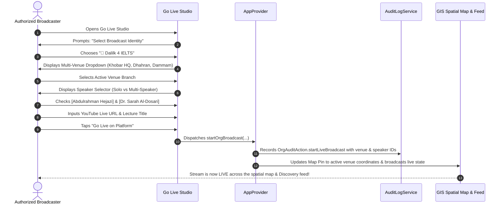

# 🏢 Comprehensive Brainstorming & Architecture: Educational Organizations Subsystem

> **Feature Master Brainstorming & System Specification**  
> **Flagship Benchmark:** Dalilk 4 IELTS (`https://www.youtube.com/@dalilk4ielts`)  
> **Parent Documents:** [[doc/roadmap to publishing.md|Publishing Roadmap]] | [[doc/technical_specs_admin_hub_and_governance.md|Admin Specs]] | [[Core_files/STATUS.md|System Status]]

---

## 📌 1. Executive Summary & Vision

In the Educational Cloud Streaming Platform, entities are classified into two distinct broadcast tiers:
1. **🎓 Individual Scholar:** A single autonomous professor, educator, or independent researcher.
2. **🏢 Educational Organization / Academic Workspace:** An institutional umbrella entity (e.g. *Dalilk 4 IELTS*, *KFUPM AI Center*, *Ithra Cultural Hub*, *English Easy Academy*) that encompasses:
   - **Multiple physical campuses / auditoriums / branches** across AlSharqia and Saudi Arabia.
   - **A diverse speaker roster:** Permanent instructors, recurring lecturers, and one-time guest speakers.
   - **Solo and Multi-Speaker live sessions:** Single masterclasses or multi-speaker panel workshops.
   - **A unified central YouTube Channel:** All live feeds and archived VODs flow into and are organized under the organization’s YouTube channel (`@dalilk4ielts`).
   - **Multi-tier Role-Based Access Control (RBAC):** Organization Owner $\rightarrow$ Co-Owners $\rightarrow$ Authorized Broadcasters.
   - **Immutable Audit Logging:** Complete traceable history of who added/removed members, who granted stream keys, and which speaker broadcasted from which physical venue.

---

## 🏛️ 2. Multi-Venue & Multi-Location Campus Architecture

An Organization is not confined to a single room; it often operates multiple branches or venues.

```
+---------------------------------------------------------------------------------------------------+
|                                 ORGANIZATION MULTI-VENUE HIERARCHY                                |
|                                                                                                   |
|                               +----------------------------------+                                |
|                               |  ORGANIZATION: Dalilk 4 IELTS   |                                |
|                               |  Central YouTube: @dalilk4ielts  |                                |
|                               +-----------------+----------------+                                |
|                                                 |                                                 |
|                 +-------------------------------+-------------------------------+                 |
|                 |                               |                               |                 |
|  +--------------+-------------+  +--------------+-------------+  +--------------+-------------+   |
|  |  HQ / MAIN LOCATION (Khobar)|  |  BRANCH 2: Dhahran Campus  |  |  BRANCH 3: Dammam Hall     |   |
|  |  📍 26.2871, 50.2125        |  |  📍 26.3050, 50.1450       |  |  📍 26.4207, 50.0888       |   |
|  |  🏛️ Main Auditorium (500)  |  |  🏛️ Seminar Suite (120)    |  |  🏛️ Training Lab (80)     |   |
|  |  🟢 [CURRENT LIVE VENUE]   |  |  ⚪ [OFFLINE]               |  |  ⚪ [OFFLINE]               |   |
|  +----------------------------+  +----------------------------+  +----------------------------+   |
+---------------------------------------------------------------------------------------------------+
```

### Key Principles for Multi-Location Handling:
1. **Main Headquarters vs. Current Active Venue:**
   - Every Organization defines a **Primary Headquarters (`isMainLocation == true`)** used for official institutional listings.
   - When a broadcast goes live, the stream metadata specifies the **Active Live Venue (`currentLiveVenueId`)**.
2. **Spatial Map Presence:**
   - On the Spatial GIS Map, the map pin dynamically centers and highlights the **Active Live Venue** with the pulsing radar ring (`#FF8080` for video, `#A1A1AA` for audio).
   - If offline, the pin defaults to the **Headquarters location**, while the profile sheet displays all available physical branch locations with seating capacities and Google Maps navigation deep links.
3. **Data Schema: `OrgVenueBranchModel`:**
   ```dart
   class OrgVenueBranchModel {
     final String venueId;
     final String nameEn;
     final String nameAr;
     final String cityEn;
     final String cityAr;
     final double latitude;
     final double longitude;
     final int seatingCapacity;
     final bool isMainHeadquarters;
     final String? roomNumberOrHall;
     final List<String> availableFacilities; // ['Fiber Audio', '4K Camera Rig', 'Projector', 'Wi-Fi']
   }
   ```

---

## 🎙️ 3. Speaker Dynamics, Directory & Live Stream Presentation

A live broadcast or VOD within an organization can feature solo or multi-speaker panel configurations, both in video and audio-only stages.

```
+---------------------------------------------------------------------------------------------------+
|                                   SPEAKER ATTRIBUTION DYNAMICS                                    |
|                                                                                                   |
|  [CASE A: SOLO MASTERCLASS]                         [CASE B: MULTI-SPEAKER / CO-HOSTED PANEL]     |
|  👤 Single Speaker                                  👥 2 to 6+ Co-Presenters / Debate Panel       |
|  "IELTS Writing Task 2 with Abdulrahman"            "IELTS Speaking Simulation & Q&A Panel"       |
|  [Avatar: Abdulrahman Hejazi]                       [Avatars: Abdulrahman + Sarah + Alex + ...]   |
+---------------------------------------------------------------------------------------------------+
```

### 3.1 Organization Speaker Directory (Profile View)
Inside the Organization Profile Page, viewers can browse all affiliated instructors in a dedicated **Speakers & Instructors Directory**:
- **Layout Options:** Available as a fluid **Horizontal Scroll Carousel** or a **2-Column Responsive Card Grid**.
- **Speaker Card Content:** Avatar photo, full name (En/Ar), academic title/specialization, permanent staff badge, short bio, and quick *"View Lectures"* filter button.
- **Tapping a Speaker Card:** Opens a detailed modal bottom sheet with the speaker’s full bio, credentials, upcoming scheduled lectures, and filtered VOD archive.

### 3.2 Multi-Speaker Live Stream Player Display
During an active live broadcast:
- **1 to 2 Speakers:** Side-by-side circular avatars with prominent name tags.
- **3 to 5 Speakers:** Horizontal circular avatar strip positioned below the video title or in the speaker banner.
- **More than 5 Speakers (> 5):** The avatar strip automatically transitions into a **smooth horizontal scrollable carousel** with active count indicator (e.g. `[Avatar 1][Avatar 2][Avatar 3][Avatar 4][Avatar 5] ➔ [Avatar 6]`), ensuring no visual clutter.

### 3.3 Audio-Only Live Stage: Kinetic Pulse & Interactive Avatars
In **Audio-Only Streaming Mode (`BroadcastFormat.audioOnly`)**:
- All session speakers are prominently rendered on the stage as interactive circular avatars with high-contrast borders.
- **Kinetic Active Speaker Pulse Animation:** A dynamic animated soundwave/pulse ring (multi-layered atmospheric glow) automatically expands around whichever avatar is actively speaking.
- **Interactive Avatar Inspection:** Viewers can tap **any speaker avatar directly on the audio stage** to immediately open that speaker’s inspection card, bio, social links, and slide notes without interrupting audio playback.

---

## 🔐 4. Granular Broadcaster Permissions Matrix & RBAC

The Organization Owner and Co-Owners have granular control over what each authorized broadcaster is permitted to do when streaming on behalf of the organization.

### 4.1 Granular Streamer Permissions (`OrgBroadcasterPermissions`)
```dart
class OrgBroadcasterPermissions {
  final bool canGoLiveVideo;       // Permission to start Video Live Streams
  final bool canGoAudioOnly;       // Permission to start Audio-Only Live Streams
  final bool canChangeLocation;    // Permission to switch the assigned physical venue/branch
  final bool canEditDescription;   // Permission to edit title, description, and topic tags
  final bool canEditStreamTime;    // Permission to change scheduled broadcast time
  final bool canAddExternalLinks;  // Permission to attach slide PDFs, resources, & links

  const OrgBroadcasterPermissions({
    this.canGoLiveVideo = true,
    this.canGoAudioOnly = true,
    this.canChangeLocation = false,
    this.canEditDescription = true,
    this.canEditStreamTime = false,
    this.canAddExternalLinks = true,
  });
}
```

### 4.2 Multi-Tier Role Hierarchy & Delegation

| Role | Capabilities & Permission Control | Assignment Authority |
| :--- | :--- | :--- |
| **👑 Owner (`orgOwner`)** | • Full control over Organization profile, YouTube handle, & branding<br>• Add/delete campus branches & physical venues<br>• Promote/demote Co-Owners & configure all permissions<br>• Full access to audit logs & Organization telemetry<br>• Delete Organization account | Creator upon Admin verification |
| **⭐ Co-Owner (`orgAdmin`)** | • Add/edit/remove speakers on the roster<br>• Add/edit venue branches<br>• Assign and adjust granular permissions for broadcasters<br>• Start live streams for the organization<br>• View organization analytics & audit logs | Assigned by Owner |
| **🎙️ Authorized Broadcaster (`orgBroadcaster`)** | • Start live streams subject to assigned `OrgBroadcasterPermissions`:<br>  - Video live / Audio live<br>  - Assigned branch vs custom branch selection<br>  - Description / links / schedule edits | Assigned by Owner or Co-Owner |
| **🎓 Listed / Guest Speaker (`guestSpeaker`)** | • Credited in roster, VOD tags, and live panel avatar strips<br>• *Cannot launch streams directly* | Added to roster by Owner/Admin |

### 4.3 Streaming Permission Policy Switch
The Owner can configure the global broadcast access mode:
- `🔘 All Roster Broadcasters Allowed to Stream (with default permissions)`
- `🔘 Selective Whitelist Only (Only individually checked broadcaster accounts with custom permissions)`

---

## 📜 5. Immutable Audit Trail & Historical Activity Logging

Every administrative and streaming action within the organization is permanently recorded to guarantee accountability and traceability.

### Audit Log Schema: `OrgAuditLogEntry`
```dart
enum OrgAuditAction {
  createOrganization,
  updateOrganizationProfile,
  addVenueBranch,
  updateVenueBranch,
  removeVenueBranch,
  addSpeakerToRoster,
  updateSpeakerDetails,
  removeSpeakerFromRoster,
  grantBroadcastPermission,
  revokeBroadcastPermission,
  assignOwnerRole,
  revokeOwnerRole,
  startLiveBroadcast,
  endLiveBroadcast,
}

class OrgAuditLogEntry {
  final String logId;
  final String organizationId;
  final DateTime timestamp;
  final String actorEmail;
  final String actorName;
  final OrgAuditAction action;
  final String descriptionEn;
  final String descriptionAr;
  final Map<String, dynamic> metadata; // e.g. {'venue': 'Auditorium 1', 'speakers': ['Abdulrahman', 'Sarah'], 'videoId': '...'}
}
```

### Audit Log UI in Admin / Organization Hub:
- Displays a chronological feed of all changes:
  - *2026-08-17 06:30 — Amir Al-Hatemi granted Broadcaster permissions to `sarah.dosari@dalilk.com`.*
  - *2026-08-17 07:15 — Abdulrahman Hejazi started Live Stream "IELTS Band 8 Strategy" from Khobar Main Hall.*

---

## 📺 6. YouTube Channel & VOD Library Federation (`@dalilk4ielts`)

All content published by various instructors is archived under the **Organization's Main YouTube Channel**.

### Interactive Filtering Architecture:
In the Organization Profile Page:
1. **Header Overview:** Channel banner, subscriber count, total lecture hours, and physical venue address.
2. **Speaker Filter Bar (Horizontal Chips):**
   - `[ All Lectures (342) ]`
   - `[ Abdulrahman Hejazi (180) ]`
   - `[ Dr. Sarah Al-Dosari (94) ]`
   - `[ Eng. Khalid Mansoor (42) ]`
   - `[ Guest Lecturers (26) ]`
3. **Multi-Speaker Tagging on VOD Cards:**
   - Each VOD tile displays the speaker avatar(s), venue badge (e.g. *"📍 Khobar Campus"*), and duration.
   - Tapping a speaker chip instantly filters the VOD grid, playlists, and upcoming schedule tabs.

---

## 🧭 7. Spatial GIS Map & Discovery Feed Integration

```
+---------------------------------------------------------------------------------------------------+
|                                  SPATIAL MAP CARD & PIN BEHAVIOR                                  |
|                                                                                                   |
|  [ MAP PIN ]                                                                                      |
|  • Organization Avatar with Gold Squircle Border & Building Icon.                                 |
|  • If Live: Pulsing halo at the exact GPS coordinates of the ACTIVE live venue.                   |
|                                                                                                   |
|  [ SELECTED SUMMARY CARD ]                                                                        |
|  +---------------------------------------------------------------------------------------------+  |
|  | [Avatar]  Dalilk 4 IELTS  [ 🏢 ORGANIZATION ]  [ 🔴 LIVE NOW ]                             |  |
|  |           🏛️ Khobar Main Campus • Hall A (500 Seats)                                        |  |
|  |           👥 Presenters: Abdulrahman Hejazi + Dr. Sarah Al-Dosari                            |  |
|  |           📖 Topic: "Live IELTS Speaking Exam Simulation with Real Feedback"                |  |
|  |           [ 🎥 Watch Live Stream ]    [ 🏢 Enter Organization Hub ]  [ 🧭 Directions ]       |  |
|  +---------------------------------------------------------------------------------------------+  |
+---------------------------------------------------------------------------------------------------+
```

---

## 🚀 8. Streamer Go Live Workflow for Organizations



---

## 🛠️ 9. Organization Admin Hub Workspace Modules

Inside the **Desktop Admin Hub (`AdminHubScreen`)** and the **Organization Management Modal**:

1. **🏢 Organization Profile & Branding:** Name (En/Ar), Bio, YouTube Channel URL/Handle, Banner, Logo.
2. **📍 Venue Branches Manager:** Add, edit GPS coordinates, adjust seating capacities, and designate the Main HQ.
3. **👥 Speaker & Instructor Roster:** Add permanent instructors and guest speakers with photos, bios, and linked emails.
4. **🔐 Access Control & Role Management:** Manage Co-Owners, toggle global broadcast permission, and whitelist authorized broadcaster emails.
5. **📋 Immutable Audit Logs:** Real-time searchable log of all organizational actions with actor timestamps.
6. **📊 Organization Telemetry:** Total watch hours across all instructors, RSVP counts per venue, and lecture bookmark statistics.

---

## 📋 10. Step-by-Step Implementation Roadmap

```
+---------------------------------------------------------------------------------------------------------------+
|                                    ORGANIZATION SUBSYSTEM IMPLEMENTATION ROADMAP                              |
|                                                                                                               |
|  [STEP 1] ─────────────► [STEP 2] ─────────────► [STEP 3] ─────────────► [STEP 4] ─────────────► [STEP 5]     |
|  Data Models &           RBAC Engine &           Organization Hub         Multi-Venue GIS &       Admin Hub & |
|  Database Layer          Audit Logger            Profile & Filter UI      Go Live Studio Sync     Test Suite  |
+---------------------------------------------------------------------------------------------------------------+
```

1. **Step 1: Data Models & Database Layer:**
   - Define `OrgVenueBranchModel`, `OrgSpeakerModel`, `OrgAuditLogEntry`, and update `StreamerModel` & `VodModel`.
   - Update `AdminDatabaseService` to persist multi-venue organizations and audit logs.
2. **Step 2: RBAC Engine & Audit Logger:**
   - Implement role verification (`isOrgOwner`, `isOrgAdmin`, `canStreamForOrg`) in `AppProvider`.
   - Implement automated audit log recording on every entity mutation.
3. **Step 3: Organization Hub Profile & Speaker Filter UI:**
   - Build rich Organization profile view in `broadcaster_profile_screen.dart` with horizontal speaker filter chips and branch locator.
4. **Step 4: Multi-Venue GIS Map & Go Live Studio Integration:**
   - Update `SpatialStreamerMarker` and `MarkerSummaryCard` for multi-venue active branch display.
   - Update `Go Live Studio` with Organization, Venue Branch, and Multi-Speaker selectors.
5. **Step 5: Admin Hub Management & Verification Tests:**
   - Integrate Organization branch/roster/audit tabs into `AdminHubScreen`.
   - Write comprehensive unit tests (`test/organization_feature_test.dart`) covering multi-venue, multi-speaker, and RBAC audit trail workflows.
