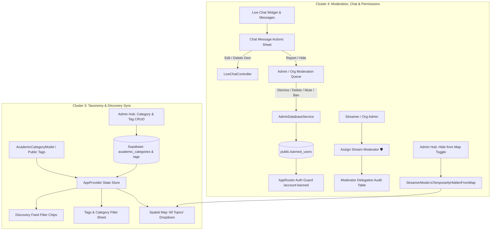

# Cluster 3 & 4 Implementation Plan: Categories, Tags, Moderation, Chat & User Permissions

This document provides the complete, production-grade technical specification and execution roadmap for **Cluster 3 (Tasks 10–12)** and **Cluster 4 (Tasks 13–18)** of the Streamer App architecture.

---

## 📋 Architecture Overview



---

## 🏷️ Cluster 3: Categories, Tags & Feed Filter Synchronization (Tasks 10–12)

### 🎯 Task 10: Sync Academic Categories Across Discovery, Filters & Spatial Map
* **Files to Modify:**
  1. `lib/features/discovery/models/academic_category_model.dart`
  2. `lib/core/providers/app_provider.dart`
  3. `lib/features/discovery/presentation/discovery_feed_screen.dart`
  4. `lib/features/discovery/presentation/widgets/tags_filter_bottom_sheet.dart`
  5. `lib/features/map/presentation/widgets/topic_selector_dropdown.dart`
* **Implementation Details:**
  * Define `AcademicCategoryModel`:
    ```dart
    class AcademicCategoryModel {
      final String id;
      final String nameEn;
      final String nameAr;
      final String iconName;
      final int sortOrder;
      final bool isActive;

      const AcademicCategoryModel({
        required this.id,
        required this.nameEn,
        required this.nameAr,
        this.iconName = 'school',
        this.sortOrder = 0,
        this.isActive = true,
      });

      String getLocalizedName(String langCode) =>
          langCode == 'ar' ? nameAr : nameEn;
    }
    ```
  * In `AppProvider`:
    * Maintain `List<AcademicCategoryModel> academicCategories` with initial default pool (Islamic Studies, Computer Science, Engineering, Medicine, Business, Linguistics, Mathematics, Architecture).
    * `String? selectedCategoryId`: Unified active filter state.
    * Method `selectCategoryFilter(String? categoryId)` that updates state and filters `filteredStreamers` across Discovery Feed and Spatial Map.
  * In `topic_selector_dropdown.dart`: Replace hardcoded `kAcademicTopics` with `appProvider.academicCategories`.
  * In `discovery_feed_screen.dart` and `tags_filter_bottom_sheet.dart`: Render category filter chips driven directly by `appProvider.academicCategories`.

---

### 🎯 Task 11: Admin Power to Create, Edit, and Reorder Academic Categories
* **Files to Modify:**
  1. `lib/features/admin/presentation/admin_hub_screen.dart`
  2. `lib/core/services/admin_database_service.dart`
  3. `lib/core/providers/app_provider.dart`
* **Implementation Details:**
  * In `AdminHubScreen`, add tab/section: **"Academic Categories / التصنيفات الأكاديمية"**.
  * Add dialogs for:
    * **Add Category:** `id`, `nameEn`, `nameAr`, `iconName`, `sortOrder`.
    * **Edit Category:** Update bilingual names, icon, active state.
    * **Reorder / Delete Category:** Safe soft-delete or reorder with instant `AppProvider.reloadCategories()` notification.
  * In `AdminDatabaseService`: Methods `fetchCategories()`, `saveCategory(AcademicCategoryModel category)`, `deleteCategory(String id)`.

---

### 🎯 Task 12: Admin Controls on Tags & Tag Moderation
* **Files to Modify:**
  1. `lib/features/admin/presentation/admin_hub_screen.dart`
  2. `lib/features/discovery/presentation/widgets/tags_filter_bottom_sheet.dart`
  3. `lib/features/auth/presentation/steps/apply_step_3_professional.dart`
  4. `lib/core/providers/app_provider.dart`
* **Implementation Details:**
  * Maintain `List<String> approvedTags` in `AppProvider`.
  * In `AdminHubScreen`: Add **Tag Moderation Manager** card showing submitted tags with `Approve`, `Merge / Rename`, and `Blacklist` actions.
  * In `apply_step_3_professional.dart`: Streamer application tag input suggests approved tags from `appProvider.approvedTags` and flags new unapproved tags as `pending_review`.
  * In `tags_filter_bottom_sheet.dart`: Display only approved public tags in the discovery filter sheet.

---

## 🛡️ Cluster 4: Moderation, Chat & User Permission Architecture (Tasks 13–18)

### 🎯 Task 13: User Message Actions (Edit/Delete Own, Report, and Hide Others)
* **Files to Modify:**
  1. `lib/features/live_stream/presentation/widgets/live_chat_widget.dart`
  2. `lib/features/live_stream/presentation/widgets/chat_message_actions_sheet.dart`
  3. `lib/features/live_stream/services/live_chat_controller.dart`
  4. `lib/features/live_stream/models/chat_message_model.dart`
* **Implementation Details:**
  * Enable long-press on **all** chat message tiles (remove restriction that ignored current user messages).
  * In `chat_message_actions_sheet.dart`:
    * If `message.isCurrentUser`: Show **"Edit Message / تعديل الرسالة"** and **"Delete Message / حذف الرسالة"**.
    * If message from another user: Show **"Report Message / إبلاغ عن الرسالة"**, **"Hide Message / إخفاء الرسالة"**, and **"Block User / حظر المستخدم"**.
  * In `LiveChatController`:
    * `editChatMessage(String messageId, String newText)`: Updates text in local list and broadcasts update.
    * `deleteChatMessage(String messageId)`: Removes message or marks `isDeleted: true`.
    * `hideChatMessage(String messageId)`: Adds to local `Set<String> hiddenMessageIds` persisted in `SharedPreferences` so hidden messages vanish from current viewer's feed.

---

### 🎯 Task 14: Link Reports and Hides to Moderation Queue in Admin Hub
* **Files to Modify:**
  1. `lib/features/admin/presentation/widgets/chat_moderation_view.dart`
  2. `lib/features/admin/presentation/admin_hub_screen.dart`
  3. `lib/core/services/admin_database_service.dart`
  4. `lib/core/providers/app_provider.dart`
* **Implementation Details:**
  * When a user taps "Report Message", create a report record:
    ```dart
    class ChatReportModel {
      final String id;
      final String messageId;
      final String streamId;
      final String reporterId;
      final String reportedUserId;
      final String reportedUserName;
      final String messageText;
      final String reportReason;
      final DateTime createdAt;
      final String status; // pending, resolved, dismissed
    }
    ```
  * In `ChatModerationView`: Render live list of reported messages with action buttons:
    * `Dismiss / تجاهل`
    * `Delete Message / حذف الرسالة`
    * `Mute in Stream (10 min / 1 hour / Permanent) / كتم في البث`
    * `Ban Platform-Wide / حظر شامل`

---

### 🎯 Task 15: Stream Moderator Labels & Delegation Hierarchy
* **Files to Modify:**
  1. `lib/features/live_stream/models/chat_message_model.dart`
  2. `lib/features/live_stream/presentation/widgets/live_chat_widget.dart`
  3. `lib/features/admin/presentation/widgets/role_permission_management_view.dart`
  4. `lib/core/providers/app_provider.dart`
* **Implementation Details:**
  * Add `ChatSenderBadge.moderator` with shield icon (`🛡️ MOD`).
  * In `ChatMessageModel`: Support `senderBadge: ChatSenderBadge.moderator` and `isStreamModerator: true`.
  * In `RolePermissionManagementView`: Display moderator delegation audit table:
    * Columns: `User / Moderator Email`, `Assigned By (Streamer / Org / Admin)`, `Scope (Stream / Organization / Global)`, `Granted Date`, `Revoke Action`.
  * Streamers and Org Admins can appoint moderators directly from live chat user profiles.

---

### 🎯 Task 16: Admin Power to Block User from the Application (Email/Account Ban)
* **Files to Modify:**
  1. `lib/features/admin/presentation/admin_hub_screen.dart`
  2. `lib/core/services/admin_database_service.dart`
  3. `lib/core/providers/app_provider.dart`
  4. `lib/core/routing/app_router.dart`
  5. `lib/features/auth/presentation/screens/account_banned_screen.dart` (NEW)
* **Implementation Details:**
  * In `AdminHubScreen`: Add "Banned Accounts / الحسابات المحظورة" manager with email search, ban user dialog (reason + duration), and unban action.
  * In `AppProvider`: Check `isCurrentUserBanned`.
  * In `AppRouter`: Add redirect guard: If `appProvider.isCurrentUserBanned == true`, redirect immediately to `/account-banned`.
  * Create `AccountBannedScreen`: Displays ban reason, contact support email, and logout button.

---

### 🎯 Task 17: Option in Settings to Delete Past Messages (All or by Stream)
* **Files to Modify:**
  1. `lib/features/profile/presentation/settings_screen.dart`
  2. `lib/core/providers/app_provider.dart`
  3. `lib/core/services/admin_database_service.dart`
  4. Localization files (`en.json`, `ar.json`)
* **Implementation Details:**
  * In `SettingsScreen`, under Privacy & Data section, add **"Chat History & Messages / سجل الرسائل والمحادثات"**:
    * Button: **"Delete All My Messages / حذف جميع رسائلي"** (with confirmation dialog).
    * Button: **"Clear Messages by Broadcast / حذف رسائل بث محدد"** (presents stream selector).
  * In `AppProvider`: Purge user messages from local cache and backend.

---

### 🎯 Task 18: Temporary Removal of Streamer from Map by Moderation
* **Files to Modify:**
  1. `lib/features/profile/models/streamer_models.dart`
  2. `lib/features/admin/presentation/admin_hub_screen.dart`
  3. `lib/core/providers/app_provider.dart`
  4. `lib/features/map/presentation/spatial_map_screen.dart`
* **Implementation Details:**
  * In `StreamerModel`: Add `final bool isTemporarilyHiddenFromMap;` (default `false`), update constructor, `copyWith`, and JSON parsing.
  * In `AdminHubScreen` under Streamers Registry: Add a toggle switch: **"Hide from Map / إخفاء من الخريطة"**.
  * In `AppProvider.filteredStreamers`: Exclude any streamer where `isTemporarilyHiddenFromMap == true` from spatial map markers, while keeping their profile accessible via direct link.

---

## 🧪 Comprehensive Verification Checklist
1. `flutter analyze`: Must return 0 errors, 0 warnings, 0 infos.
2. `flutter test test/live_stream_test.dart` and `flutter test`: Must pass 100% green.
3. Bilingual localization symmetry in `en.json` and `ar.json`.
