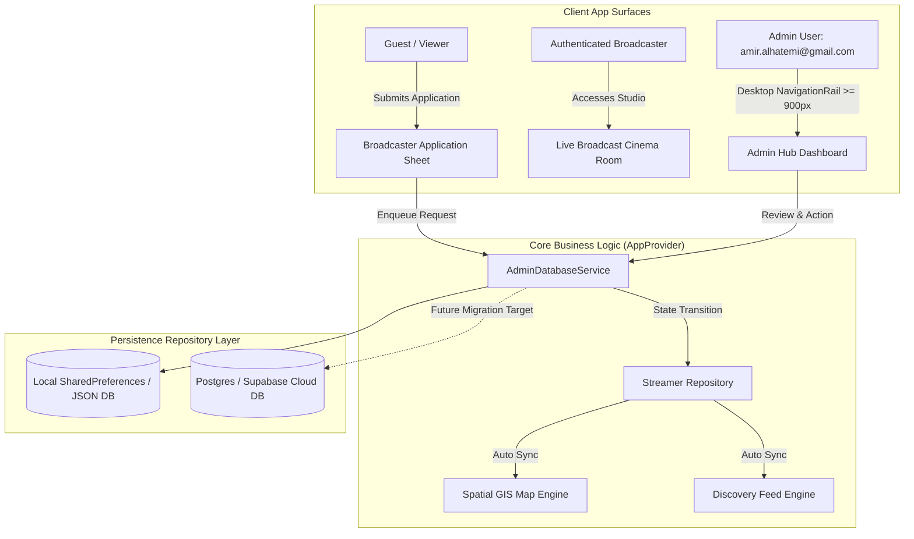
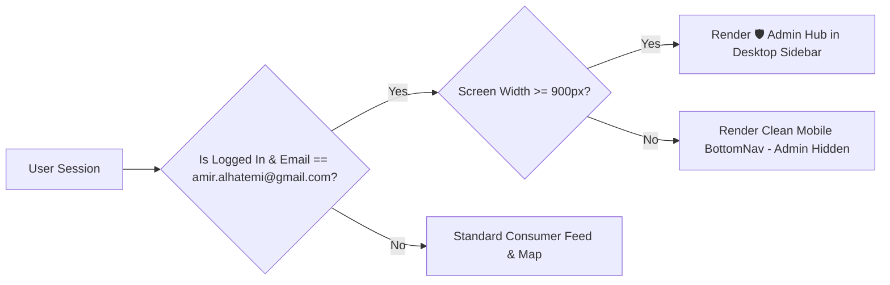

# 🛡️ Technical Specifications: Admin Hub, Broadcaster Verification & Platform Governance

> **Document Status:** Official Architecture Specification  
> **Target Subsystem:** Admin Moderation Console, Broadcaster/Org Verification Queue, Persistent Database Repository, and Terms Governance.  
> **Parent Documents:** [[Core_files/README.md|Core README]] | [[Core_files/STATUS.md|System Status]] | [[Core_files/Desgin.md|Design Contract]] | [[doc/roadmap to publishing.md|Publishing Roadmap]]

---

## 1. 🏗️ High-Level System Architecture & Scope

This specification defines the operational and technical contracts for introducing a production-grade **Admin Moderation & Governance Hub** to the Educational Cloud Streaming Platform (Streamer App). It establishes a secure multi-tier identity model, an asynchronous verification pipeline for individual scholars and physical venue organizations, a persistent database layer, and a dynamic Terms & Conditions management engine.



---

## 2. 👥 Role-Based Access Control (RBAC) Hierarchy

The platform strictly enforces three non-overlapping permission tiers:

| Attribute | 👤 Tier 1: Guest / Viewer | 🎙️ Tier 2: Broadcaster / Organization | 🛡️ Tier 3: Platform Administrator |
| :--- | :--- | :--- | :--- |
| **Authentication Requirement** | None (Immediate Guest Access) | Verified Google Account OAuth 2.0 | Whitelisted Google Email (`amir.alhatemi@gmail.com`) |
| **GIS Map Marker Visibility** | Renders All Active Broadcasters | Broadcaster Pin Appears on Map (if Approved) | Renders All Markers + Admin HUD Overlays |
| **Broadcast Studio Access** | ❌ Completely Hidden (Cell Tower Omitted) | 🟢 Full Access to RTMP & YouTube Studio | 🟢 Full Access + Impersonation Testing |
| **Verification Status** | `N/A` | `pending` \| `approved` \| `rejected` \| `suspended` | `super_admin` |
| **Application Submission** | 🟢 Can Apply to Become Scholar/Org | 🟡 Can View & Edit Own Submitted Application | 🟢 Can Approve, Deny, Edit, or Remove Any Entry |
| **Terms of Service** | Read-Only Viewer Terms | Read-Only Broadcaster Code of Conduct | 🟢 Full Read/Write/Publish Authority |
| **Desktop Admin Hub Access** | ❌ Strictly Hidden | ❌ Strictly Hidden | 🟢 Persistent Sidebar Item on Screens $\ge 900\text{px}$ |

---

## 3. 📋 Verification Contract: Individuals vs. Organizations

To prevent spam, impersonation, and fraudulent physical venue mapping in a public application, applications must satisfy distinct validation rules based on entity classification:

```
+-------------------------------------------------------------------------------------------------------------------+
|                                      DUAL-TRACK VERIFICATION SCHEMA MATRIX                                        |
|                                                                                                                   |
|   🎓 INDIVIDUAL SCHOLAR (Lecturer / Professor)          🏢 ACADEMIC INSTITUTION / VENUE (Organization)            |
|   ├─ Full Name (English & Arabic)                       ├─ Entity Name (English & Arabic)                         |
|   ├─ Academic Title (e.g. Associate Professor)          ├─ Entity Type (University, Cultural Center, Auditorium)  |
|   ├─ University / Institute Affiliation                 ├─ Physical Venue Name & Lat/Lng Coordinates (Required)   |
|   ├─ Official YouTube Channel URL / Handle              ├─ Auditorium Seating Capacity (e.g. 500 Seats)           |
|   ├─ Academic Category (CS, Sharia, Medicine, etc.)     ├─ Managing Officer Name, Official Email & Phone          |
|   ├─ AlSharqia Physical Base City                       ├─ Official Domain / Verification Link                    |
|   └─ Circular Map Avatar Representation                 └─ Squircle Organization Badge Representation             |
+-------------------------------------------------------------------------------------------------------------------+
```

---

## 4. 💾 Database Schema & Data Models

### 4.1. Broadcaster Application Model (`BroadcasterApplicationModel`)

```dart
enum ApplicationAccountType { individualScholar, organizationVenue }
enum ApplicationStatus { pending, approved, rejected, suspended }

class BroadcasterApplicationModel {
  final String id;
  final ApplicationAccountType accountType;
  final String applicantNameEn;
  final String applicantNameAr;
  final String email;
  final String phone;
  
  // Scholar-specific fields
  final String? academicTitleEn;
  final String? academicTitleAr;
  final String? institutionEn;
  final String? institutionAr;
  final String categoryId;
  final List<String> tags;
  
  // Organization-specific fields
  final String? organizationType;
  final String venueNameEn;
  final String venueNameAr;
  final double latitude;
  final double longitude;
  final int seatingCapacity;
  final String? officialWebsiteUrl;

  // Streaming & Profile metadata
  final String youtubeChannelUrl;
  final String youtubeHandle;
  final String bioEn;
  final String bioAr;
  final String avatarUrl;
  final String bannerUrl;

  // Lifecycle & Moderation state
  final ApplicationStatus status;
  final String? adminReviewNotes;
  final String? reviewedBy;
  final DateTime submittedAt;
  final DateTime? reviewedAt;

  const BroadcasterApplicationModel({
    required this.id,
    required this.accountType,
    required this.applicantNameEn,
    required this.applicantNameAr,
    required this.email,
    required this.phone,
    this.academicTitleEn,
    this.academicTitleAr,
    this.institutionEn,
    this.institutionAr,
    required this.categoryId,
    this.tags = const [],
    this.organizationType,
    required this.venueNameEn,
    required this.venueNameAr,
    required this.latitude,
    required this.longitude,
    this.seatingCapacity = 0,
    this.officialWebsiteUrl,
    required this.youtubeChannelUrl,
    required this.youtubeHandle,
    required this.bioEn,
    required this.bioAr,
    required this.avatarUrl,
    required this.bannerUrl,
    this.status = ApplicationStatus.pending,
    this.adminReviewNotes,
    this.reviewedBy,
    required this.submittedAt,
    this.reviewedAt,
  });

  Map<String, dynamic> toJson() => {
    'id': id,
    'accountType': accountType.name,
    'applicantNameEn': applicantNameEn,
    'applicantNameAr': applicantNameAr,
    'email': email,
    'phone': phone,
    'academicTitleEn': academicTitleEn,
    'academicTitleAr': academicTitleAr,
    'institutionEn': institutionEn,
    'institutionAr': institutionAr,
    'categoryId': categoryId,
    'tags': tags,
    'organizationType': organizationType,
    'venueNameEn': venueNameEn,
    'venueNameAr': venueNameAr,
    'latitude': latitude,
    'longitude': longitude,
    'seatingCapacity': seatingCapacity,
    'officialWebsiteUrl': officialWebsiteUrl,
    'youtubeChannelUrl': youtubeChannelUrl,
    'youtubeHandle': youtubeHandle,
    'bioEn': bioEn,
    'bioAr': bioAr,
    'avatarUrl': avatarUrl,
    'bannerUrl': bannerUrl,
    'status': status.name,
    'adminReviewNotes': adminReviewNotes,
    'reviewedBy': reviewedBy,
    'submittedAt': submittedAt.toIso8601String(),
    'reviewedAt': reviewedAt?.toIso8601String(),
  };

  factory BroadcasterApplicationModel.fromJson(Map<String, dynamic> json) =>
      BroadcasterApplicationModel(
        id: json['id'],
        accountType: ApplicationAccountType.values.byName(json['accountType']),
        applicantNameEn: json['applicantNameEn'],
        applicantNameAr: json['applicantNameAr'],
        email: json['email'],
        phone: json['phone'],
        academicTitleEn: json['academicTitleEn'],
        academicTitleAr: json['academicTitleAr'],
        institutionEn: json['institutionEn'],
        institutionAr: json['institutionAr'],
        categoryId: json['categoryId'] ?? 'cs_tech',
        tags: List<String>.from(json['tags'] ?? []),
        organizationType: json['organizationType'],
        venueNameEn: json['venueNameEn'] ?? '',
        venueNameAr: json['venueNameAr'] ?? '',
        latitude: (json['latitude'] as num?)?.toDouble() ?? 26.2871,
        longitude: (json['longitude'] as num?)?.toDouble() ?? 50.2125,
        seatingCapacity: json['seatingCapacity'] ?? 0,
        officialWebsiteUrl: json['officialWebsiteUrl'],
        youtubeChannelUrl: json['youtubeChannelUrl'] ?? '',
        youtubeHandle: json['youtubeHandle'] ?? '',
        bioEn: json['bioEn'] ?? '',
        bioAr: json['bioAr'] ?? '',
        avatarUrl: json['avatarUrl'] ?? 'assets/images/Amir_Alhatemi/amir_person_pic.jpg',
        bannerUrl: json['bannerUrl'] ?? 'assets/images/Amir_Alhatemi/amir_card_pic.jpg',
        status: ApplicationStatus.values.byName(json['status'] ?? 'pending'),
        adminReviewNotes: json['adminReviewNotes'],
        reviewedBy: json['reviewedBy'],
        submittedAt: DateTime.parse(json['submittedAt']),
        reviewedAt: json['reviewedAt'] != null ? DateTime.parse(json['reviewedAt']) : null,
      );
}
```

---

### 4.2. Platform Terms & Conditions Governance Model (`TermsAndConditionsModel`)

```dart
class TermsAndConditionsModel {
  final String version;
  final DateTime lastUpdated;
  final String termsOfServiceEn;
  final String termsOfServiceAr;
  final String broadcasterGuidelinesEn;
  final String broadcasterGuidelinesAr;
  final String privacyPolicyEn;
  final String privacyPolicyAr;

  const TermsAndConditionsModel({
    required this.version,
    required this.lastUpdated,
    required this.termsOfServiceEn,
    required this.termsOfServiceAr,
    required this.broadcasterGuidelinesEn,
    required this.broadcasterGuidelinesAr,
    required this.privacyPolicyEn,
    required this.privacyPolicyAr,
  });

  Map<String, dynamic> toJson() => {
    'version': version,
    'lastUpdated': lastUpdated.toIso8601String(),
    'termsOfServiceEn': termsOfServiceEn,
    'termsOfServiceAr': termsOfServiceAr,
    'broadcasterGuidelinesEn': broadcasterGuidelinesEn,
    'broadcasterGuidelinesAr': broadcasterGuidelinesAr,
    'privacyPolicyEn': privacyPolicyEn,
    'privacyPolicyAr': privacyPolicyAr,
  };

  factory TermsAndConditionsModel.fromJson(Map<String, dynamic> json) =>
      TermsAndConditionsModel(
        version: json['version'] ?? 'v1.0.0',
        lastUpdated: DateTime.parse(json['lastUpdated']),
        termsOfServiceEn: json['termsOfServiceEn'] ?? '',
        termsOfServiceAr: json['termsOfServiceAr'] ?? '',
        broadcasterGuidelinesEn: json['broadcasterGuidelinesEn'] ?? '',
        broadcasterGuidelinesAr: json['broadcasterGuidelinesAr'] ?? '',
        privacyPolicyEn: json['privacyPolicyEn'] ?? '',
        privacyPolicyAr: json['privacyPolicyAr'] ?? '',
      );
}
```

---

## 5. 🖥️ Desktop Isolation & Admin Hub UI Structure

### 5.1. Navigation & Routing Rule
The Admin Hub is registered in [`app_router.dart`](file:///c:/Users/User/Documents/Amir%20Ob/projects/Ideas/Current/Streamer_app/project/lib/core/routing/app_router.dart) under route `/admin`.
- **Desktop Viewport ($\ge 900\text{px}$):** The persistent `NavigationRail` inspects `appProvider.isAdminUser`. If `true`, a highlighted `🛡️ Admin Hub` item is appended.
- **Mobile Viewport ($< 900\text{px}$):** The `BottomNavigationBar` renders strictly the standard consumer tabs (`Discovery`, `Spatial Map`). The Admin route is blocked on mobile client viewports to maintain consumer purity.



---

### 5.2. Admin Hub Screen Tabs (`AdminHubScreen`)

```
+-------------------------------------------------------------------------------------------------------------------+
|  🛡️ STREAMER APP ADMIN PORTAL                                           [ Amir Al-Hatemi (Super Admin) 👑 ]       |
+-------------------------------------------------------------------------------------------------------------------+
|  [ 📊 Metrics & KPIs ]  [ ⏳ Pending Requests (2) ]  [ 🎙️ Broadcasters & Orgs ]  [ 👥 Viewers ]  [ 📜 Terms ]    |
+-------------------------------------------------------------------------------------------------------------------+
|                                                                                                                   |
|  [TAB 1: METRICS OVERVIEW]                                                                                        |
|  +---------------------+ +---------------------+ +---------------------+ +---------------------+                 |
|  | 5 Active Streamers  | | 2 Pending Reviews   | | 1 Organization Venue| | 1,420 Active Viewers |                 |
|  +---------------------+ +---------------------+ +---------------------+ +---------------------+                 |
|                                                                                                                   |
|  [TAB 2: VERIFICATION QUEUE]                                                                                      |
|  +-------------------------------------------------------------------------------------------------------------+  |
|  | [🏢 ORG] KFUPM Artificial Intelligence Center                               [ Submitted: 2 hours ago ]      |  |
|  | Physical Venue: Building 24 Auditorium (Cap: 450) • YouTube: @kfupm_ai                                      |  |
|  | Actions: [ ✅ Approve & List on Map ]  [ ❌ Deny with Reason ]  [ 🔍 Full 360° Inspection ]                 |  |
|  +-------------------------------------------------------------------------------------------------------------+  |
|  | [🎓 SCHOLAR] Dr. Tariq Al-Mansoor • Dammam Medical College                  [ Submitted: 1 day ago ]        |  |
|  | Academic Title: Associate Professor • Topic: Medicine & Public Health • YouTube: @dr_tariq_health           |  |
|  | Actions: [ ✅ Approve & List on Map ]  [ ❌ Deny with Reason ]  [ 🔍 Full 360° Inspection ]                 |  |
|  +-------------------------------------------------------------------------------------------------------------+  |
|                                                                                                                   |
|  [TAB 5: PLATFORM TERMS & GOVERNANCE]                                                                             |
|  [ 🇬🇧 English Terms ]  [ 🇸🇦 Arabic Terms ]                                 [ 💾 Save & Publish Version ]         |
|  +-------------------------------------------------------------------------------------------------------------+  |
|  | # Educational Streamer Platform Guidelines & Broadcaster Code of Conduct                                   |  |
|  | 1. All live streams must belong to verified educational, scientific, or academic lectures...                |  |
|  +-------------------------------------------------------------------------------------------------------------+  |
+-------------------------------------------------------------------------------------------------------------------+
```

---

## 6. 🔄 Lifecycle Actions & Real-Time Sync Contract

When an Administrator clicks **`[ ✅ Approve & List on Map ]`**:
1. `AdminDatabaseService` marks application status $\rightarrow$ `ApplicationStatus.approved`.
2. A new `StreamerModel` is instantiated from the application data:
   - Sets `isVerified: true`.
   - Sets `isOrganization: application.accountType == ApplicationAccountType.organizationVenue`.
   - Sets physical latitude and longitude.
3. The new broadcaster is injected into `AppProvider.streamers`.
4. `notifyListeners()` automatically redraws:
   - The **Spatial GIS Map**: The new scholar/organization marker appears in real-time at its exact geographic coordinate with squircle/circle badge styling.
   - The **Discovery Feed Hub**: The new scholar appears in the Streamers list and category filters.
   - The **Push Notifications Subsystem**: Dispatches an immediate platform alert celebrating the onboarding of the new academic entity.

---

## 7. 🧪 Verification & Acceptance Criteria

1. **TC-ADM-01 (RBAC Security):** Non-admin users and logged-out viewers cannot see the Admin navigation item or invoke admin moderation mutations.
2. **TC-ADM-02 (Application Submission):** Viewers can complete and submit the dual-track application (Scholar vs Org) and receive a persistent `pending` receipt.
3. **TC-ADM-03 (Approval Pipeline & GIS Sync):** Approving an organization in the Admin Hub instantly converts the application into an active `StreamerModel` and renders its squircle marker on the Spatial Map at the specified GPS coordinate.
4. **TC-ADM-04 (Rejection Feedback):** Denying an application requires a rejection note and transitions status to `rejected`.
5. **TC-ADM-05 (Governance Editor):** Admin edits to Terms & Conditions update both English and Arabic versions persistently.
6. **TC-ADM-06 (Desktop Gating):** Admin UI renders only when screen width $\ge 900\text{px}$ and user is `amir.alhatemi@gmail.com`.
