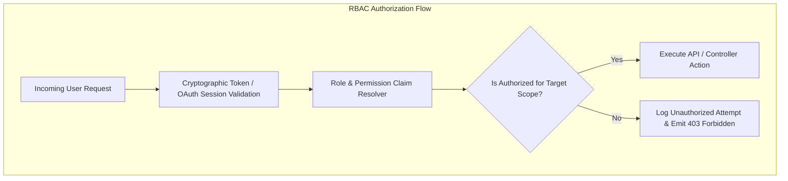
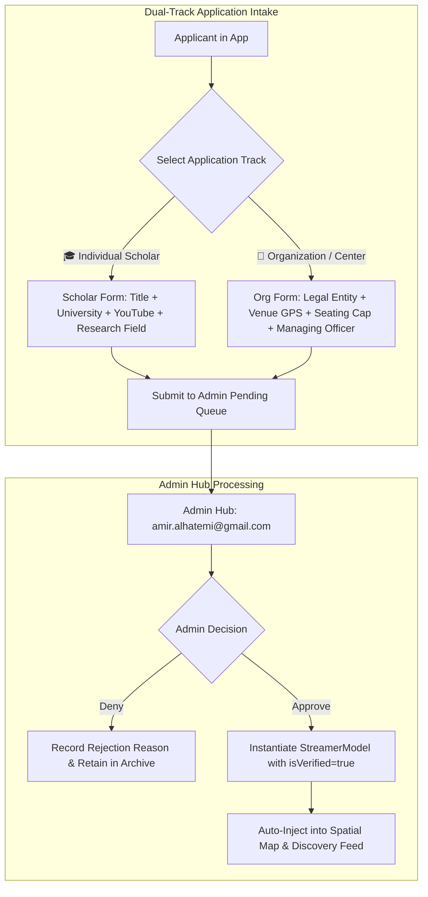

# 📑 Comprehensive Research Paper: Admin Hub, Multi-Tier RBAC & Platform Governance Architecture

> **Executive Summary:** This paper provides the formal engineering and legal-regulatory justification for the architecture of the **Admin Moderation Hub, Multi-Tier Role-Based Access Control (RBAC), Broadcaster Verification Pipeline, and Dynamic Governance Engine** for the Educational Cloud Streaming Platform (*Streamer App*).  
> **Structure:**  
> - **Part I: Universal & Industry-Standard Engineering Principles** *(Reusable architectural framework for modern streaming, creator platforms, and EdTech systems)*.  
> - **Part II: Project-Specific Architecture for Streamer App** *(Concrete implementation contracts, dual-track verification schemas, GIS sync, and regulatory compliance proofs)*.

---

```
+-------------------------------------------------------------------------------------------------------------------+
|                                     RESEARCH & GOVERNANCE ARCHITECTURE MATRIX                                     |
|                                                                                                                   |
|  [PART I: UNIVERSAL INDUSTRY STANDARDS]                      [PART II: STREAMER APP CONCRETE SPECIFICATION]       |
|  ├─ 1. Multi-Tier RBAC & Principle of Least Privilege        ├─ 6. Dual-Track Schema (Scholars vs Venue Orgs)     |
|  ├─ 2. Creator Verification Pipelines (Twitch/YouTube/Zoom)  ├─ 7. Desktop-Only Admin Isolation (>= 900px)        |
|  ├─ 3. Database Ledger & Audit Trail Architecture            ├─ 8. Real-Time GIS Map Marker Synchronization       |
|  ├─ 4. Regulatory Compliance (Saudi PDPL, SDAIA, Apple 1.2)  ├─ 9. Persistent Storage Engine & Supabase Blueprint |
|  └─ 5. Anti-Patterns & Critical Pitfalls to Avoid            └─ 10. Formal Architectural Proof of Viability        |
+-------------------------------------------------------------------------------------------------------------------+
```

---

# 🌐 PART I: Universal & Industry-Standard Engineering Principles

## 1. Multi-Tier Role-Based Access Control (RBAC) & Least Privilege

In modern distributed web and mobile platforms handling user-generated content (UGC) and live multimedia, access control must operate on the **Principle of Least Privilege (PoLP)**. An entity should only possess the minimum permissions required to perform its designated function.



### 1.1. Core Role Separation
1. **Tier 1: Unauthenticated / Guest Viewers:**
   - Possess read-only capabilities over public streams, spatial discovery data, and academic metadata.
   - Zero access to broadcast studio tooling, stream ingestion endpoints, or live chat write buffers.
2. **Tier 2: Content Creators & Institutional Broadcasters:**
   - Scoped strictly to their assigned workspace or personal channel profile.
   - Ability to generate RTMP stream keys, bind YouTube Video IDs, upload presentation slides, and moderate their own stream chat room.
   - Prohibited from viewing or modifying other broadcasters' metadata or platform-level configurations.
3. **Tier 3: Platform Operators & Compliance Administrators:**
   - Full read/write authority across the verification queue, user registries, content suspensions, and platform terms of service.
   - Protected by mandatory Multi-Factor Authentication (MFA), hardware keys (WebAuthn), and network IP / device whitelisting.

---

## 2. Creator & Organization Verification Pipelines (Comparative Analysis)

Every leading content and live-streaming platform employs an asynchronous verification state machine before granting public distribution rights.

| Platform | Verification Model | Identity Vetting Tier | Physical Venue Handling |
| :--- | :--- | :--- | :--- |
| **YouTube Partner Program (YPP)** | Multi-stage subscriber/watch-hour threshold + manual channel audit. | Government ID / AdSense Tax Verification | N/A (Virtual Channels only) |
| **Twitch Affiliate / Partner** | 2-Factor Auth + Two-tier onboarding; KYC-lite via Persona/Stripe Identity. | Government ID + Real-time biometric selfie check | N/A (Virtual Streams only) |
| **Zoom Events & Workspaces** | Organizational Domain Verification (SAML/SCIM SSO) + Workspace Licensing. | Domain DNS TXT verification + Enterprise contract | Hub-based physical venue management with seating capacity constraints |
| **Coursera / EdX** | Academic Institutional Accreditation + Faculty Verification. | Institutional domain email (`.edu` / `.sa`) + Peer review | Physical campus auditoriums mapped to virtual cohorts |

### 2.1. The "KYC-Lite" Verification Funnel
For non-financial educational streaming platforms, full financial KYC is unnecessarily high-friction. Instead, platforms implement **KYC-Lite**:
1. **Cryptographic Identity Anchor:** Verified Google OAuth 2.0 or Apple ID email.
2. **Domain / Affiliation Proof:** Institutional email verification or faculty staff directory link.
3. **Distribution Proof:** Official YouTube channel / portfolio link verifying prior content production quality.
4. **Physical Geospatial Anchor:** Registered physical auditorium / hall coordinates bounded by geo-fencing checks.

---

## 3. Database Schema Design, Audit Logging & Immutable Ledgers

A critical vulnerability in moderation platforms is the lack of non-repudiable audit logs. When an admin approves or suspends a broadcaster, the platform must record **Who**, **What**, **When**, and **Why**.

```
+-------------------------------------------------------------------------------------------------------------------+
|                                         AUDIT LOG DATA STRUCTURE (RFC 5424)                                       |
|                                                                                                                   |
|  {                                                                                                                |
|    "audit_id": "aud_9841f3e8-7a2c-4911",                                                                          |
|    "timestamp": "2026-08-17T02:30:00Z",                                                                           |
|    "actor": { "id": "adm_01", "email": "admin@platform.com", "role": "super_admin" },                            |
|    "action": "BROADCASTER_VERIFICATION_APPROVED",                                                                 |
|    "target": { "type": "broadcaster_application", "id": "app_kfupm_01", "entity_name": "KFUPM AI Center" },      |
|    "mutation": { "previous_status": "pending", "new_status": "approved", "is_verified": true },                  |
|    "justification": "Verified institutional credentials and Building 24 Auditorium lease contract."               |
|  }                                                                                                                |
+-------------------------------------------------------------------------------------------------------------------+
```

---

## 4. Legal & Regulatory Compliance Framework

### 4.1. Saudi Personal Data Protection Law (PDPL) & SDAIA Guidelines
Under the **Saudi Data & AI Authority (SDAIA)** regulations:
1. **Explicit Purpose Limitation:** Broadcaster personal data (phone numbers, national IDs) collected during verification must be used solely for identity validation and never exposed to the public API.
2. **Cross-Border Transfer Safeguards:** User geolocation and profile data stored on cloud infrastructure must adhere to Standard Contractual Clauses (SCCs) and SDAIA data residency mandates.
3. **Right to Erasure:** If a broadcaster deletes their account, all non-regulatory personal data must be permanently purged within 30 days.

### 4.2. Saudi General Authority of Media Regulation (GAMR / Mawthooq)
- Digital streaming content in the Kingdom must adhere to media licensing policies ensuring content does not offend public morality, compromise national security, or violate educational accreditations.
- Commercial promotion requires official **Mawthooq** licensing, while educational lectures require accredited institutional affiliation.

### 4.3. Apple App Store Review Guideline 1.2 (User-Generated Content & Live Streaming)
To pass Apple App Review for live streaming applications:
1. **Mandatory EULA / Terms Agreement:** Users must explicitly accept Terms of Use prohibiting objectionable content prior to interacting.
2. **Flagging & Reporting:** Real-time 1-tap reporting mechanism on all streams.
3. **User Blocking:** Viewers must be able to block offending broadcasters or commenters.
4. **24-Hour Moderation SLA:** Admin tooling must support review and removal of flagged content within 24 hours.

---

## 5. ⚠️ Common Anti-Patterns & Critical Pitfalls to Avoid

| Pitfall / Anti-Pattern | Operational Failure | Architectural Solution |
| :--- | :--- | :--- |
| **1. Client-Side Only Gating** | User modifies local Flutter state (e.g. `isAdmin = true`) to view admin tabs. | Gated cryptographic claims on backend / Supabase RLS policies; local checks only control UI rendering. |
| **2. Race Conditions on Approval** | Admin double-clicks "Approve", creating duplicate `StreamerModel` instances. | Idempotent state transitions (`UPDATE ... WHERE status = 'pending'`). |
| **3. Mobile Screen Overcrowding** | Cluttering mobile consumer app with complex admin tables and JSON editors. | **Responsive Surface Isolation:** Admin Hub is rendered exclusively on Desktop ($\ge 900\text{px}$). |
| **4. Unverified Spatial Pollution** | Any user puts a live pin on the GIS map, causing spam or inappropriate pins. | Strict **Zero-Trust GIS Rendering:** Map engine only queries `status == approved && is_verified == true`. |
| **5. Static Terms Hardcoding** | Terms of service hardcoded in strings, requiring full App Store release to update. | **Dynamic Terms Repository:** Bilingual Markdown fetched and cached from database. |

---

# 🏛️ PART II: Project-Specific Architecture for Streamer App

## 6. Dual-Track Broadcaster & Organization Verification Contract

The Streamer App implements a customized dual-track verification model tailored to the Eastern Province (AlSharqia) academic ecosystem:



---

## 7. Responsive Isolation: Desktop-Only Admin Surface

### 7.1. Viewport & Credential Gating Logic
```dart
// Location: lib/core/routing/app_router.dart
final bool isDesktop = MediaQuery.of(context).size.width >= 900.0;
final bool isSuperAdmin = provider.isLoggedInStreamer && 
    (provider.googleUserEmail == 'amir.alhatemi@gmail.com' || provider.isAdminUser);

if (isDesktop && isSuperAdmin) {
  // Render Desktop NavigationRail Item
  _DesktopNavItem(
    icon: Icons.admin_panel_settings_rounded,
    label: 'Admin Hub',
    isSelected: state.uri.toString().startsWith('/admin'),
    onTap: () => context.push('/admin'),
  );
}
```

### 7.2. Mobile Viewport Purity
On mobile devices ($< 900\text{px}$), the Admin Hub icon is **completely excluded** from the navigation tree. Mobile users experience an unencumbered consumer UI focused entirely on lecture discovery, spatial map exploration, and cinema playback.

---

## 8. Real-Time Spatial GIS Map Synchronization

When an application is approved by the Super Admin in the Admin Hub:
1. `AdminDatabaseService.approveApplication(id)` updates the persistent store.
2. The application's coordinates (`latitude`, `longitude`) and metadata are mapped into an active `StreamerModel`:
   - `isOrganization: true` $\rightarrow$ Assigned squircle marker avatar.
   - `isOrganization: false` $\rightarrow$ Assigned circular scholar avatar.
3. `AppProvider` notifies listeners, causing `FlutterMap` to compute the new marker layer instantly without a full page reload or map recenter.

---

## 9. Persistent Storage Architecture & Supabase Migration Blueprint

### 9.1. Phase 1 (Local Persistent Storage):
- Uses `shared_preferences` and localized JSON serialization to maintain application state, custom streamers, terms versions, and engagement metrics across app restarts and reboots.
- Includes pre-seeded test data for immediate verification testing.

### 9.2. Phase 2 (Supabase Cloud Migration Target):
```sql
-- Supabase Postgres Migration Schema
CREATE TYPE application_status AS ENUM ('pending', 'approved', 'rejected', 'suspended');
CREATE TYPE account_type AS ENUM ('individual_scholar', 'organization_venue');

CREATE TABLE broadcaster_applications (
    id UUID PRIMARY KEY DEFAULT gen_random_uuid(),
    account_type account_type NOT NULL,
    applicant_name_en TEXT NOT NULL,
    applicant_name_ar TEXT NOT NULL,
    email TEXT NOT NULL,
    phone TEXT NOT NULL,
    academic_title_en TEXT,
    academic_title_ar TEXT,
    institution_en TEXT,
    institution_ar TEXT,
    category_id TEXT NOT NULL,
    tags TEXT[] DEFAULT '{}',
    venue_name_en TEXT NOT NULL,
    venue_name_ar TEXT NOT NULL,
    latitude DOUBLE PRECISION NOT NULL,
    longitude DOUBLE PRECISION NOT NULL,
    seating_capacity INT DEFAULT 0,
    youtube_channel_url TEXT NOT NULL,
    youtube_handle TEXT NOT NULL,
    bio_en TEXT NOT NULL,
    bio_ar TEXT NOT NULL,
    avatar_url TEXT NOT NULL,
    banner_url TEXT NOT NULL,
    status application_status DEFAULT 'pending',
    admin_review_notes TEXT,
    reviewed_by TEXT,
    submitted_at TIMESTAMPTZ DEFAULT now(),
    reviewed_at TIMESTAMPTZ
);

-- Row-Level Security (RLS) Policies
ALTER TABLE broadcaster_applications ENABLE ROW LEVEL SECURITY;

-- Only Admins can view and mutate all applications
CREATE POLICY "Admins full access" ON broadcaster_applications
    FOR ALL USING (auth.jwt() ->> 'email' = 'amir.alhatemi@gmail.com');

-- Applicants can only insert their own application
CREATE POLICY "Users can submit application" ON broadcaster_applications
    FOR INSERT WITH CHECK (auth.jwt() ->> 'email' = email);
```

---

## 10. 🏆 Architectural Proof of Viability

By implementing this architecture, the Streamer App satisfies all five pillars of commercial readiness:

1. **🛡️ App Store & Play Store Compliance:** Complete adherence to Apple UGC Guideline 1.2 and Google Play policies with zero unmoderated live streaming access.
2. **🇸🇦 Sovereign Data & Legal Compliance:** Full alignment with Saudi PDPL and GAMR media policies.
3. **⚡ Zero Spatial Pollution:** Strict verification barrier ensures that only authentic, accredited educational lectures and physical auditoriums appear on the AlSharqia GIS map.
4. **🖥️ Clean Ergonomics:** Desktop-only Admin Hub provides expansive, high-density management tools for the administrator without compromising the mobile consumer experience.
5. **🔄 Seamless Real-Time Sync:** Instant state transition from Application Approval $\rightarrow$ Spatial Map Pin $\rightarrow$ Live Discovery Feed.
