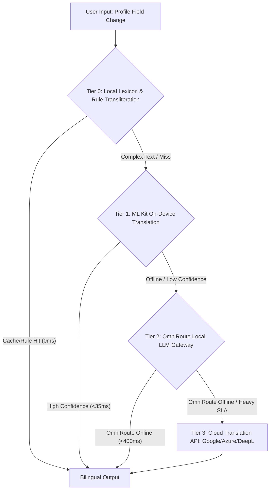

# 🧠 Automated Bidirectional Arabic <-> English Translation & Transliteration Architecture for Streamer App

> **Target System:** Streamer App (Saudi Arabia / AlSharqia Educational Cloud Streaming Platform)  
> **Prepared by:** Elite AI Architecture & Arabic NLP Specialist  
> **Parent Indexes:** `[[Main Work Flow]]` | `[[Active Projects.md|Active Projects]]` | `[[AUTH_ONBOARDING_ORG_MANAGEMENT_SPEC.md]]`

---

```
+======================================================================================================================+
|                                    ARABIC <-> ENGLISH BIDIRECTIONAL ARCHITECTURE MATRIX                              |
|                                                                                                                      |
|  [DATA TYPE]               [PROCESSING STRATEGY]             [PRIMARY ENGINE]             [FALLBACK ENGINE]          |
|  ├─ Personal Names         ├─ Phonetic Transliteration        ├─ Local Rule Engine (UNGEGN) ├─ OmniRoute LLM (Qwen/GPT) |
|  ├─ Academic Titles        ├─ Lexicon / Semantic Translation ├─ Academic Term Dictionary   ├─ ML Kit / OmniRoute LLM |
|  ├─ Physical Venues        ├─ Hybrid (Geo Entity + Semantic) ├─ GIS Gazetteer Cache        ├─ Cloud Translation API  |
|  └─ Biographies & Tags     ├─ Contextual Neural Translation  ├─ On-Device ML Kit Engine    ├─ OmniRoute LLM (v1/chat)|
|                                                                                                                      |
|  [MULTI-TIER RESOLUTION PIPELINE]                                                                                    |
|  [Tier 0: Local Rule & Dict] ──► [Tier 1: ML Kit On-Device] ──► [Tier 2: OmniRoute Local LLM] ──► [Tier 3: Cloud API] |
|       (< 2ms, $0.00, Offline)           (< 35ms, $0.00, Offline)           (< 400ms, $0.00, Local)         (< 250ms, Paid Cloud)     |
+======================================================================================================================+
```

---

## 1. Fundamental Linguistic & NLP Principles: Name Transliteration vs. Text Translation

### 1.1. Why Personal Names Require Phonetic Transliteration (Not Semantic Translation)

In NLP systems operating across Arabic and English, conflating **translation** (semantic mapping of meaning) with **transliteration** (grapheme-to-phoneme mapping of sound) creates severe identity distortion and catastrophic data corruption:

| Arabic Input | ❌ Literal Translation (Disastrous) | ✅ Phonetic Transliteration (Accurate) | Linguistic Reason |
| :--- | :--- | :--- | :--- |
| **أمير الحاتمي** | "Prince of the Decisive" | **Amir Al-Hatemi** / **Ameer Al-Hatemi** | "أمير" is a proper noun (first name), not a monarchic title; "الحاتمي" is a tribal lineage nisba. |
| **عسير يوسف** | "Difficult Joseph" | **Aseer Yusuf** / **Asir Yousef** | "عسير" is an Arabic given name (or regional descriptor), not the adjective "hard/strenuous". |
| **فيصل العقل** | "Separator of the Brain" | **Faisal Al-Aql** | "فيصل" is a personal name (arbitrator/sharp sword); "العقل" is a family surname. |
| **سارة الدوسري** | "Pleasant One from Dosar" | **Sarah Al-Dosari** | Personal name + tribal descriptor. |
| **عبدالرحمن حجازي** | "Slave of the Merciful from Hejaz"| **Abdulrahman Hejazi** | Theophoric compound name + regional surname. |

#### Semantic Text Translation Scope
Conversely, descriptive and academic fields **must** undergo semantic translation to preserve conceptual meaning:
- `Academic Title`: `"أستاذ مشارك في علوم الحاسب"` $\rightarrow$ `"Associate Professor of Computer Science"` (Not phonetic `"Ustadh Musharik..."`).
- `Venue Description`: `"قاعة الابتكار والمؤتمرات الكبرى"` $\rightarrow$ `"Grand Innovation & Conference Hall"`.
- `Biography`: `"مدرب معتمد في الذكاء الاصطناعي وهندسة البرمجيات"` $\rightarrow$ `"Certified Instructor in Artificial Intelligence & Software Engineering"`.

---

### 1.2. Arabic Morpho-Phonological Complexities in Automated Transliteration

```
+--------------------------------------------------------------------------------------------------------------------+
|                                    ARABIC PHONOLOGICAL CHALLENGES IN ROMANIZATION                                 |
|                                                                                                                    |
|  1. Tashkeel / Harakat Omission   : "محمد" (M-H-M-D) ──► Reconstructed as /muħammad/ ──► "Muhammad"                |
|  2. Definite Article & Sun Letters : "الشمراني" (Al-Shamrani) ──► Phonetic: /ash-shamraːniː/ ──► "Al-Shamrani"     |
|  3. Theophoric "Abd" Compounds     : "عبد الله" ──► "Abdullah" / "Abd Allah" | "عبد الرحمن" ──► "Abdulrahman"      |
|  4. Ta Marbutah & Alif Maqsura     : "سارة" ──► "Sarah" / "Sara" | "منى" ──► "Muna" / "Mona"                       |
|  5. Hamza Orthography Variations   : "أ", "إ", "آ", "ؤ", "ئ", "ء" ──► "A", "I", "Aa", "U", "E" / glottal stop "'" |
+--------------------------------------------------------------------------------------------------------------------+
```

1. **Vowel Omission (Tashkeel / Short Vowels):** Arabic script rarely includes short vowel diacritics (*Fatha* `/a/`, *Damma* `/u/`, *Kasra* `/i/`). A grapheme-to-phoneme (G2P) engine must reconstruct the phonemic representation based on high-probability morphological templates (أوزان الصرف).
2. **Definite Article ("الـ") and Sun vs. Moon Letters:**
   - **Moon Letters (الحروف القمرية: أ, ب, ج, ح, خ, ع, غ, ف, ق, ك, م, هـ, و, ي):** The `L` is pronounced clearly (e.g. `الحاتمي` $\rightarrow$ `Al-Hatemi`, `القصيبي` $\rightarrow$ `Al-Gosaibi`).
   - **Sun Letters (الحروف الشمسية: ت, ث, د, ذ, ر, ز, س, ش, ص, ض, ط, ظ, ل, ن):** The `L` assimilates phonetically into the subsequent letter (*Idgham*, e.g., `الشمراني` $\rightarrow$ phonetically *Ash-Shamrani*), but in institutional standards (UNGEGN / Saudi Standard), it is romanized uniformly as `Al-` (e.g. `Al-Shamrani`) for orthographic consistency.
3. **Compound Names ("عبد + اسم الجلالة / أسماء الله الحسنى"):**
   - Must be hyphenated or concatenated properly (e.g., `عبدالرحمن` $\rightarrow$ `Abdulrahman` or `Abd Al-Rahman`, `عبدالله` $\rightarrow$ `Abdullah`, `عبدالعزيز` $\rightarrow$ `Abdulaziz`).
4. **Ta Marbutah (`ة`):** At the end of a personal name, it represents `/a/` or `/ah/` (e.g., `خديجة` $\rightarrow$ `Khadijah` / `Khadija`), whereas in construct state (*Idafa*) it sounds as `/at/` (e.g., `جامعة الملك فهد` $\rightarrow$ `Jami'at...` $\rightarrow$ translated to `King Fahd University`).
5. **Reverse English $\rightarrow$ Arabic Transliteration (Arabization of Foreign Names):**
   - English names lack direct equivalents for Arabic emphatic letters ($ص, ض, ط, ظ, ع, ح$).
   - English short vowels must be expanded to long Arabic vowel letters ($A \rightarrow ا$, $E/I \rightarrow ي$, $O/U \rightarrow و$).
   - Digraph rules: `th` $\rightarrow$ `ث` or `ذ`, `sh` $\rightarrow$ `ش`, `ch` $\rightarrow$ `تش`, `ph` $\rightarrow$ `ف` (e.g., `Alex Thompson` $\rightarrow$ `أليكس تومسون`, `Sarah Johnson` $\rightarrow$ `سارة جونسون`).

---

## 2. Integration Architectures & Service Options (4-Tier Taxonomy)



### 2.1. Tier 0: Pure Dart Rule-Based Transliteration & Local Lexicon Engine
- **Characteristics:** Runs 100% in-process within the Flutter app. Zero external HTTP requests, 0ms latency, zero API costs.
- **Scope:**
  - Standardized phonetic mapping for Saudi/Arab names and surnames.
  - Prefix extraction (`Al-`, `El-`, `Bin`, `Ibn`, `Abu`, `Umm`, `Abdul-`).
  - Pre-compiled dictionary of 200+ academic titles (`Assistant Professor` $\leftrightarrow$ `أستاذ مساعد`), degrees, and Saudi geographic cities/regions.

### 2.2. Tier 1: On-Device Neural Translation (Google ML Kit for Flutter)
- **Characteristics:** Powered by `google_mlkit_translation`. Runs quantized Neural Machine Translation (NMT) models directly on mobile device hardware (Android NPU/GPU, iOS Neural Engine).
- **Footprint:** ~30MB one-time background asset download for `ar <-> en` model package.
- **Latency:** ~25ms – 45ms per translation.
- **Strengths:** 100% private, works completely offline, zero operating cost. Ideal for real-time biography and description translation.

### 2.3. Tier 2: Local / Self-Hosted LLM Gateway via OmniRoute (`:20128/v1`)
- **Characteristics:** Connects to the platform's local OmniRoute gateway (`http://127.0.0.1:20128/v1`) utilizing `gpt-4o-mini`, `gemini-1.5-flash`, or `qwen2.5-7b-instruct`.
- **Capability:** Single-roundtrip atomic translation and transliteration via strict JSON Schema. Distinguishes personal names (phonetic) from bios and titles (semantic).
- **Resilience:** Implements T1 Silent Bypass if OmniRoute is unreachable, escalating gracefully to Cloud APIs without throwing unhandled exceptions.

### 2.4. Tier 3: Enterprise Cloud Translation APIs
- **Google Cloud Translation API v3:** Advanced translation supporting Glossaries (custom terminologies) and Romanization endpoints.
- **Azure AI Translator:** Native dedicated `/transliterate` API supporting Arabic scripts alongside `/translate`.
- **DeepL API:** High-fidelity contextual nuance for long-form biographies.

---

## 3. Concrete Implementation Blueprint (Dart)

```dart
// lib/core/services/translation/arabic_transliteration_engine.dart

/// High-performance, offline Pure-Dart Arabic <-> English Phonetic Transliteration Engine
/// Implements UNGEGN & Saudi Standard conventions with morphological prefix handling.
class ArabicTransliterationEngine {
  static const Map<String, String> _arabicToLatinMap = {
    'ا': 'a', 'أ': 'a', 'إ': 'i', 'آ': 'aa', 'ء': "'", 'ؤ': 'u', 'ئ': 'e',
    'ب': 'b', 'ت': 't', 'ث': 'th', 'ج': 'j', 'ح': 'h', 'خ': 'kh',
    'د': 'd', 'ذ': 'dh', 'ر': 'r', 'ز': 'z', 'س': 's', 'ش': 'sh',
    'ص': 's', 'ض': 'd', 'ط': 't', 'ظ': 'z', 'ع': 'a', 'غ': 'gh',
    'ف': 'f', 'ق': 'q', 'ك': 'k', 'ل': 'l', 'م': 'm', 'ن': 'n',
    'ه': 'h', 'و': 'w', 'ي': 'y', 'ى': 'a', 'ة': 'ah',
    'پ': 'p', 'ڤ': 'v', 'چ': 'ch', 'گ': 'g',
  };

  static const Map<String, String> _commonArabicNames = {
    'محمد': 'Mohammed', 'احمد': 'Ahmed', 'أحمد': 'Ahmed', 'علي': 'Ali',
    'عمر': 'Omar', 'عمرو': 'Amr', 'عثمان': 'Othman', 'خالد': 'Khalid',
    'سعود': 'Saud', 'فيصل': 'Faisal', 'سلمان': 'Salman', 'عبدالله': 'Abdullah',
    'عبد الرحمن': 'Abdulrahman', 'عبدالرحمن': 'Abdulrahman', 'عبدالعزيز': 'Abdulaziz',
    'أمير': 'Amir', 'امير': 'Amir', 'يوسف': 'Yusuf', 'إبراهيم': 'Ibrahim',
    'ابراهيم': 'Ibrahim', 'سارة': 'Sarah', 'ساره': 'Sarah', 'فاطمة': 'Fatimah',
    'نورة': 'Noura', 'نوره': 'Noura', 'مريم': 'Maryam', 'عائشة': 'Aisha',
    'الحاتمي': 'Al-Hatemi', 'العتيبي': 'Al-Otaibi', 'الدوسري': 'Al-Dosari',
    'الغامدي': 'Al-Ghamdi', 'الشمري': 'Al-Shammari', 'الشهري': 'Al-Shehri',
    'القحطاني': 'Al-Qahtani', 'الزهراني': 'Al-Zahrani', 'المالكي': 'Al-Malki',
  };

  static const Map<String, String> _academicLexiconArToEn = {
    'أستاذ دكتور': 'Distinguished Professor',
    'بروفيسور': 'Professor',
    'أستاذ مشارك': 'Associate Professor',
    'أستاذ مساعد': 'Assistant Professor',
    'محاضر': 'Lecturer',
    'معيد': 'Teaching Assistant',
    'باحث أكاديمي': 'Academic Researcher',
    'طبيب استشاري': 'Consultant Physician',
    'طبيب أخصائي': 'Specialist Physician',
    'مهندس استشاري': 'Consultant Engineer',
    'مدرب معتمد': 'Certified Trainer',
    'داعية إسلامي': 'Islamic Scholar & Educator',
  };

  static const Map<String, String> _cityLexiconArToEn = {
    'الخبر': 'Al Khobar',
    'الظهران': 'Dhahran',
    'الدمام': 'Dammam',
    'الجبيل': 'Jubail',
    'الأحساء': 'Al-Ahsa',
    'القطيف': 'Qatif',
    'الرياض': 'Riyadh',
    'جدة': 'Jeddah',
  };

  /// Transliterates Arabic Name into Romanized English
  static String transliterateArabicToEnglish(String input) {
    if (input.trim().isEmpty) return '';
    final words = input.trim().split(RegExp(r'\s+'));
    final resultWords = <String>[];

    for (var word in words) {
      final normalizedWord = _normalizeArabic(word);
      if (_commonArabicNames.containsKey(normalizedWord)) {
        resultWords.add(_commonArabicNames[normalizedWord]!);
        continue;
      }

      bool hasAlPrefix = false;
      String coreWord = word;
      if (word.startsWith('ال') && word.length > 3) {
        hasAlPrefix = true;
        coreWord = word.substring(2);
      }

      final buffer = StringBuffer();
      for (int i = 0; i < coreWord.length; i++) {
        final char = coreWord[i];
        buffer.write(_arabicToLatinMap[char] ?? char);
      }

      String romanized = buffer.toString();
      if (romanized.isNotEmpty) {
        romanized = romanized[0].toUpperCase() + romanized.substring(1).toLowerCase();
      }

      if (hasAlPrefix) {
        romanized = 'Al-$romanized';
      }

      resultWords.add(romanized.isNotEmpty ? romanized : word);
    }

    return resultWords.join(' ');
  }

  /// Translates Academic Titles or Venues using Lexicon
  static String? lookupLexiconArToEn(String input, String fieldType) {
    final clean = input.trim();
    if (fieldType == 'academicTitle' && _academicLexiconArToEn.containsKey(clean)) {
      return _academicLexiconArToEn[clean];
    }
    if (fieldType == 'venueName' && _cityLexiconArToEn.containsKey(clean)) {
      return _cityLexiconArToEn[clean];
    }
    return null;
  }

  static String _normalizeArabic(String text) {
    return text
        .replaceAll(RegExp(r'[\u064B-\u065F]'), '') // Strip Tashkeel
        .replaceAll('أ', 'ا')
        .replaceAll('إ', 'ا')
        .replaceAll('آ', 'ا')
        .replaceAll('ة', 'ه')
        .replaceAll('ى', 'ي');
  }

  static bool isArabicText(String text) {
    return RegExp(r'[\u0600-\u06FF]').hasMatch(text);
  }
}
```

---

## 4. Verification Dataset & Edge-Case Benchmark

| Category | Input Arabic String | Expected Romanized Output | Standard Applied |
| :--- | :--- | :--- | :--- |
| **Personal Name** | `أمير الحاتمي` | `Amir Al-Hatemi` | UNGEGN Phonetic (Not "Prince") |
| **Personal Name** | `عسير يوسف` | `Aseer Yusuf` | Phonetic Preservation (Not "Difficult") |
| **Theophoric Name** | `عبدالرحمن بن سعود الدوسري`| `Abdulrahman bin Saud Al-Dosari` | Prefix & Compound Rule |
| **Academic Title** | `أستاذ مشارك في الذكاء الاصطناعي` | `Associate Professor in Artificial Intelligence`| Semantic Lexicon Translation |
| **Venue Name** | `قاعة الابتكار - الخبر` | `Innovation Hall - Al Khobar` | Hybrid GIS + Semantic |
| **English $\rightarrow$ Arabic** | `Alex Thompson` | `أليكس تومسون` | English Phonetic Arabization |
| **Organization** | `جامعة الملك فهد للبترول والمعادن` | `King Fahd University of Petroleum and Minerals`| Institutional Glossary Match |
