# 🏛️ v0.9 Readiness & Roadmap Report: Legal, Account Deletion & Settings Cleanup

> **Specialist Role:** v0.9 Legal, Account Deletion & Settings Cleanup Specialist  
> **Target Roadmap Version:** v0.9 (`doc/Roadmap/v0.9_Settings_Legal_Account_Deletion.md`)  
> **Key References:** `doc/Audit/03_Saudi_Legal_And_Store_Compliance_Audit.md`, `supabase/migrations/`, `project/lib/features/profile/presentation/settings_screen.dart`, `project/lib/features/admin/presentation/admin_hub_screen.dart`  
> **Status:** Audit & Architecture Complete — Ready for v0.9 Execution  
> **File Output Path:** `teamwork_preview/v0.9_readiness_and_roadmap.md`

---

## 1. 📋 Executive Summary & v0.9 Strategic Mission

The v0.9 milestone resolves two critical store-submission blockers while transforming the sprawling `SettingsScreen` (currently 1,912 lines / 75KB) into a clean, role-tailored user experience:

1. **Store & Regulatory Compliance Blockers:**
   - **Apple App Store Guideline 5.1.1(v):** Mandatory in-app account deletion for all apps supporting account creation. (Currently **Missing**).
   - **Google Play Store Policy (May 31, 2024):** Mandatory in-app account deletion **plus** an independent hosted web deletion portal. (Currently **Missing**).
   - **Saudi Personal Data Protection Law (PDPL - SDAIA):** Right to Erasure (Article 5 & 24), Right to Data Portability / Export (Article 23), and Explicit Onboarding Consent capture. (Currently **Missing**).
2. **Settings Architectural Cleanup:**
   - Removal of developer/pitch toggles (Pitch Director, Laptop RTMP IP `192.168.1.100`, Simulated Notification triggers) into the Admin Hub / Developer Diagnostics.
   - Implementation of role-tailored dynamic settings sections: **Viewer (Baseline) $\rightarrow$ Streamer $\rightarrow$ Org Owner/Co-Owner $\rightarrow$ Admin/Master Admin**.

---

## 2. 🔍 Store & Saudi PDPL Compliance Audit Matrix

| Regulation / Store Policy | Current Status | Codebase Gap | v0.9 Solution Architecture |
|---|---|---|---|
| **Apple Guideline 5.1.1(v)** *(In-App Account Deletion)* | ❌ Non-Compliant | No delete option in `settings_screen.dart` or profile. | In-App "Delete My Account & Erase Data" flow with atomic cascade deletion via Supabase RPC `delete_user_account()`. |
| **Google Play Deletion Policy** *(Web Path + In-App)* | ❌ Non-Compliant | No web deletion request page; no in-app deletion. | In-App deletion flow + Hosted static web deletion request portal (`https://streamerapp.sa/privacy/delete-request`). |
| **Saudi PDPL (SDAIA)** *(Right to Erasure - Art. 5 & 24)* | ❌ Non-Compliant | User cannot delete data; PII stored without self-service erasure. | Immediate auth revocation, database cascade deletion, storage asset cleanup, and PII anonymization in audit logs. |
| **Saudi PDPL (SDAIA)** *(Explicit Consent - Art. 19)* | ❌ Non-Compliant | Onboarding gathers name, phone, coordinates with no recorded consent. | Onboarding explicit consent step with recorded version, timestamp, and locale in profile/local storage. |
| **Saudi PDPL (SDAIA)** *(Data Portability - Art. 23)* | ❌ Non-Compliant | No "Download My Data" export feature. | Self-service JSON/ZIP data export generating profile, applications, chat history, and preferences. |
| **Apple Guideline 4.8** *(Login Alternatives)* | ⚠️ Android Only | Only Google Sign-In + Guest Mode exist. | Retained for Android/Web in v0.9; scheduled for Sign in with Apple in v1.1 iOS build. |
| **Apple Guideline 1.2** *(UGC / Chat Moderation)* | ✅ Compliant (v0.8) | Live chat moderation dashboard & reporting built in v0.8. | Verified functional: `chat_reports`, `chat_muted_users`, keyword filtering, and Admin resolution tabs. |

---

## 3. 🧪 Experimental & Testing Toggles Migration Plan

### 3.1 Components Extracted from `SettingsScreen`
The following developer/testing controls currently exposed to all users in `settings_screen.dart` (lines 1439–1509) will be removed:

1. **`_buildPitchDirectorCard`:**
   - `isPitchDirectorModeEnabled` toggle (`setPitchDirectorMode`).
   - `rtmpLaptopIp` text input (`updateRtmpLaptopIp`).
   - `triggerSimulatedNotification` button (`triggerSimulatedNotification`).
2. **Developer Onboarding Reset:**
   - `reopen_onboarding` action button (`context.push('/onboarding')`) extracted from the account card.
3. **Mock Broadcast Ingest Overrides:**
   - Raw manual stream URL and slides URL mock overrides extracted from Viewer view and moved to Streamer Studio / Admin diagnostics.

### 3.2 Relocation Target: Admin Hub "Developer & Pitch Diagnostics" Tab
In `admin_hub_screen.dart`, a new dedicated tab / modal is introduced: **"Developer Diagnostics & Pitch Tools" (أدوات المطور والمحاكاة)**, gated by `is_admin_tier()`:

```
AdminHubScreen
├── 1. Overview Tab
├── 2. Verification Queue Tab
├── 3. Streamers Registry Tab
├── 4. Organizations Tab (OrgManagementView)
├── 5. Chat Moderation Tab (ChatModerationView)
├── 6. Viewer Analytics Tab
├── 7. Terms & Governance Tab
├── 8. Roles & Permissions Tab (Master Admin Only)
└── 9. 🛠️ Developer & Pitch Diagnostics Tab (NEW)
       ├── Pitch Director Mode Toggle (ADR-005 Safe Overlays)
       ├── Local RTMP Ingest & Relay Testing (Laptop IP config & ping)
       ├── Notification Simulator (Burst testing & 10-min rate-limit verification)
       ├── Onboarding Flow Test Harness & State Reset
       └── Supabase DB & RLS Security Advisor Runner
```

---

## 4. 🛡️ Saudi PDPL & Store-Compliant Account Deletion Workflow

```mermaid
sequenceDiagram
    autonumber
    actor User as User / Streamer
    participant Flutter as Streamer App (Settings UI)
    participant AuthSvc as SupabaseAuthService
    participant DB as Postgres RPC (delete_user_account)
    participant Storage as Supabase Storage
    participant Local as SharedPreferences & Cache

    User->>Flutter: Tap "Delete My Account & Erase Data"
    Flutter->>Flutter: Show Multi-Step Warning Dialog (List data to be erased)
    User->>Flutter: Confirm intent (Type "DELETE" or Re-authenticate)
    Flutter->>DB: Call delete_user_account() RPC
    
    rect rgb(30, 40, 60)
        Note over DB: Atomic Deletion & Cascade Phase
        DB->>DB: Check if user owns an active Organization
        alt User is Sole Org Owner
            DB-->>Flutter: Return ORG_OWNER_RESTRICTION (Block deletion until transfer)
            Flutter-->>User: Display transfer requirement error
        else Validation Passed
            DB->>DB: Anonymize Audit Logs (actor_email = 'deleted_user@privacy.local')
            DB->>DB: CASCADE delete chat_messages, chat_reports, chat_mutes
            DB->>DB: CASCADE delete broadcaster_applications, affiliation_requests
            DB->>DB: CASCADE delete user_roles, user_permissions, profiles
            DB->>DB: Delete auth.users row
            DB-->>Flutter: Return success: true
        end
    end

    Flutter->>Storage: Delete user avatar & asset files (if stored)
    Flutter->>AuthSvc: signOut()
    Flutter->>Local: Clear SharedPreferences, tokens, cached VODs
    Flutter->>User: Navigate to /welcome with confirmation toast
```



### 4.1 Stored Procedure: `delete_user_account.sql`
```sql
-- Migration: 20260829090000_delete_user_account.sql
create or replace function public.delete_user_account()
returns jsonb
language plpgsql
security definer
set search_path = public, auth
as $$
declare
  v_user_id uuid := auth.uid();
  v_org_count int;
begin
  if v_user_id is null then
    raise exception 'Unauthorized';
  end if;

  -- 1. Enforce Organization Ownership Safety Check (Foreign Key ON DELETE RESTRICT)
  select count(*) into v_org_count from public.organizations where owner_profile_id = v_user_id;
  if v_org_count > 0 then
    return jsonb_build_object(
      'success', false,
      'error', 'ORG_OWNER_RESTRICTION',
      'message_en', 'You are registered as the owner of an active organization. Please transfer ownership or archive the organization before deleting your account.',
      'message_ar', 'أنت مسجل كمالك لمنظمة نشطة. يرجى نقل ملكية المنظمة أو أرشفتها قبل حذف حسابك.'
    );
  end if;

  -- 2. Anonymize Audit Trail (Preserve regulatory history while stripping PII)
  update public.audit_logs
  set actor_email = 'deleted_user@privacy.local',
      actor_name = 'Deleted User / مستخدم محذوف',
      actor_profile_id = null
  where actor_profile_id = v_user_id;

  -- 3. Delete records referencing profile
  delete from public.chat_muted_users where muted_profile_id = v_user_id or muted_by = v_user_id;
  delete from public.chat_reports where reporter_id = v_user_id or reported_sender_id = v_user_id;
  delete from public.chat_messages where sender_id = v_user_id;
  delete from public.broadcaster_applications where applicant_profile_id = v_user_id;
  delete from public.affiliation_requests where streamer_profile_id = v_user_id;
  delete from public.org_speakers where linked_profile_id = v_user_id;
  delete from public.user_permissions where profile_id = v_user_id;
  delete from public.user_roles where profile_id = v_user_id;

  -- 4. Delete profile row (Cascade triggers)
  delete from public.profiles where id = v_user_id;

  -- 5. Delete Supabase Auth User
  delete from auth.users where id = v_user_id;

  return jsonb_build_object(
    'success', true,
    'message_en', 'Account and associated personal data erased successfully.',
    'message_ar', 'تم حذف الحساب وجميع البيانات الشخصية المرتبطة به بنجاح.'
  );
end;
$$;

grant execute on function public.delete_user_account() to authenticated;
```

### 4.2 Hosted Web Deletion Portal (Google Play Policy)
- **Hosted URL:** `https://streamerapp.sa/legal/account-deletion` (also mirrored at `doc/Legal/account_deletion_portal.html`).
- **Form Requirements:**
  - Registered Google Account / Email address.
  - Verification Code via OTP / Magic Link.
  - Confirmation of deletion scope (Profile, Applications, Chat logs).
  - SLA: Automated instant execution via Supabase Service Role or max 24 hours.

---

## 5. 👥 Role-Tailored Settings Information Architecture

The new `SettingsScreen` dynamically stacks sections according to the user's authenticated role:

```
┌────────────────────────────────────────────────────────┐
│ 1. Account Profile Header (All Users & Guests)         │
│    - Avatar, Display Name, Academic Title, Edit Profile│
├────────────────────────────────────────────────────────┤
│ 2. Role-Specific Action & Navigation Banners           │
│    ├── [Guest / Viewer]: "Apply to Become Broadcaster" │
│    ├── [Applicant]: Application Status Tracker & Notes │
│    ├── [Streamer]: Go Live Studio & YouTube Linker     │
│    ├── [Org Owner]: "Manage Organization" -> /org-admin│
│    └── [Admin / Master]: "Admin Hub" -> /admin         │
├────────────────────────────────────────────────────────┤
│ 3. Preferences & Quality (All Users)                   │
│    - Language Switcher (العربية RTL / English LTR)     │
│    - Notification Preferences (10-Min Slider & Toggles)│
│    - Default Streaming Quality (1080p, 720p, Audio)   │
├────────────────────────────────────────────────────────┤
│ 4. Platform Governance & PDPL Rights (All Users)       │
│    - View Terms of Service (Versioned Dialog)          │
│    - View Broadcaster Guidelines                       │
│    - View Privacy Notice (Saudi PDPL Compliance)       │
│    - 📥 "Download My Data" (PDPL Data Portability)     │
├────────────────────────────────────────────────────────┤
│ 5. Account Security & Danger Zone (All Users)          │
│    - Sign Out / Switch Account                         │
│    - ⚠️ "Delete My Account & Erase Personal Data"       │
├────────────────────────────────────────────────────────┤
│ 6. App Info & Version                                  │
│    - v2.0.0 (Production Release), Eastern Province, KSA│
└────────────────────────────────────────────────────────┘
```

### 5.1 Role Breakdown

| Role Tier | Displayed Sections & Capabilities |
|---|---|
| **Guest Viewer** | Baseline Profile, Language (AR/EN), Notification Filters, Video Quality, Governance & Privacy, "Apply to Broadcast" Promo, Reset Guest Profile. |
| **Authenticated Viewer** | Baseline Profile, Google Account Info, Language, Notification Preferences, Video Quality, Governance, "Download My Data", "Delete My Account", Sign Out. |
| **Broadcaster Applicant** | Authenticated Viewer baseline + Realtime Application Status Card (Pending review / Feedback / Re-apply CTA). |
| **Verified Streamer** | Authenticated Viewer baseline + Streamer Studio Quick Settings (Default Title, YouTube Handle, RTMP Key, Slides URL, Go Live toggle). |
| **Permitted Admin (Org Owner / Co-Owner)** | Verified Streamer baseline + Org Management Quick Card (Direct shortcut to `/org-admin`, campus branch selection, co-speaker roster). |
| **Admin / Master Admin** | Permitted Admin baseline + Admin Hub Banner (Direct shortcut to `/admin`, pending verification queue badge, chat reports counter, Developer Diagnostics). |

---

## 6. 📜 PDPL Consent & Data Export Specifications

### 6.1 Onboarding Consent Step (`OnboardingConsentModal`)
- Triggered during `welcome_screen.dart` and `viewer_setup_screen.dart` before storing user input.
- Checkbox confirmation: *"I have read and agree to the Terms of Service, Broadcaster Guidelines, and Saudi PDPL Privacy Notice."*
- Stored fields on profile: `consent_version` ('v1.0'), `consent_timestamp` (ISO-8601), and `consent_locale` ('ar'/'en').

### 6.2 Data Export Engine ("Download My Data")
- Export structure (JSON format):
  ```json
  {
    "export_timestamp": "2026-08-24T11:45:00Z",
    "data_subject": {
      "id": "c6f4c923-...",
      "email": "user@kfupm.edu.sa",
      "display_name_en": "Amir Al-Hatemi",
      "display_name_ar": "أمير الحاتمي",
      "title_en": "Lead Researcher",
      "organization_en": "KFUPM",
      "created_at": "2026-08-21T20:30:00Z"
    },
    "broadcaster_application": { ... },
    "notification_preferences": { ... },
    "chat_messages_count": 42,
    "organization_affiliations": [ ... ]
  }
  ```

---

## 7. 🚀 v0.9 Implementation Checkpoints & Action Plan

### Checkpoint 1 — Settings Information Architecture & Developer Extraction
1. Extract `_buildPitchDirectorCard` and testing toggles from `settings_screen.dart` to `AdminHubScreen` (new Diagnostics Tab).
2. Refactor `settings_screen.dart` into modular widget sections with role-gated conditional rendering.
3. Apply layout, typography, and touch-target padding (min 48dp) across all settings cards.
- **Commits:**
  - `refactor(settings): move experimental/dev toggles to Admin-only surface`
  - `feat(settings): role-aware settings sections`
  - `polish(settings): layout, typography, and touch-target consolidation`

### Checkpoint 2 — Account & Data Deletion
1. Write database migration `20260829090000_delete_user_account.sql` implementing atomic cascade deletion and audit log anonymization.
2. Build in-app "Delete My Account" dialog with multi-step confirmation and safety checks.
3. Author hosted static web deletion request portal page (`account_deletion_portal.html`).
- **Commits:**
  - `feat(db): delete_user_account stored procedure with audit anonymization`
  - `feat(settings): in-app account and data deletion flow`
  - `feat(legal): hosted account-deletion request page`

### Checkpoint 3 — Consent & Legal
1. Create `OnboardingConsentStep` capturing recorded consent before collecting personal data.
2. Build `UserDataExportService` and "Download My Data" export button in Settings Governance card.
3. Review and polish Arabic & English legal copies.
- **Commits:**
  - `feat(legal): onboarding consent step with recorded acceptance`
  - `feat(legal): user data export for PDPL portability`
  - `polish(legal): bilingual consent and privacy copy verification`

---

*This report has been compiled and saved to `teamwork_preview/v0.9_readiness_and_roadmap.md`.*
